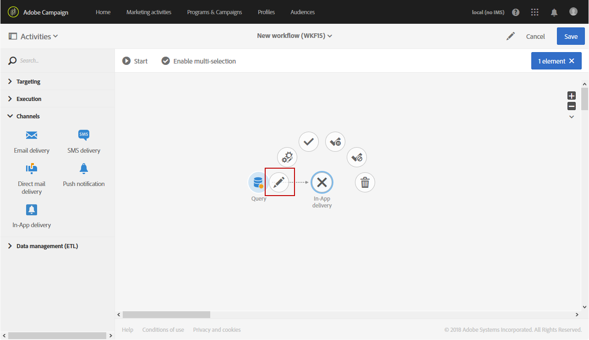
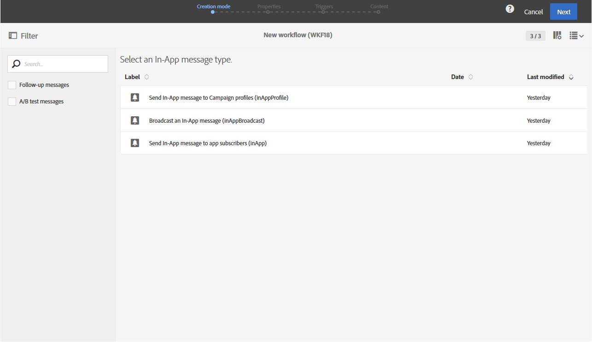
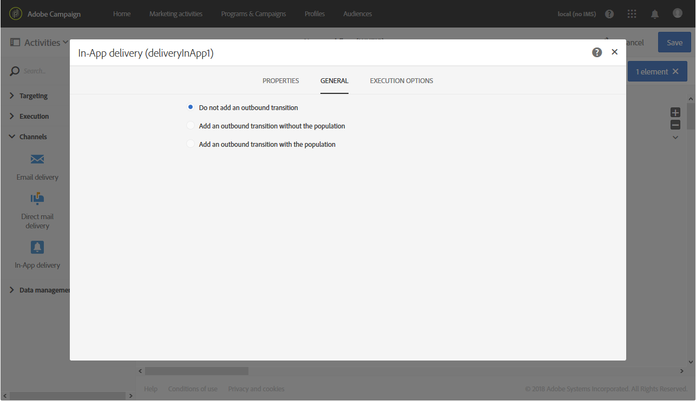

# In-App delivery{#in-app-delivery}

In-App delivery

## Description {#description}

>[!NOTE]
>
>In-App messaging is currently a Beta feature and can be subject to future changes. To use it, you have to agree with the Terms and Conditions displayed when selecting the channel in the interface.

The **In-App delivery** activity allows you to configure sending an In-App message within a workflow. In-App messaging allows you to display a message when the user is active within the application. For more information concerning the In-App delivery, refer to this [section](../../channels/using/about-in-app-messaging.md).

## Context of use {#context-of-use}

The **In-App delivery** activity is generally used to automate sending an In-App message to a target audience calculated in the same workflow.

The recipients are defined upstream of the activity in the same workflow, via targeting activities such as queries, intersections, etc.

The message preparation is triggered according to the workflow execution parameters. From the message dashboard, you can select whether to request or not a manual confirmation to send the message (required by default). You can start the workflow manually or place a scheduler activity in the workflow to automate execution.

## Configuration {#configuration}

1. Drag and drop a **In-App delivery** activity into your workflow.
1. Select the activity, then open it using the  

   button from the quick actions that appear.

   >[!NOTE]
   >
   >You can access the general properties and advanced options of the activity (and not of the delivery itself) via the     >
   >
   >button from the activity's quick actions.

   

1. Select the In-App message type. This will depend on the data targeted in your **Query** activity.

    * **Send In-App message to Campaign profiles**: This message type enables you to target Adobe Campaign profiles who have subscribed to your mobile application and to personalize In-App messages with profile attributes available in Campaign.
    * **Broadcast an In-App message**: This message type enables you to send a message to all users of your mobile application even if they don't have an existing profile in Campaign.
    * **Send In-App message to app subscribers**: This message type enables you to target all users of a mobile app that have a profile in Campaign whether known or unknown and to personalize In-App messages with any profile attributes that have been obtained from mobile device.

   

1. Enter your In-App message properties and select your mobile app in the **Associate a Mobile App to a delivery** field.
1. In the **Triggers** tab, drag and drop the event that will trigger your message. Three categories of events are available: 
1. Define your In-App content. Refer to the section concerning [In-App customization](../../channels/using/customizing-an-in-app-message.md).
1. By default, the **In-App delivery** activity does not include any outbound transitions. If you would like to add an outbound transition to your **In-App delivery** activity, go to the **General** tab of the advanced activity options (  

   button in the activity's quick actions) then check one of the following options:

    * **Add outbound transition without the population**: this lets you generate an outbound transition that contains the exact same population as the inbound transition.
    * **Add outbound transition with the population**: this lets you generate an outbound transition containing the population to whom the message was sent. The members of the target excluded during the delivery preparation are excluded from this transition.

   

1. Confirm the configuration of your activity and save your workflow.

When you reopen the activity, you are taken directly to the In-App dashboard. Only its content can be edited.

By default, starting a delivery workflow only triggers the message preparation. The sending of messages created from a workflow still needs to be confirmed after the workflow has been started. But from the message dashboard, and only if the message was created from a workflow, you can disable the **Request confirmation before sending messages** option. By unchecking this option, messages are sent without further notice once the preparation is done.

## Remarks {#remarks}

The deliveries created within a workflow can be accessed in the application's marketing activity list. You can view the workflow's execution status using the dashboard. Links in the push notification summary pane allow you to directly access linked elements (workflow, campaign, etc.).

In the parent deliveries, which can be accessed from the marketing activity list, you can view the total number of sends that have been processed (according to the aggregation period specified when the **In-App delivery** activity was configured). To do this, open the detail view of the parent delivery's **Deployment** block by selecting  

.
