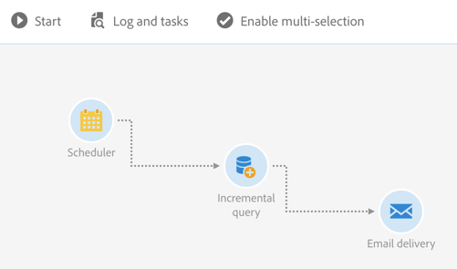
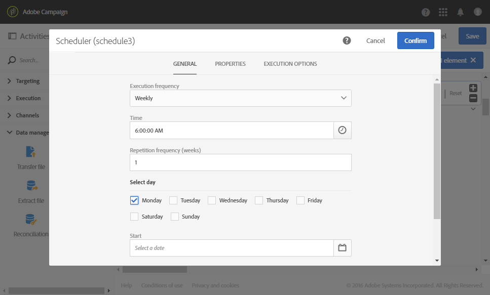
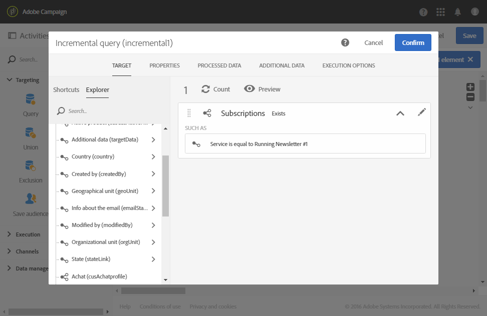

# Incremental query{#incremental-query}

Incremental query

## Description {#description}

The **[!UICONTROL Incremental query]** activity allows you to filter and extract a population of elements from the Adobe Campaign database. Each time this activity is executed, the results from the previous executions are excluded. This allows you to target only new elements.

You can define **[!UICONTROL Additional data]** for the targeted population via a dedicated tab. This data is stored in additional columns and can only be used for the workflow in progress.

The activity uses the query editor tool. This tool is detailed in a [dedicated section](../../automating/using/editing-queries.md#about-query-editor).

## Context of use {#context-of-use}

An **[!UICONTROL Incremental query]** has to be linked to a **[!UICONTROL Scheduler]** in order to define the execution frequency of the workflow, and therefore the query.

The **[!UICONTROL Processed data]** tab, which is specific to this activity, allows you to view any results of the activity's previous executions, if required.

The **[!UICONTROL Incremental query]** activity can be used for various types of uses:

* Segmenting individuals to define the target of a message, audience, etc.
* Exporting data.

## Configuration {#configuration}

1. Drag and drop an **[!UICONTROL Incremental query]** activity into your workflow.
1. Select the activity, then open it using the  button from the quick actions that appear.
1. If you would like to run a query on a resource other than the profile resource, go to the activity's **[!UICONTROL Properties]** tab and select a **[!UICONTROL Resource]** and a **[!UICONTROL Targeting dimension]** .

   The **[!UICONTROL Resource]** allows you to refine the filters displayed in the palette whereas the **[!UICONTROL Targeting dimension]** , contextual with regard to the resource selected, corresponds to the type of population that you would like to obtain (identified profiles, deliveries, data linked to the selected resource, etc.).

1. In the **[!UICONTROL Target]** tab, run your query by defining and combining rules.
1. In the **[!UICONTROL Processed data]** tab, choose the incremental mode you want to use for the next executions of the workflow:

    * **[!UICONTROL Use the exclusion of the results of previous executions]** : the results of previous executions for each new execution are excluded.
    * **[!UICONTROL Use a date field]** : the next executions only take into account the results having the selected date field greater or equal to the last execution date of the **[!UICONTROL Incremental query]** activity. You can select any date field pertaining to the resource selected in the **[!UICONTROL Properties]** tab. This mode has better performance when querying large resources such as log data.

      After the first execution of the workflow, you can see in this tab the last execution date that will be used for the next execution. It is automatically updated every time the workflow is executed. You still have the possibility to override this value by manually entering a new one so that it fits your needs.

   >[!NOTE]
   >
   >The **[!UICONTROL Use a date field]** mode allows more flexibility depending on the date field that is selected. For example, if the selected field corresponds to a modification date, the date field mode will allow you to retrieve data that were recently updated, while the other mode will simply exclude recordings that were already targeted in a previous execution, even if they have been modified since the last execution of the workflow.

   

1. You can define **[!UICONTROL Additional data]** for the targeted population via a dedicated tab. This data is stored in additional columns and can only be used for the workflow in progress. In particular, you can add data from the Adobe Campaign database tables linked to the query's targeting dimension. Consult the [Enriching data](../../automating/using/query.md#enriching-data) section.
1. Confirm the configuration of your activity and save your workflow.

## Enriching data {#enriching-data}

Just as for a query, you can enrich the data from an **[!UICONTROL Incremental query]** . Consult the [Enriching data](../../automating/using/query.md#enriching-data) section.

## Example: incremental query on subscribers to a service {#example--incremental-query-on-subscribers-to-a-service}

The following example shows the configuration of an **[!UICONTROL Incremental query]** activity which filters the profiles in the Adobe Campaign database that are subscribed to the **Running Newsletter** service, to send them a welcome email containing a promo code.

The workflow is up made up of the following elements:

* A **[!UICONTROL Scheduler]** activity, to execute the workflow every Monday at 6 am.

  

* An **[!UICONTROL Incremental query]** activity, which targets all of the current subscribers during the first execution, then only the new subscribers of that week during the following executions.

  

* An **[!UICONTROL Email delivery]** activity. The workflow is executed once a week, but you can aggregate the emails sent and the results per month, for example to generate reports over a period of an entire month and not just a single week.

  To do this, choose to create a **[!UICONTROL Recurring email]** here regrouping the emails and the results **[!UICONTROL By month]** .

  Define the content of your email and insert the welcome promo code.

  For more on this, refer to the [Email delivery](../../automating/using/email-delivery.md) and [Defining email content](../../designing/using/about-personalization.md) sections.

Then start the workflow execution. Each week the new subscribers will receive the welcome email with the promo code.

## Example: incremental query on delivery logs {#example--incremental-query-on-delivery-logs}

You can use an **[!UICONTROL Incremental query]** activity to regularly export new logs in files. It can be useful for example if you want to use your log data in external reporting or BI tools.

A complete example is available in the [Exporting logs](../../automating/using/exporting-logs.md) section.
