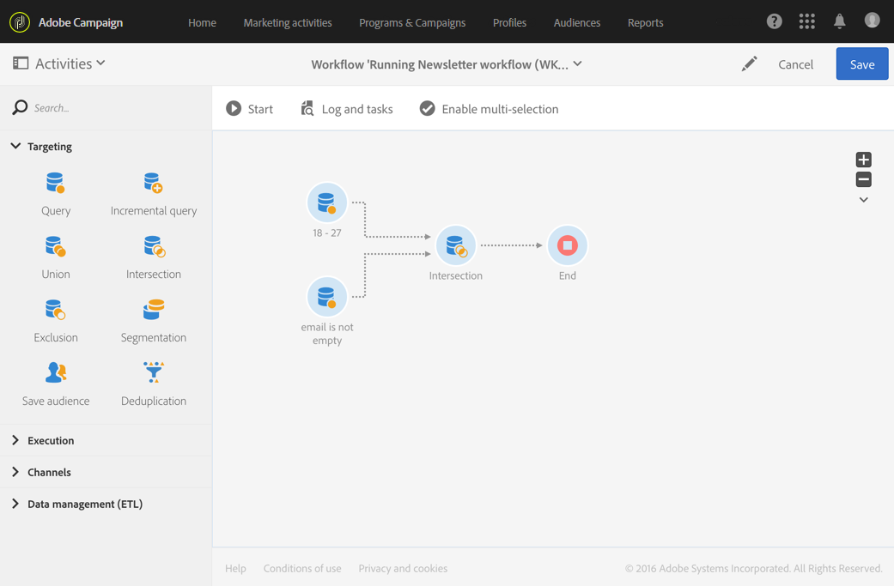

# Intersection{#intersection}

## Description {#description}

The **[!UICONTROL Intersection]** activity allows you to keep only the elements common to the different inbound populations in the activity.

## Context of use {#context-of-use}

The **[!UICONTROL Intersection]** activity is generally used to carry out additional filtering on populations from inbound transitions.

## Configuration {#configuration}

1. Drag and drop an **[!UICONTROL Intersection]** activity into your workflow.
1. Connect it to the other activities that come before it, such as queries.
1. Select the activity, then open it using the  button from the quick actions that appear.
1. Select the **[!UICONTROL Reconciliation type]**:

    * **[!UICONTROL Keys only]**: Default mode. The activity only keeps one element when elements from the different inbound transitions have the same key.
    * **[!UICONTROL All shared columns]**: The data is reconciled on the basis of columns in common with the inbound transitions. Therefore, you have to select the primary set that will serve as a basis for comparison. This option can be used if the inbound population targeting dimensions are different.
    * **[!UICONTROL A selection of columns]**: Select this option to define the list of columns on which the data reconciliation will be applied. You must first select the primary set (the one which contains the source data), then specify the fields to use for the join.

1. Check the **[!UICONTROL Use common additional data only]** box if you would like to keep only the additional data that is in all inbound transitions.
1. If needed, manage the activity's [Transitions](../../automating/using/activity-properties.md) to access the advanced options for the outbound population.
1. Confirm the configuration of your activity and save your workflow.

## Example {#example}

The following example shows the intersection between two query activities. It is being used here to look into the Adobe Campaign database and retrieve profiles who are between 18 to 27 years old and profiles whose email address has been provided respectively.

