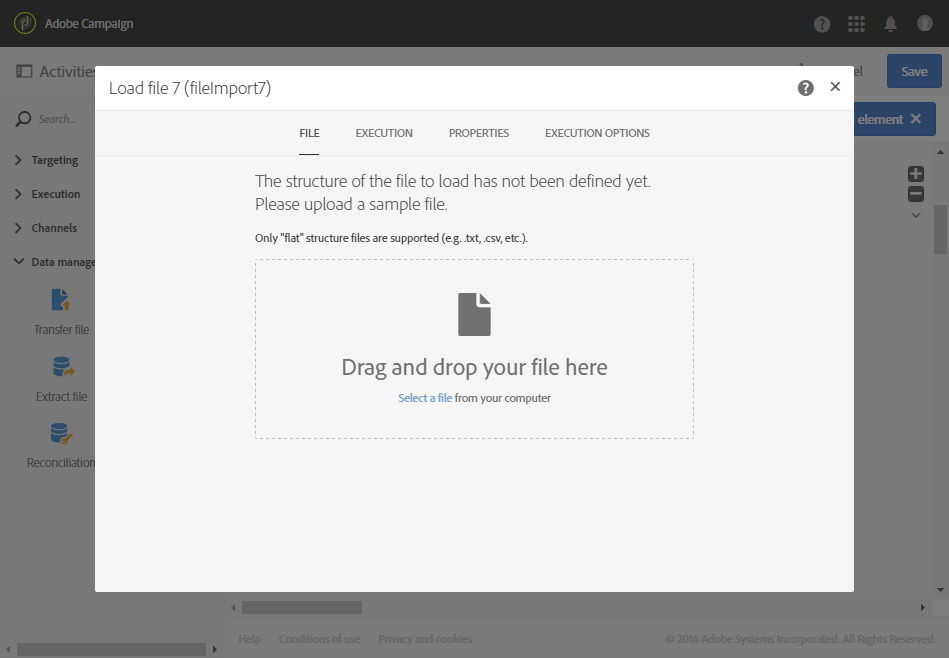
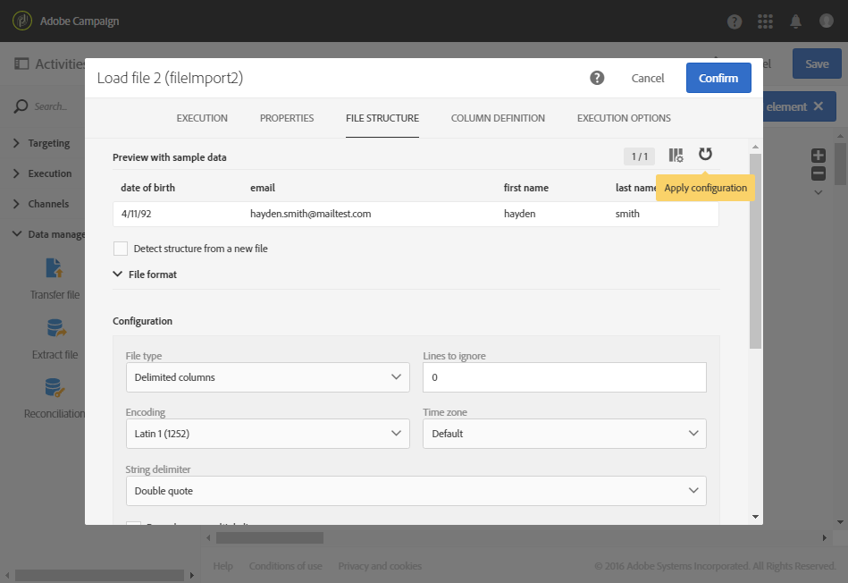
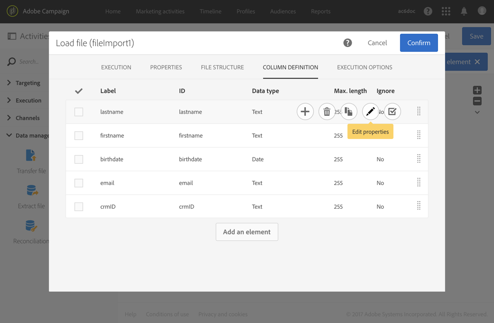
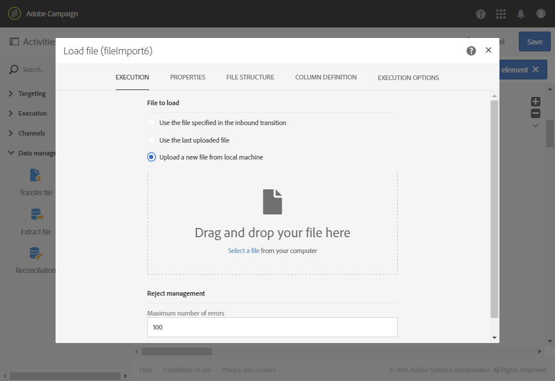

# Load file{#load-file}

Load file

## Description {#description}

The **Load file** activity allows you to import data in one structured form to use this data in Adobe Campaign. The data is temporarily imported and another activity is necessary to definitively integrate it in the Adobe Campaign database.

## Context of use {#context-of-use}

The way in which the data will be extracted is defined when the activity is configured. The file to load may be a list of contacts, for example.

>[!CAUTION]
>
>Only the "flat" structure files are taken into account, such as the .txt, .csv, etc., files for example.

You can:

* Use the file structure to apply it to another file's data (recovered using the **Transfer file** activity) or,
* Use the structure and data from the file to import it into Adobe Campaign.

## Configuration {#configuration}

The activity configuration involves two steps. First, you need to define the expected file structure by uploading a sample file. Once this is done, you can specify the origin of the file whose data will be imported.

>[!NOTE]
>
>The data of the sample file is used for configuring the activity but is not imported. We recommend using a sample file containing little data.

1. Drag and drop a **Load file** activity into your workflow.
1. Select the activity, then open it using the  

   button from the quick actions that appear.
1. Upload the sample file that will let you define the expected structure when importing the final file.

   

   Once the data file is uploaded, two new tabs appear in the activity: **File structure** and **Column definition**.

1. Go to the **File structure** tab to view the structure that is automatically detected from the sample file.

   If the file structure was incorrectly detected, you have several options to correct any possible errors:

    * You can choose to use the structure of another file by selecting the **Detect structure from a new file** option.
    * You can modify the default detection parameters to adapt them to your file.

      All of the detection options necessary to correctly recover the data from the file are regrouped in **File format**. You can modify them then re-detect the structure of the last file loaded in the activity by taking into account these new settings. To do this, use the **Apply configuration** button. For example, you can specify a different column separator.

      >[!NOTE]
      >
      >This operation takes into account the last file that was loaded in the activity. If the file detected is large, the data preview will only show the first 30 lines.

      

1. Go to the **Column definition** tab to check the data format for each column and adjust the parameters if necessary.

   The **Column definition** tab allows you to precisely specify the data structure of each column in order to import data that does not contain any errors (for example, using null management) and make it match the types that are already present in the Adobe Campaign database for future operations.

   For example, you can change the label of a column, select its type (string, integer, date, etc.) or even specify error processing.

   For more information, refer to the [Column format](../../automating/using/load-file.md#column-format) section.

   

1. In the **Execution** tab, specify whether the file is to be processed for loading data:

    * Comes from an inbound transition in the workflow.
    * Is the one that you uploaded during the previous step.
    * Is a new file to upload from the local machine. The **Upload a new file from local machine** option appears if uploading a first file was already defined in the workflow. This allows you to upload another file to be processed if the current file does not suit your needs.
    
      

1. If the file that you want to load the data from is compressed into a GZIP file (.gz), select the **Decompression** option in the **Add a pre-processing step** field. This allows you to unzip the file before loading the data. This option is only available if the file comes from the activity's inbound transition.
1. The **Keep the rejects in a file** option enables you to download a file containing errors that occurred during the import, and to apply to it a post-processing stage.

   

1. Confirm the configuration of your activity and save your workflow.

## Column format {#column-format}

When you load a sample file, the column format is automatically detected with the default parameters for each data type. You can modify these default parameters in order to specify the particular processes to apply to your data, particularly when there is an error or an empty value.

To do this, select **Edit properties** from the quick actions of the column whose format you would like to define. The column format detail window will open.

You may then modify the formatting for each column.

The column formatting allows you to define the value processing of each column:

* **Ignore column**: does not process this column during data loading.
* **Data type**: specifies the type of data expected for each column.
* **Format and separators**, **Properties**: specify the properties of a text, the time, date, and numerical value format, as well as the separator specified by the column context.

    * **Maximum number of characters**: specifies the maximum number of characters for **Text** data.
    * **Letter case management**: defines whether a character case process needs to be applied for **Text** data.
    * **White space management**: specifies whether certain spaces need to be ignored in a string for **Text** data.
    * **Time format**, **Date format**: specify the format for **Date**, **Time** and **Date and time** data.
    * **Format**: allows you to define the format of numerical values for **Integer** and **Floating number** data.
    * **Separator**: defines the separator specified by the column context (thousands separator or decimal separator for numerical values, separator for dates and time) for **Date**, **Time**, **Date and time**, **Integer**, and **Floating number** data.

* **Remapping of values**: this field is only available in the column detail configuration. It lets you transform certain values when they are imported. For example, you can transform "three" into "3".
* **Error processing**: defines the behavior if an error is encountered.

    * **Ignore the value**: the value is ignored. A warning is generated in the workflow execution log.
    * **Reject the line**: the entire line is not processed.
    * **Use a default value**: replaces the value causing the error with a default value, defined in the **Default value** field.
    * **Use a default value in case the value is not remapped**: replaces the value causing the error with a default value, defined in the **Default value** field, unless a mapping was defined for the erroneous value (see the **Remapping of values** option above).
    * **Reject the line when there is no remapping value**: the entire line is not processed unless a mapping was defined for the erroneous value (see the **Remapping of values** option above).

  >[!NOTE]
  >
  >**Error processing** concerns errors regarding values in the imported file. For example, a faulty data type encountered ("four" all in letters for an "Integer" column), a string containing more characters than the maximum number authorized, a date with faulty separators, etc. However, this option does not concern errors generated by empty value management.

* **Default value**: specifies the default value according to the error processing chosen.
* **Empty value management**: specifies how to manage empty values during data loading.

    * **Generate an error for numerical fields**: generates an error for the numerical fields only, otherwise inserts a NULL value.
    * **Insert NULL in the corresponding field**: authorizes empty values. The value NULL is therefore inserted.
    * **Generate an error**: generates an error if a value is empty.

## Example {#example}

The load file activity mainly structures the data from a transfer file activity in order to integrate it into the existing data.

The following example shows the result of an automatically downloaded load file activity via a transfer file activity, followed by an update data activity. This workflow aims to enrich the Adobe Campaign database with new profiles or to update existing profiles using the data recovered from the imported file.

1. Drag and drop a **Transfer file** activity into your workflow and configure it in a way so that it recovers the file you would like.
1. Drag and drop a **Load file** activity into your workflow and place it after the **Transfer file** activity.
1. Select the activity, then open it using the  

   button from the quick actions that appear.
1. In the **File to load** section of the **Execution** tab, check the **Use the file specified in the inbound transition** option.

   

1. Configure your activity as specified earlier.
1. Drag and drop an **Update data** activity into your workflow and place it after the **Load file** activity, then configure it. Refer to [Update data](../../automating/using/update-data.md).

Once the workflow has started, the data from the uploaded file is extracted and then used to enrich the Adobe Campaign database.
