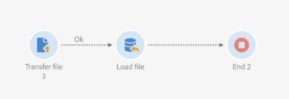
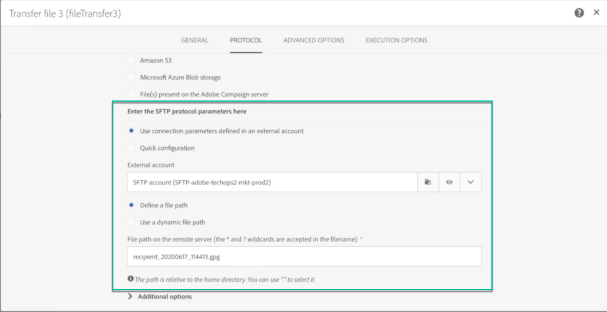
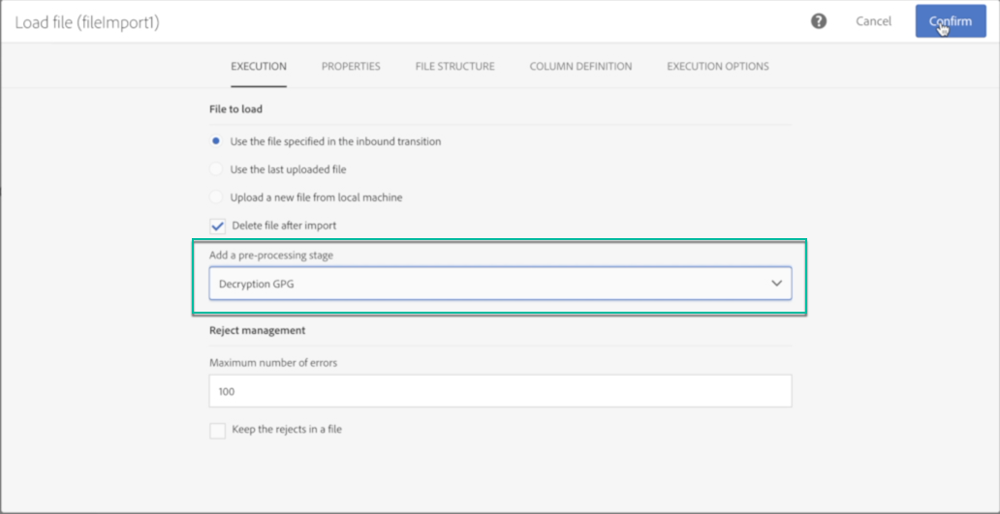
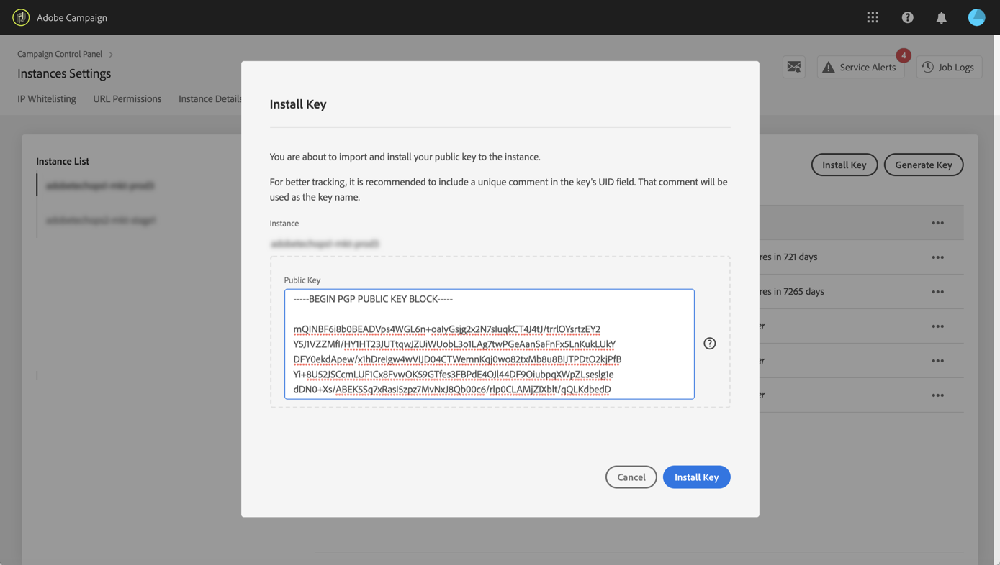
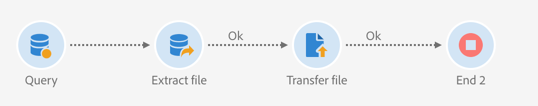
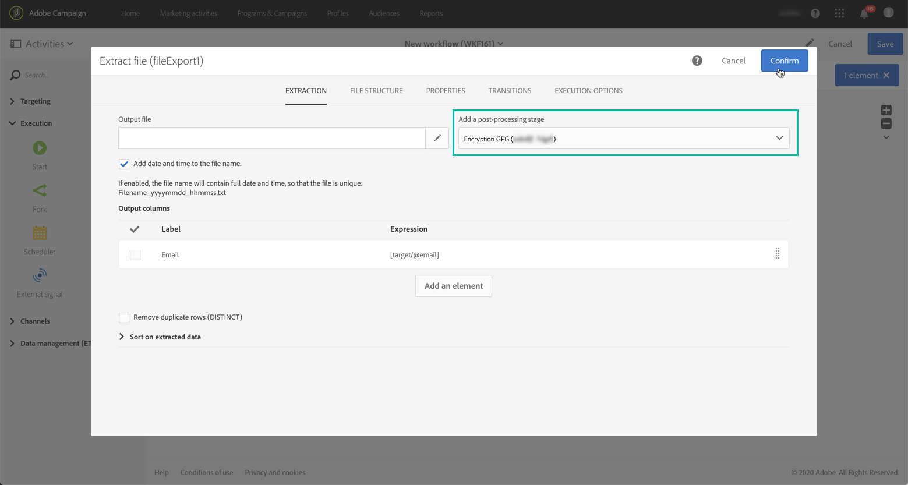
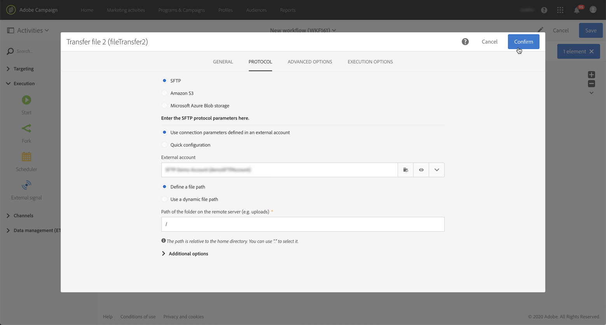

# Managing encrypted data {#managing-encrypted-data}

## About pre-processing stages {#about-preprocessing-stages}

In some cases, the data that you want to import Campaign Servers may need to be encrypted, for example if it contains PII data.

To be able to encrypt outgoing data or decrypt incoming data, you need to manage GPG keys using the [Control Panel](https://docs.adobe.com/content/help/en/control-panel/using/instances-settings/gpg-keys-management.html).

>[!NOTE]
>
>Control Panel is available to all customers hosted on AWS (excepted for customers who host their marketing instances on premise).

If you are not eligible to use Control Panel, you need to contact Adobe Customer Care so that they provide your instance with the needed encryption/decryption commands. To do this, submit a request indicating:

* The **label** that will display in Campaign interface to use the command. For example "Encrypt file".
* The **command** to install on your instance.

Once the request is processed, the encryption / decryption commands will be available in the **[!UICONTROL Pre-processing stage]** field from the **[!UICONTROL Load file]** and **[!UICONTROL Extract file]** activities. You can use them to decrypt or encrypt the files that you want to import or export.

   

**Related topics:**

* [Load file](../../automating/using/load-file.md)
* [Extract file](../../automating/using/extract-file.md)

## Use case: Importing data encrypted using a key generated by Control Panel {#use-case-gpg-decrypt}

In this use case, we will build a workflow in order to import data that has been encrypted in an external system, using a key generated in the Control Panel.

A tutorial video showing how to use a GPG key to decrypt data is also available in [this section](https://docs.adobe.com/content/help/en/campaign-standard-learn/tutorials/administrating/control-panel/gpg-key-management/decrypting-data.html).

The steps to perform this use case are as follows:

1. Use the Control Panel to generate a key pair (public/private). Detailed steps are available in [Control Panel documentation](https://docs.adobe.com/content/help/en/control-panel/using/instances-settings/gpg-keys-management.html#decrypting-data).

    * The public key will be shared with the external system, which will use it to  encrypt the data to send to Campaign.
    * The private key will be used by Campaign to decrypt the incoming encrypted data.

    

1. In the external system, use the public key downloaded from the Control Panel to encrypt the data to import into Campaign Standard.

    

1. In Campaign Standard, build a workflow to import the encrypted data and decrypt it using the private key that has been installed via the Control Panel. To do this, we will build a workflow as follows:

   

    * **[!UICONTROL Transfer file]** activity: Transfers the file from an external source to Campaign. In this example, we want to transfer the file from an SFTP server.
    * **[!UICONTROL Load file]** activity: Loads the data from the file into the database and decrypt it using the private key generated in the Control Panel.

1. Open the **[!UICONTROL Transfer file]** activity then configure it according to your needs. Global concepts on how to configure the activity are available in [this section](../../automating/using/load-file.md).

    In the **[!UICONTROL Protocol]** tab, specify details about the sftp server and the encrypted .gpg file that you want to transfer.

    

1. Open the **[!UICONTROL Load file]** activity, then configure it according to your needs. Global concepts on how to configure the activity are available in [this section](../../automating/using/load-file.md).

    Add a pre-processing stage to the activity, in order to decrypt the incoming data. To do this, select the **[!UICONTROL Decryption GPG]** option from the list.

    >[!NOTE]
    >
    >Note that you do not need to specify the private key to use to decrypt the data. The private key is stored in Control Panel, which will automatically detect the key to use to decrypt the file.

    

1. Click **[!UICONTROL OK]** to confirm the activity configuration.

1. You can now run the workflow.

## Use case: Encrypting and exporting data using a key installed on Control Panel {#use-case-gpg-encrypt}

In this use case, we will build a workflow in order to encrypt and export data using a key installed on Control Panel.

A tutorial video showing how to use a GPG key to encrypt data is also available in [this section](https://docs.adobe.com/content/help/en/campaign-standard-learn/tutorials/administrating/control-panel/gpg-key-management/using-a-gpg-key-to-encrypt-data.html).

The steps to perform this use case are as follows:

1. Generate a GPG key pair (public/private) using a GPG utility, then install the public key onto Control Panel. Detailed steps are available in [Control Panel documentation](https://docs.adobe.com/content/help/en/control-panel/using/instances-settings/gpg-keys-management.html#encrypting-data).

    

1. In Campaign Standard, build a workflow to export the data and export it using the private key that has been installed via the Control Panel. To do this, we will build a workflow as follows:

    

    * **[!UICONTROL Query]** activity: In this example, we want to execute a query to target the data from the database that we want to export.
    * **[!UICONTROL Extract file]** activity: Encrypts and extracts the data into a file.
    * **[!UICONTROL Transfer file]** activity: Transfers the file containing the encrypted data to an SFTP server.

1. Configure the **[!UICONTROL Query]** activity to target the desired data from the database. For more on this, refer to [this section](../../automating/using/query.md).

1. Open the **[!UICONTROL Extract file]** activity then configure it according to your needs (output file, columns, format, etc). Global concepts on how to configure the activity are available in [this section](../../automating/using/extract-file.md).

    Add a pre-processing stage to the activity, in order to encrypt the data to extract. To do this, select the encryption GPG key to use to encrypt the data.

    

    >[!NOTE]
    >
    >The value in parentheses is the **comment** that you defined when generating the key pair using your GPG encryption tool. Make sure you select the correct matching key, otherwise the recipient will not be able to decrypt the file.

1. Open the **[!UICONTROL Transfer file]** activity, then specify the SFTP server to which you want to send the file. Global concepts on how to configure the activity are available in [this section](../../automating/using/transfer-file.md).

    

1. You can now run the workflow. Once it is executed, data target by the query will be exported to the SFTP server into an encrypted .gpg file.

    
