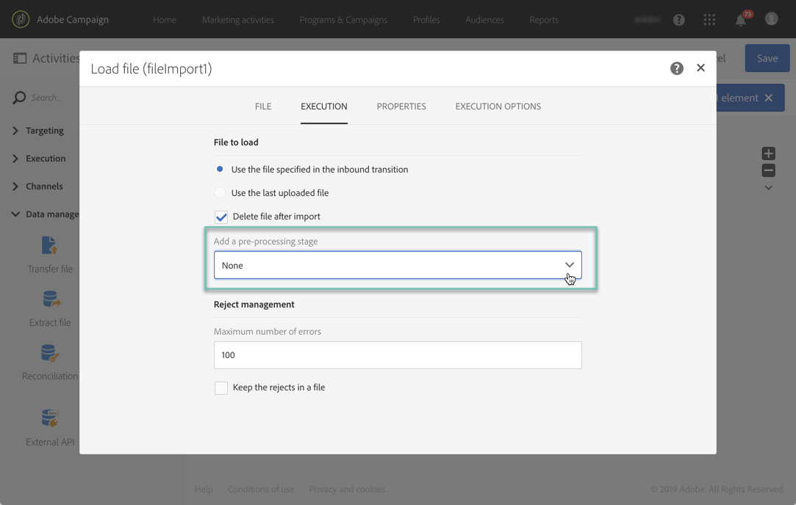

# Managing encrypted data {#managing-encrypted-data}

In some cases, the data that you want to import Campaign Servers may need to be encrypted, for example if it contains PII data.

To be able to import or export encrypted files, you first need to contact Adobe Customer Care so that they provide your instance with the needed encryption/decryption commands.

To do this, submit a request indicating:

* The **label** that will display in Campaign interface to use the command. For example "Encrypt file".
* The **command** to install on your instance.
  For example, to decrypt a file using PGP, the command will be:

  ```
  <path-to_pgp_if-not_global_or_server/>pgp.exe --decrypt --input nl6/var/vp/import/filename.pgp --passphrase "your password" --recipient recipient @email.com --verbose --output nl6/var/vp/import/filename
  ```

Once the request is processed, the encryption / decryption commands will be available in the **[!UICONTROL Pre-processing stage]** field from the **[!UICONTROL Load file]** and **[!UICONTROL Extract file]** activities. You can use them to decrypt or encrypt the files that you want to import or export.

   

**Related topics:**

* [Load file](../../automating/using/load-file.md)
* [Extract file](../../automating/using/extract-file.md)
