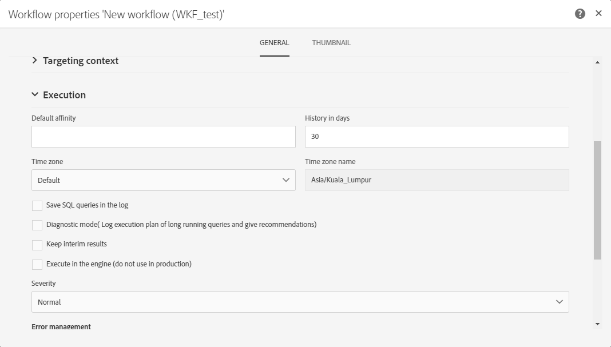
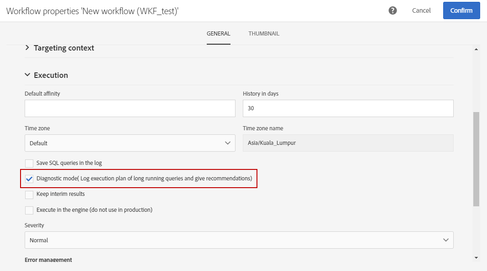
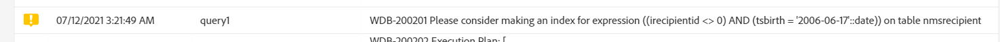
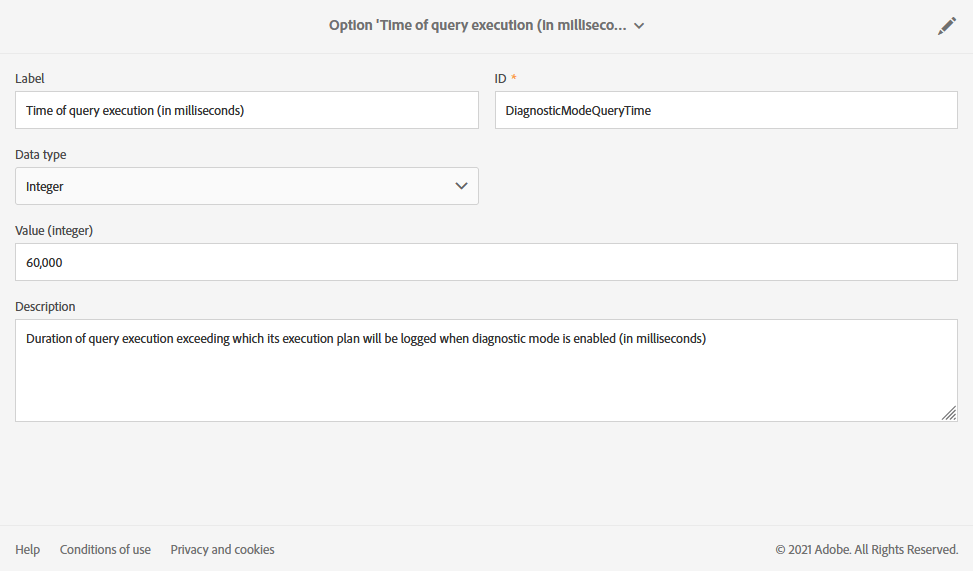
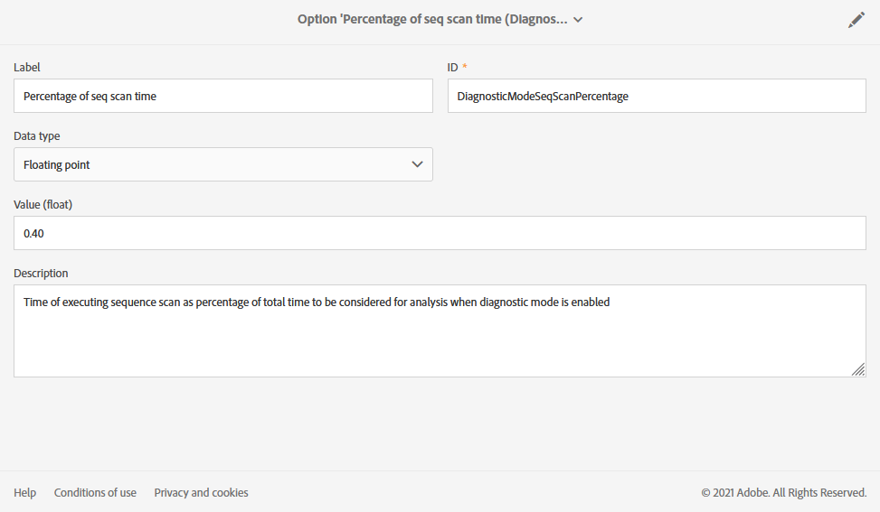

# Managing execution options {#managing-execution-options}

To modify a workflow's execution options, use the  button to access the workflow properties and select the **[!UICONTROL Execution]** section.

Possible options are:

* **[!UICONTROL Default affinity]**: this field allows you to force a workflow or a workflow activity to execute on a particular machine.

* **[!UICONTROL History in days]**: specifies the number of days after which the history must be purged. The history contains elements related to the workflow: logs, tasks, events (technical objects linked to the workflow operation), as well as files downloaded by the **[!UICONTROL Transfer file]** activity. Default value is 30 days for out-of-the-box workflow templates.

  Purge of the history is performed by the Database cleanup technical workflow, which is executed by default everyday (see [List of technical workflows](../../administration/using/technical-workflows.md).)

  >[!IMPORTANT]
  >
  >If the **[!UICONTROL History in days]** field is left blank, its value will be considered as "1", meaning that the history will purged after 1 day.

* **[!UICONTROL Save SQL queries in the log]**: allows you to save the SQL queries from the workflow into the logs.

* **[!UICONTROL Diagnostic mode (Log execution plan of long running queries and give recommendations)]**: check this option if you want the whole execution plan to be logged. It is disabled by default. 

  For more information on this option, refer to this [section](#diagnostic-mode). 

* **[!UICONTROL Keep interim results]**: check this option if you would like to be able to view the detail of transitions.
  
  >[!CAUTION]
  >
  >This option consumes a lot of disk space and is designed to help you build a workflow and ensure proper configuration and behavior. Leave it unchecked on production instances.

* **[!UICONTROL Execute in the engine (do not use in production)]**: allows you to execute the workflow locally, for development environment testing purposes.

* **[!UICONTROL Severity]**: allows you to specify a level of priority for executing workflows in your Adobe Campaign instance. This field is used by Adobe teams only for monitoring purposes.

The **[!UICONTROL Error management]** section provides additional options that allow you to manage how workflows behave in case of errors. These options are detailed in the [Error management](../../automating/using/monitoring-workflow-execution.md#error-management) section.

## Diagnostic mode {#diagnostic-mode}

When enabled, the **[!UICONTROL Diagnostic mode (Log execution plan of long running queries and give recommendations)]** option in the **[!UICONTROL Execution]** section of the workflow properties logs the whole execution plan if a query takes more than one minute.

After enabling this option and launching your workflow, if your query takes more than one minute, the execution plan will be logged.

You can then retrieve your execution plan by using an EXPLAIN ANALYZE. For more information on this, refer to [PostgreSQL documentation](https://www.postgresql.org/docs/9.4/using-explain.html).

If you have a sequence scan in this query, the **[!UICONTROL Diagnostic mode]** will also provide recommendations on how to create an index with the help of a filter expression. The following two conditions must be met during your workflow execution to trigger recommendations:

* The sequence takes more than 40% time of the query.

* The resulting rows after the sequence scan are less than 1 % of the total rows present in the table.

You can manage the option from the advanced menu by selecting **[!UICONTROL Administration]** > **[!UICONTROL Application settings]** > **[!UICONTROL Options]**:

* **[!UICONTROL Time of query execution (in milliseconds)(DiagnosticModeQueryTime)]**: From the **[!UICONTROL Value]** field, you can change the time after which the execution plan will be logged.

    

* **[!UICONTROL Percentage of seq scan time (DiagnosticModeSeqScanPercentage)]**: From the **[!UICONTROL Value]** field, you can change the percentage of Query time the sequence scan has to take for the recommendation to be generated.

    
