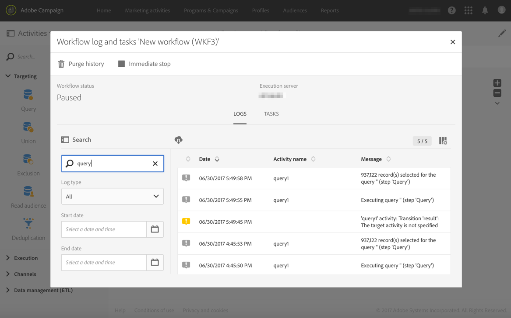
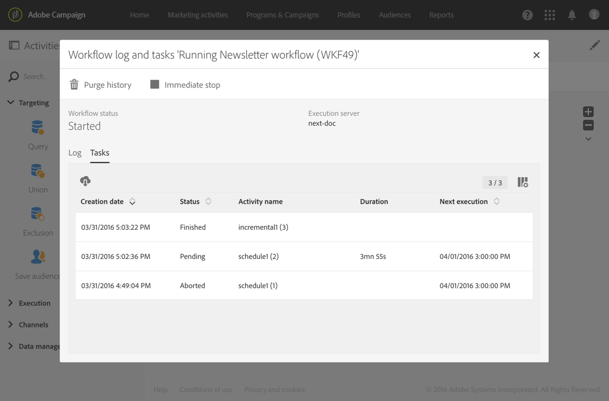
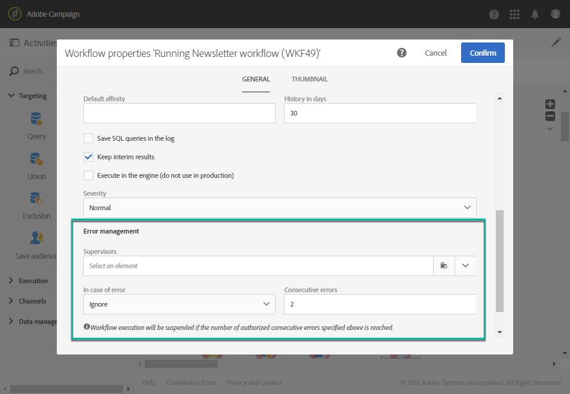

# Monitoring workflow execution {#monitoring}

## Workflow log and tasks {#workflow-log-and-tasks}

The  icon opens the workflow log and task menu.

The workflow history is saved for the duration specified in the workflow execution options (refer to [Workflow properties](#workflow-properties)). During this duration, all the messages are therefore saved, even after a restart. If you do not want to save the messages from a previous execution, you have to purge the history by clicking the  button.

The **[!UICONTROL Log]** tab contains the execution history of all the activities or any selected activities. It indexes the operations carried out and execution errors by chronological order.

The **[!UICONTROL Tasks]** tab details the execution sequencing of the activities. Click a task to get more information.

In these two lists:

* Click the counter to see the total number of activities according to the filter applied. The counter is displayed by default if the number of elements in the list is less than 30.
* The **[!UICONTROL Configure list]** button allows you to choose the information displayed, define the column order, and sort the list.
* You can use filters to find the information you need quicker. Use the search field to look for a specific text in workflow activity names (for example: "query") and logs.

## Error management {#error-management}

When an error occurs, the workflow is paused and the activity that was being executed when the error was encountered flashes red.

The workflow status turns red and the error is recorded in the log.

You can configure the workflow so that it does not pause and continues executing without any errors. To do this, go to the workflow properties via the  button and, in the **[!UICONTROL Execution]** section, select the **Ignore** option in the **In case of error** field.

In this case, the erroneous task is aborted. This mode is particularly suited to workflows designed to re-attempt the operation later (periodic actions).

>[!NOTE]
>
>You can apply this configuration individually for each activity. To do this, select an activity and open it using the quick action . Then select the error management mode in the **Execution options** tab. See [Activity execution options](../../automating/using/activity-properties.md).

In the [workflow's properties](#workflow-properties), additional options related to error management are available.

Possible options are:

* **[!UICONTROL Supervisors]**: allows you to define the group of people to notify (email and in-app notification) if the workflow encounters an error. If no group is defined, nobody will be notified. For more on Adobe Campaign notifications, refer to [Adobe Campaign notifications](../../administration/using/sending-internal-notifications.md).

* **[!UICONTROL In case of error]**: allows you to specify the action to be carried out should the activity encounter an error. There are two options available for this:
  
  * **Suspend the process**: the workflow is automatically suspended. The workflow status is then **Erroneous** and the color associated turns red. Once the problem is resolved, restart the workflow.
  * **Ignore**: the activity is not executed, and as a result neither are any of the activities that follow it (in the same branch). This may prove useful for recurring tasks. If the branch has a scheduler placed upstream, this should trigger on the next execution date.

* **[!UICONTROL Consecutive errors]** : allows you to define a number of consecutive errors that are authorized before the workflow execution is automatically suspended.

  * If the number specified is **[!UICONTROL 0]**, or as long as the number specified is not reached, activities that encounter errors are ignored. The other workflow branches are executed normally.
  
  * If the number specified is reached, the whole of the workflow is suspended and becomes **[!UICONTROL Erroneous]**. If supervisors have been defined, they are automatically notified by an email. See [Adobe Campaign notifications](../../administration/using/sending-internal-notifications.md).
