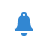
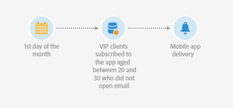
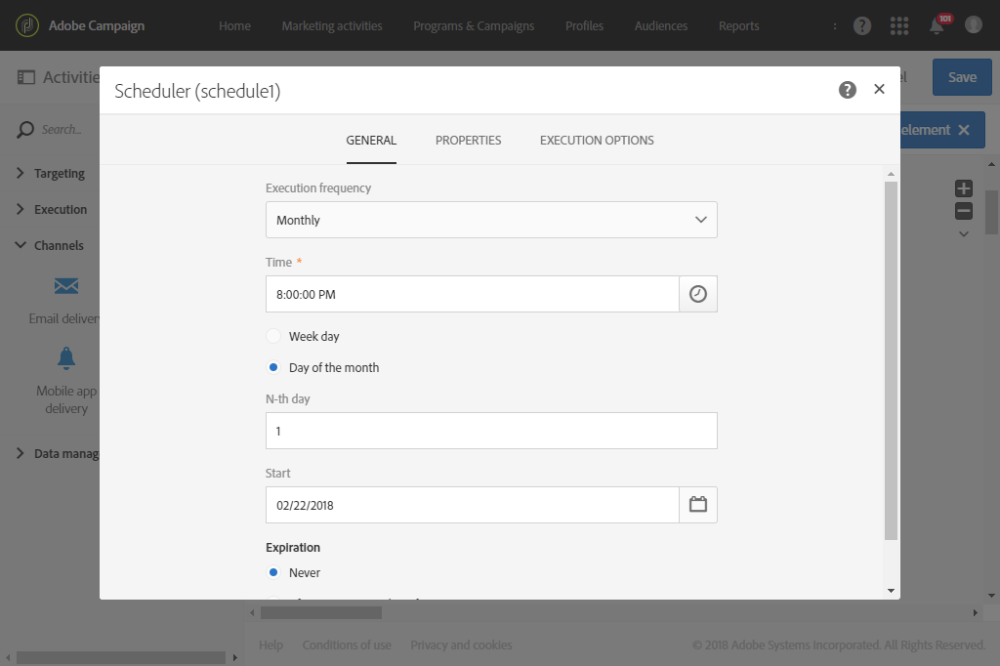
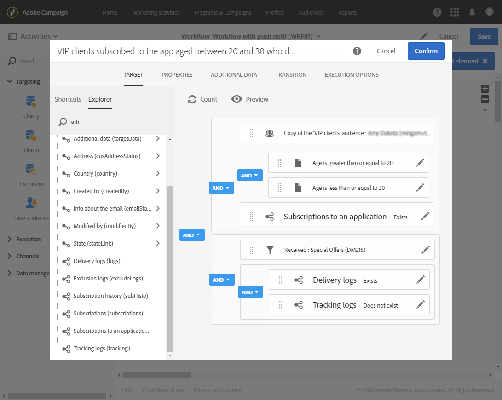

# Push notification delivery{#push-notification-delivery}

Push notification delivery

## Description {#description}

  

The **[!UICONTROL Push notification]** activity allows you to configure sending a push notification in a workflow. This can be a **single send** notification and sent just once, or it can be a **recurring** notification.

Single send notifications are standard mobile app push notification deliveries, sent once.

Recurring notifications allow you to send the same mobile app push notification delivery multiple times to different targets over a defined period. You can aggregate the deliveries per period in order to get reports that correspond to your needs.

## Context of use {#context-of-use}

The **[!UICONTROL Push notification]** activity is generally used to automate sending a notification to a target calculated in the same workflow.

When linked to a scheduler, you can define recurring push notifications.

The recipients are defined upstream of the activity in the same workflow, via targeting activities such as queries, intersections, etc.

The message preparation is triggered according to the workflow execution parameters. From the message dashboard, you can select whether to request or not a manual confirmation to send the message (required by default). You can start the workflow manually or place a scheduler activity in the workflow to automate execution.

## Configuration {#configuration}

1. Drag and drop a **[!UICONTROL Push notification]** activity into your workflow.
1. Select the activity, then open it using the  

   button from the quick actions that appear.

   >[!NOTE]
   >
   >You can access the general properties and advanced options of the activity (and not of the delivery itself) via the   button from the activity's quick actions. This button is specific to the **[!UICONTROL Push notification]** activity. The push notification's properties can be accessed via the action bar in the push dashboard.

1. Select the push notification send mode:

    * **[!UICONTROL Single notification]** : the push notification is sent a single time. You can specify here whether or not you would like to add an outbound transition to the activity. The different transition types are detailed in step 7 of this procedure.
    * **[!UICONTROL Recurring notification]** : the push notification is sent several times, according to the frequency defined in a **[!UICONTROL Scheduler]** activity. Select the aggregation period of the sends. This allows you to regroup all the sends that occur during the defined period in one single push notification that is also called **recurring execution** and can be accessed from the application's marketing activity list.

      For example, for a recurring birthday notification, that is sent daily, you can choose to aggregate the sends per month. This allows you to receive reports on your delivery on a monthly basis although the notification is sent every day.

1. Select a notification type. These types come from push notifications templates defined in the **[!UICONTROL Resources]** > **[!UICONTROL Templates]** > **[!UICONTROL Delivery templates]** menu.
1. Enter the general properties for the push notification. You can also attach it to an existing campaign. The label of the workflow's delivery activity is updated with the push notification label.
1. Define the push notification content. See [Creating a push notification](../../channels/using/preparing-and-sending-a-push-notification.md)
1. By default, the **[!UICONTROL Push notification]** activity does not include any outbound transitions. If you would like to add an outbound transition to your **[!UICONTROL Push Notification]** activity, go to the **[!UICONTROL General]** tab of the advanced activity options (  

   button in the activity's quick actions) then check one of the following options:

    * **[!UICONTROL Add outbound transition without the population]** : this lets you generate an outbound transition that contains the exact same population as the inbound transition.
    * **[!UICONTROL Add outbound transition with the population]** : this lets you generate an outbound transition containing the population to whom the notification was sent. The members of the target excluded during the delivery preparation are excluded from this transition.

1. Confirm the configuration of your activity and save your workflow.

When you reopen the activity, you are taken directly to the push notification dashboard. Only its content can be edited.

By default, starting a delivery workflow only triggers the message preparation. The sending of messages created from a workflow still needs to be confirmed after the workflow has been started. But from the message dashboard, and only if the message was created from a workflow, you can disable the **[!UICONTROL Request confirmation before sending messages]** option. By unchecking this option, messages are sent without further notice once the preparation is done.

## Remarks {#remarks}

The deliveries created within a workflow can be accessed in the application's marketing activity list. You can view the workflow's execution status using the dashboard. Links in the push notification summary pane allow you to directly access linked elements (workflow, campaign, etc.).

In the parent deliveries, which can be accessed from the marketing activity list, you can view the total number of sends that have been processed (according to the aggregation period specified when the **[!UICONTROL Push notification]** activity was configured). To do this, open the detail view of the parent delivery's **[!UICONTROL Deployment]** block by selecting  

.

## Sending a recurring push notification with a workflow {#sending-a-recurring-push-notification-with-a-workflow}

In this example, a personalized push notification is sent every first day of the month at 8 pm to the subscribers of your mobile application depending on their time zones. To do this:

1. The **[!UICONTROL Scheduler]** activity allows you to start the workflow days before the start of the delivery to be able to send the notification to every subscriber at 8 pm in any given time zone:

    * In the **[!UICONTROL Execution frequency]** field, select Monthly.
    * Select 8 pm in the **[!UICONTROL Time]** field.
    * Choose at which day the delivery will be sent every month.
    * Select a start date for your workflow, at least one day prior to the start of your delivery. Otherwise, some recipients might receive the message a day later if the selected time has already passed in their time zones.
    * In the **[!UICONTROL Execution options]** tab, select at which time zone your workflow will start in the **[!UICONTROL Time zone]** field. Here, for example, the workflow will start at 8 pm Pacific time, one week before the first day of the month to allow some time for the deliveries to be created for all applicable time zones.

   

1. The **Query** activity allows you to target your VIP customers aged between 20-30, who have subscribed to your mobile application and who did not open the email you sent:

    * Select an audience (your VIP customers) and filter on their age.
    * Drag and drop the **Subscriptions to an application** element into the workspace. Select **Exists** and select the mobile application that you want to use.
    * Select the email that you sent to your customers.
    * Drag and drop the **Delivery logs (logs)** element into the workspace and select **Exists** to target all of the customers who received the email.
    * Drag and drop the **Tracking logs (tracking)** element into the workspace and select **Does not exist** to target all of the customers who did not open the email.
    
      

1. The **Push notification** activity allows you to enter the content of your message and to select the personalization fields that you want to use:

    * Select the **[!UICONTROL Recurring notification]** option.
    * Define the push notification content. For more information on push notification content, refer to this [section](../../channels/using/preparing-and-sending-a-push-notification.md).
    * In the **[!UICONTROL Schedule]** block, select **[!UICONTROL Messages to be sent automatically on the time zone specified below]** . Here, we chose the **[!UICONTROL Time zone of the contact date]** Pacific as in the workflow **[!UICONTROL Scheduler]** .
    * In the **[!UICONTROL Optimize the sending time per recipient]** field, select **[!UICONTROL Send at the recipient's time zone]** .
    
      

1. Click the **[!UICONTROL Start]** button to start your recurring workflow.

   

Your workflow is now running. It will start at the chosen start date of the **[!UICONTROL Scheduler]** at 8 pm Pacific time, the recurring push will then be sent every first day of the month at 8 pm depending on the customers time zone.
