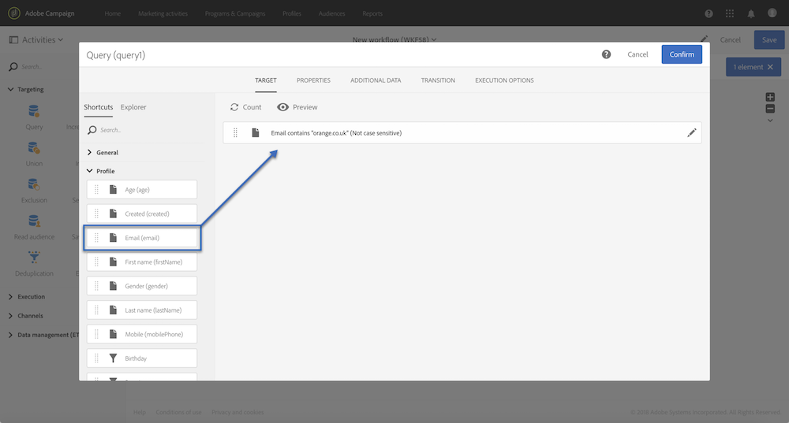
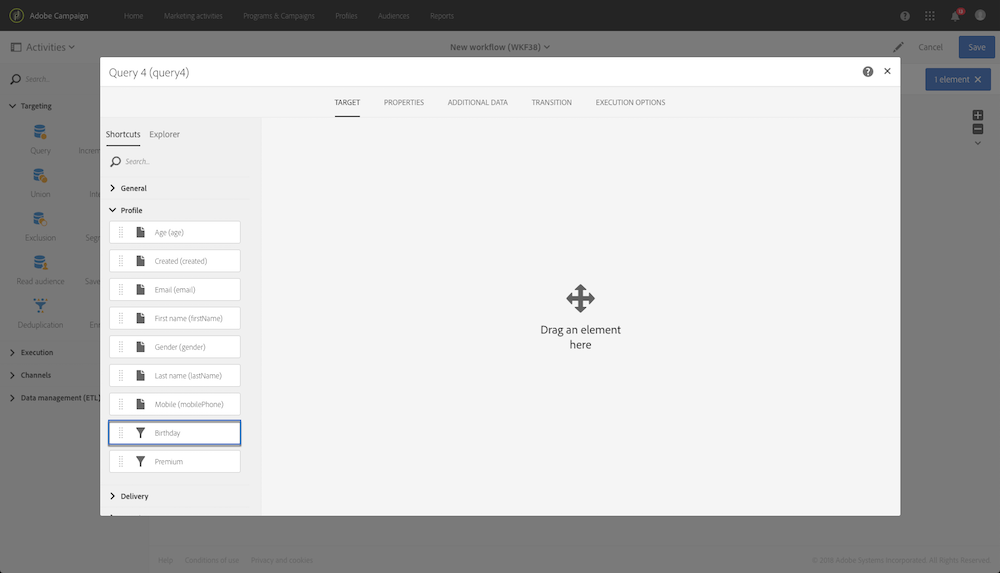
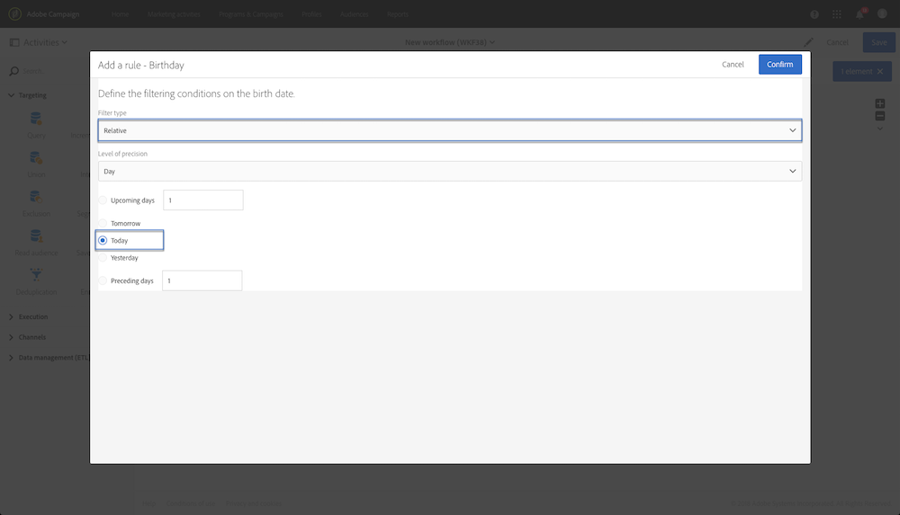
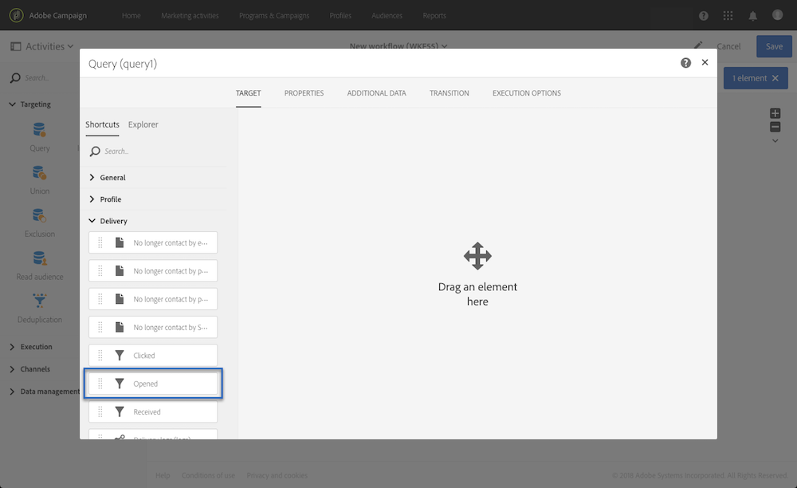
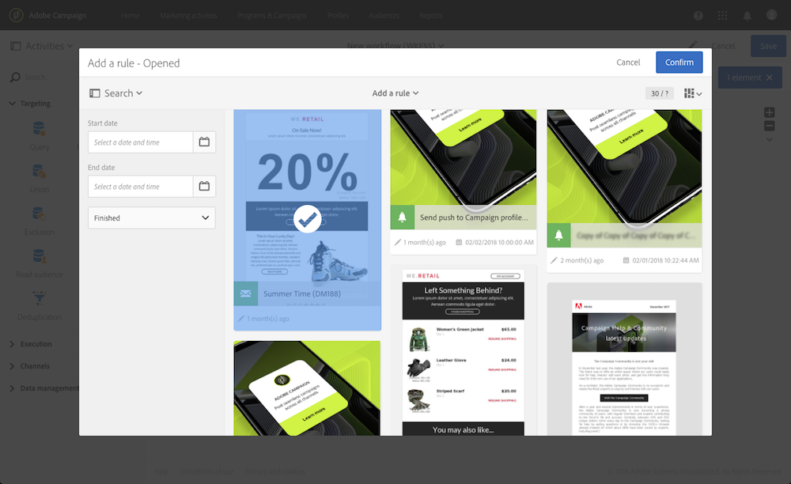
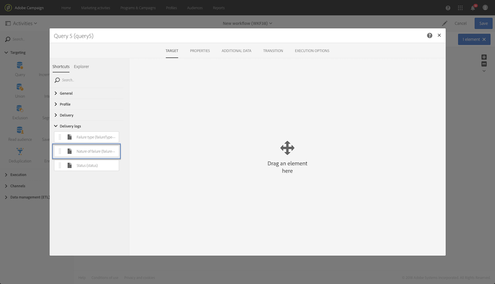
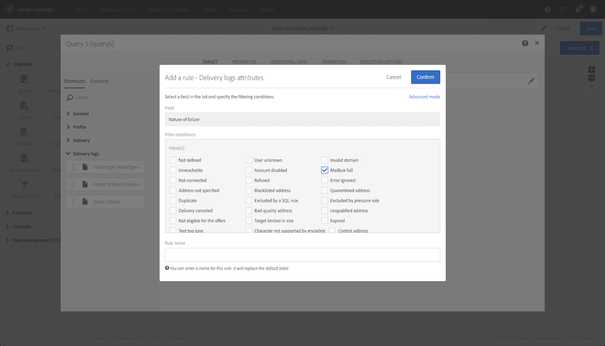
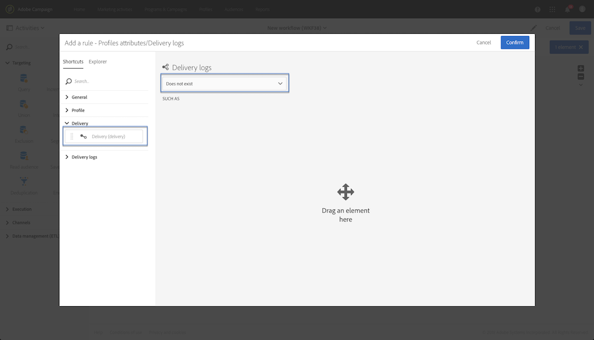
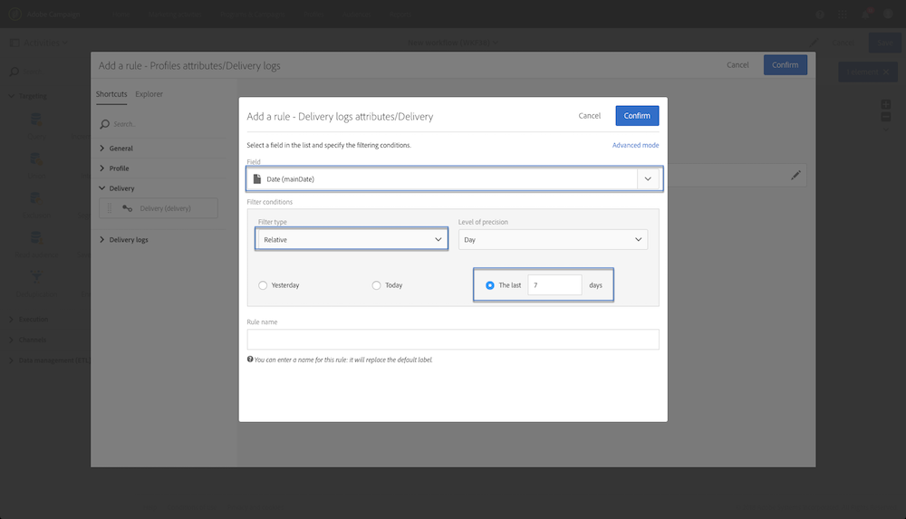

# Query samples {#query-samples}

This section presents use case when using a **[!UICONTROL Query]** activity. For more on how to use a **[!UICONTROL Query]** activity, refer to [this section](../../automating/using/query.md).

## Targeting on simple profile attributes {#targeting-on-simple-profile-attributes}

The following example shows a query activity configured to target men between 18 and 30 years old, living in London.

## Targeting on email attributes {#targeting-on-email-attributes}

The following example shows a query activity configured to target profiles with the email address domain "orange.co.uk".

The following example shows a query activity configured to target profiles whose email address has been provided. 

## Targeting profiles whose birthday is today {#targeting-profiles-whose-birthday-is-today}

The following example shows a query activity configured to target profiles whose birthday is today.

1. Drag the **[!UICONTROL Birthday]** filter in your query.

   

1. Set the **[!UICONTROL Filter type]** to **[!UICONTROL Relative]** and select **[!UICONTROL Today]**.

   

## Targeting profiles who opened a specific delivery {#targeting-profiles-who-opened-a-specific-delivery}

The following example shows a query activity configured to filter profiles who opened the delivery with the label "Summer Time".

1. Drag the **[!UICONTROL Opened]** filter in your query.

   

1. Select the delivery then click **[!UICONTROL Confirm]**.

   

## Targeting profiles for whom deliveries failed for a specific reason {#targeting-profiles-for-whom-deliveries-failed-for-a-specific-reason}

The following example shows a query activity configured to filter profiles for whom deliveries failed because their mailbox was full. This query is only available for users with administration rights and belonging to the **[!UICONTROL All (all)]** organizational units (see [this section](../../administration/using/organizational-units.md)).

1. Select the **[!UICONTROL Delivery logs]** resource in order to filter directly in the delivery log table (see [Using resources different from targeting dimensions](../../automating/using/using-resources-different-from-targeting-dimensions.md)).

   

1. Drag the **[!UICONTROL Nature of failure]** filter in your query.

   

1. Select the type of failure you want to target. In our case **[!UICONTROL Mailbox full]**.

   

## Targeting profiles not contacted during the last 7 days {#targeting-profiles-not-contacted-during-the-last-7-days}

The following example shows a query activity configured to filter profiles who where not contacted during the last 7 days.

1. Drag the **[!UICONTROL Delivery logs (logs)]** filter in your query.

   

   Select **[!UICONTROL Does not exist]** in the drop-down list, then drag the **[!UICONTROL Delivery]** filter.

   

1. Configure the filter as below.

   

## Targeting profiles who clicked a specific link {#targeting-profiles-who-clicked-a-specific-link-}

1. Drag the **[!UICONTROL Tracking logs (tracking)]** filter in your query.

   

1. Drag the **[!UICONTROL Label (urlLabel)]** filter.

   

1. In the **[!UICONTROL Value]** field, type the label that was defined when inserting the link in the delivery, then confirm.

   
