# Query{#query}

## Description {#description}

The **[!UICONTROL Query]** activity allows you to filter and extract a population of elements from the Adobe Campaign database. You can define **[!UICONTROL Additional data]** for the targeted population via a dedicated tab. This data is stored in additional columns and can only be used for the workflow in progress.

The activity uses the query editor tool. This tool is detailed in a [dedicated section](../../automating/using/editing-queries.md#about-query-editor).

**Related topics:**

* [Query samples](../../automating/using/query-samples.md)
* [Use case: Retargeting workflow sending a new delivery to non-openers](../../automating/using/workflow-cross-channel-retargeting.md)

## Context of use {#context-of-use}

The **[!UICONTROL Query]** activity can be used for various types of uses:

* Segmenting individuals to define the target of a message, audience, etc.
* Enriching data of the entire Adobe Campaign database table.
* Exporting data.

## Configuration {#configuration}

1. Drag and drop a **[!UICONTROL Query]** activity into your workflow.
1. Select the activity, then open it using the  button from the quick actions that appear. By default, the activity is pre-configured to search for profiles.
1. If you would like to run a query on a resource other than the profile resource, go to the activity's **[!UICONTROL Properties]** tab and select a **[!UICONTROL Resource]** and a **[!UICONTROL Targeting dimension]**.

   The **[!UICONTROL Resource]** allows you to refine the filters displayed in the palette whereas the **[!UICONTROL Targeting dimension]**, contextual with regard to the resource selected, corresponds to the type of population that you would like to obtain (identified profiles, deliveries, data linked to the selected resource, etc.).
   
   For more on this, refer to [Targeting dimensions and resources](#targeting-dimensions-and-resources).

1. In the **[!UICONTROL Target]** tab, run your query by defining and combining rules.

   >[!NOTE]
   >
   >When targeting an audience, note that the audience's definition is not referenced but **copied** into the query. If you make any change to the audience after it has been targeted in a query, make sure you configure the query again to take the new definition into account.

1. You can define **[!UICONTROL Additional data]** for the targeted population via a dedicated tab. This data is stored in additional columns and can only be used for the workflow in progress. In particular, you can add data from the Adobe Campaign database tables linked to the query's targeting dimension. Consult the [Enriching data](#enriching-data) section.

   >[!NOTE]
   >
   >By default, the **[!UICONTROL Remove duplicate rows (DISTINCT)]** option is checked in the **[!UICONTROL Advanced options]** of the **[!UICONTROL Additional data]** tab of the query. If the **[!UICONTROL Query]** activity contains many (from 100) additional data defined, it is recommended to uncheck this option, for performance reasons. Beware that unchecking this option can result in getting duplicates, depending on the data queried.

1. In the **[!UICONTROL Transition]** tab, the **[!UICONTROL Enable an outbound transition]** option lets you add an outbound transition after the query activity, even if it retrieves no data.

   The outbound transition's segment code can be personalized using a standard expression and events variables (see [this page](../../automating/using/customizing-workflow-external-parameters.md)).

1. Confirm the configuration of your activity and save your workflow.

## Targeting dimensions and resources {#targeting-dimensions-and-resources}

Targeting dimensions and resources let you define on which elements a query will be based to determine the target of a delivery.

They are configured in [target mappings](../../administration/using/target-mappings-in-campaign.md), and are defined when creating a workflow, in the **[!UICONTROL Properties]** tab of a Query activity.

>[!NOTE]
>
>The targeting dimension can also be defined when creating an audience (see [this section](../../audiences/using/creating-audiences.md)).

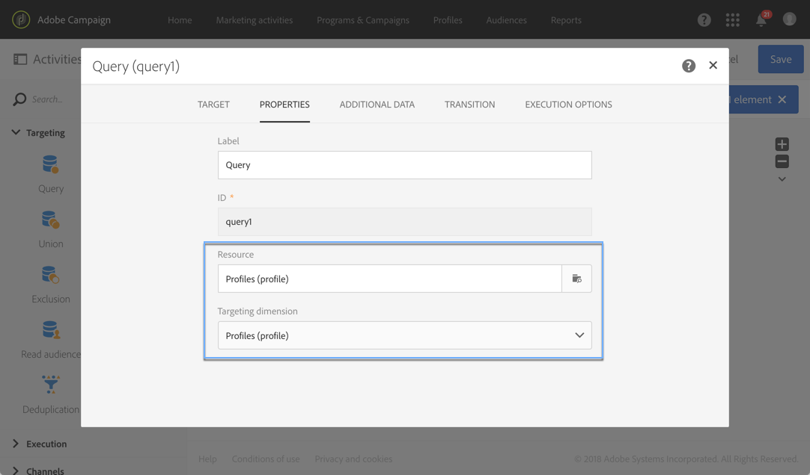

Targeting dimensions and resources are linked. The available targeting dimensions therefore depend on the selected resource.

For example, for the Resource **[!UICONTROL Profiles (profile)]**, the following targeting dimensions will be available: 

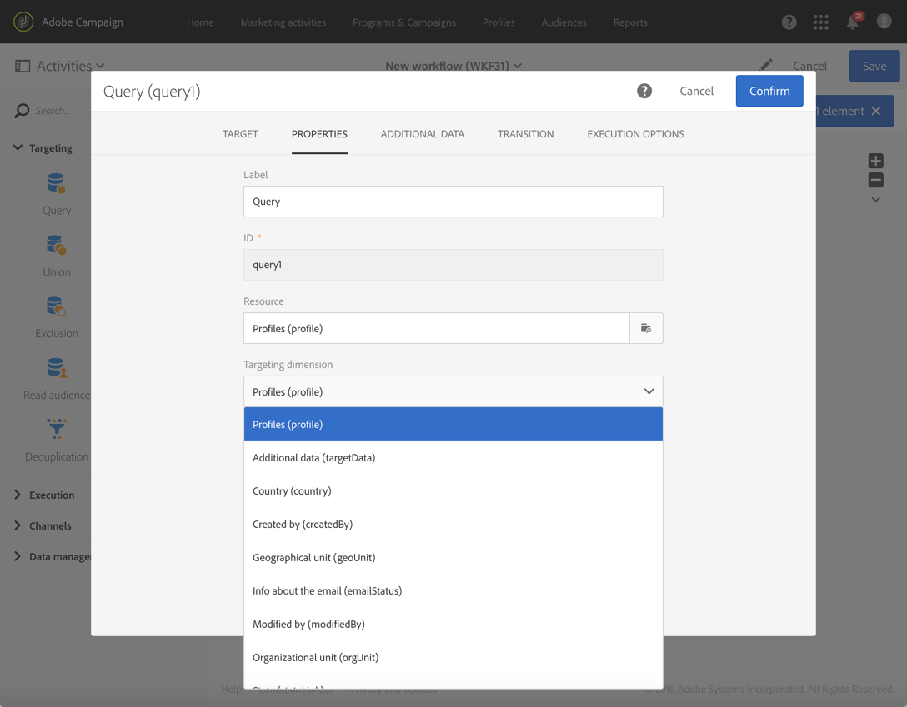

While for **[!UICONTROL Deliveries (delivery)]**, the list will contain the following targeting dimensions:

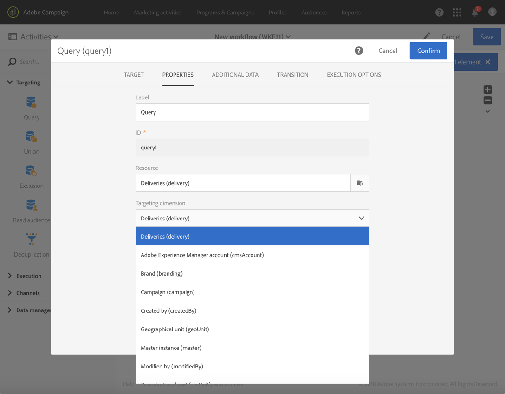

Once the targeting dimension and resource are specified, different filters are available in the query.

Example of available filters for the **[!UICONTROL Profiles (profile)]** resource: 

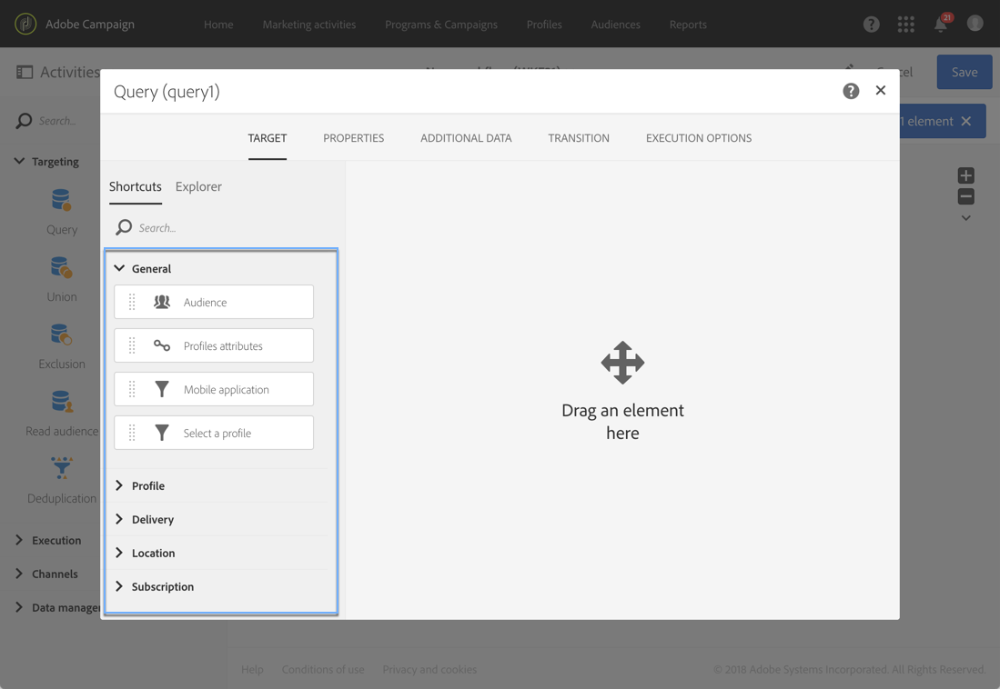

Example of available filters for the **[!UICONTROL Deliveries (delivery)]** resource: 

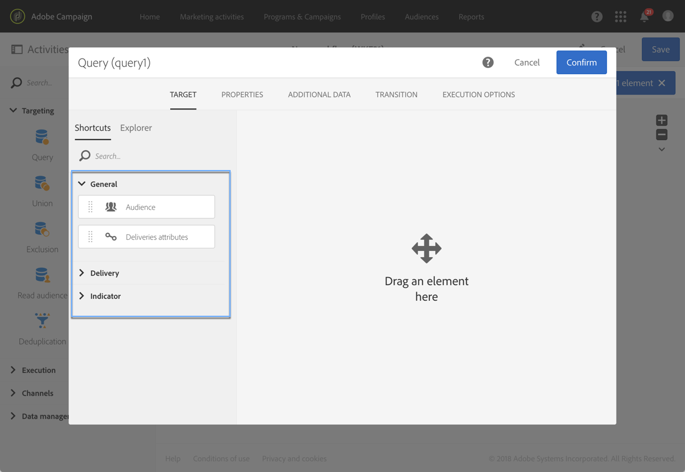

By default, the targeting dimension and resource are set in order to target profiles. However, it may be useful to use a different resource from the targeting dimension if you want to look up for a specific record in a distant table.

For more on this, refer to this use case: [Using resources different from targeting dimensions](../../automating/using/using-resources-different-from-targeting-dimensions.md)

## Enriching data {#enriching-data}

The **[!UICONTROL Additional data]** tab of the **[!UICONTROL Query]**, **[!UICONTROL Incremental query]** and **[!UICONTROL Enrichment]** activities allows you to enrich the data targeted and transfer this data to the following workflow activities, where it can be utilized. In particular, you can add:

* Simple data
* Aggregates
* Collections

For aggregates and collections, an **[!UICONTROL Alias]** is automatically defined to give a technical ID to a complex expression. This alias, which must be unique, allows the aggregates and collections to be found easily afterwards. You can modify it to give it an easily recognizable name.

>[!NOTE]
>
>The aliases must respect the following syntax rules: Only alphanumeric characters and the "_" characters are authorized. The aliases are case-sensitive. The alias must start with the "@" character. The character immediately following the "@" must not be numeric. For example: @myAlias_1 and @_1Alias are correct; whereas @myAlias#1 and @1Alias are incorrect.

After adding any additional data, you can apply an additional filter level to the data initially targeted by creating conditions based on the additional data defined.

>[!NOTE]
>
>By default, the **[!UICONTROL Remove duplicate rows (DISTINCT)]** option is checked in the **[!UICONTROL Advanced options]** of the **[!UICONTROL Additional data]** tab of the query. If the **[!UICONTROL Query]** activity contains many (from 100) additional data defined, it is recommended to uncheck this option, for performance reasons. Beware that unchecking this option can result in getting duplicates, depending on the data queried.

A use case on how to personalize an email with additional data is presented in [this section](../../automating/using/personalizing-email-with-additional-data.md).

### Adding a simple field {#adding-a-simple-field}

By adding a simple field as additional data, that field becomes directly visible in the outbound transition of the activity. This allows the user to check, for example, that the data from the query is the desired data.

1. From the **[!UICONTROL Additional data]** tab, add a new element.
1. In the window that opens, in the **[!UICONTROL Expression]** field, select one of the fields available directly in the targeting dimension or in one of the linked dimensions. You can edit expressions and use functions or simple calculations (except aggregates) from the dimension fields.

   An **[!UICONTROL Alias]** is automatically created if you edit an expression that is not a simple XPATH path (for example: "Year(<@birthDate>)"). If you like, you can modify it. If you only select one field (for example: "@age"), you do not need to define an **[!UICONTROL Alias]**.

1. Select **[!UICONTROL Add]** to confirm adding the field to the additional data. When the query is executed, an additional column corresponding to the field added will be present in the activity's outbound transition.

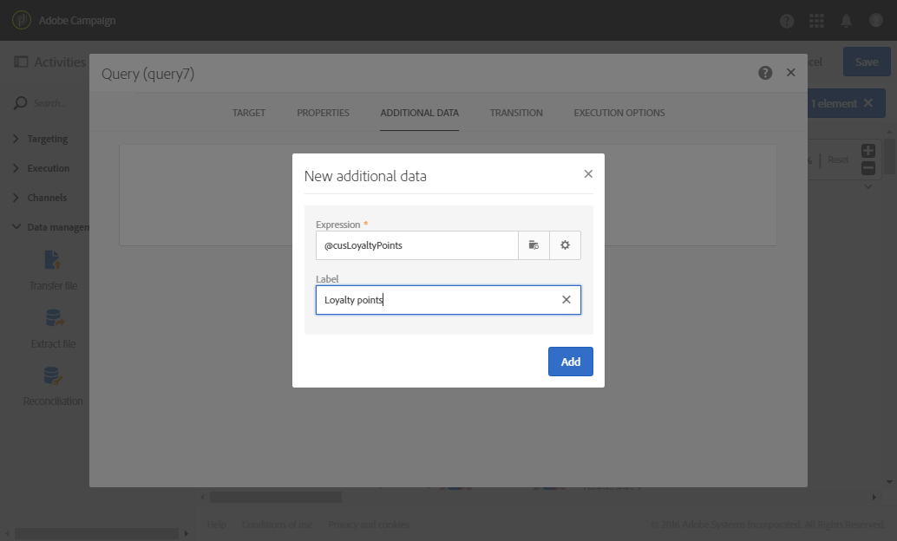

### Adding an aggregate {#adding-an-aggregate}

Aggregates allow values to be calculated from fields of the targeting dimension or from fields of dimensions linked to the targeting dimension. For example: the average amount purchased by a profile.
When using aggregate with query, its function can return to zero which is then considered as NULL. Use the **[!UICONTROL Output filtering]** tab of your query to filter the aggregated value:

* if you want zero values you should filter on **[!UICONTROL is null]**.
* if you do not want zero values filter on **[!UICONTROL is not null]**.

Note that if you need to apply sorting on your aggregate, you should filter out zero values or else the NULL value will appear as the greatest number.

1. From the **[!UICONTROL Additional data]** tab, add a new element.
1. In the window that opens, select the collection that you want to use to create your aggregate in the **[!UICONTROL Expression]** field.

   An **[!UICONTROL Alias]** is created automatically. If you like, you can modify it by going back to the query's **[!UICONTROL Additional data]** tab.

   The aggregate definition window opens.

1. Define an aggregate from the **[!UICONTROL Data]** tab. Depending on the type of aggregate selected, only the elements whose data is compatible are available in the **[!UICONTROL Expression]** field. For example, a sum can only be calculated with numerical data.

   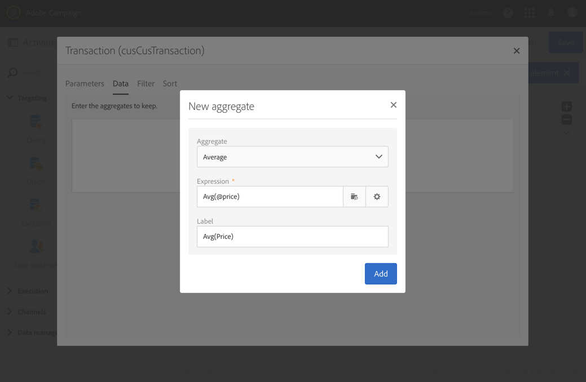

   You can add several aggregates for the fields of the collection selected. Make sure to define explicit labels to distinguish the different columns in the detail of the activity's outbound data.

   You can also change the aliases that are automatically defined for each aggregate.

   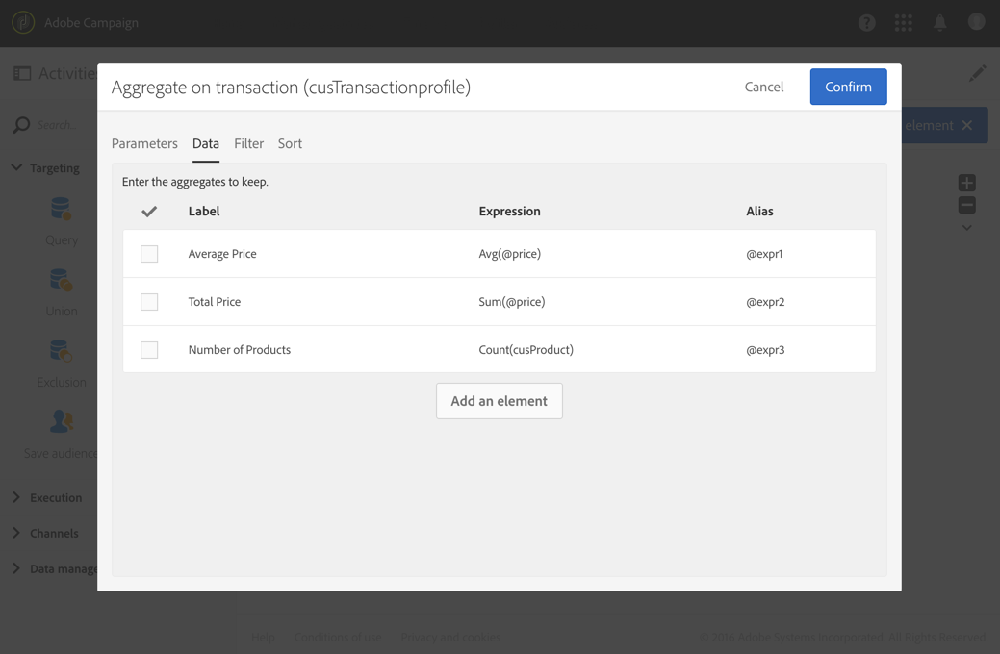

1. If needed, you can add a filter to limit the data taken into account.

   Refer to the [Filtering added data](#filtering-added-data) section.

1. Select **[!UICONTROL Confirm]** to add aggregates.

>[!NOTE]
>
>You cannot create an expression containing an aggregate directly from the **[!UICONTROL Expression]** field of the **[!UICONTROL New additional data]** window.

### Adding a collection {#adding-a-collection}

1. From the **[!UICONTROL Additional data]** tab, add a new element.
1. In the window that opens, select the collection that you want to add in the **[!UICONTROL Expression]** field. An **[!UICONTROL Alias]** is created automatically. If you like, you can modify it by going back to the query's **[!UICONTROL Additional data]** tab.
1. Select **[!UICONTROL Add]**. A new window opens, allowing you to refine the collection data that you want to display.
1. In the **[!UICONTROL Parameters]** tab, select **[!UICONTROL Collection]** and define the number of lines of the collection that you want to add. For example, if you want to get the three most recent purchases carried out by each profile, enter "3" in the **[!UICONTROL Number of lines to return]** field.

   >[!NOTE]
   >
   >You must enter a number larger than or equal to 1.

1. From the **[!UICONTROL Data]** tab, define the fields of the collection that you want to display for each line.

   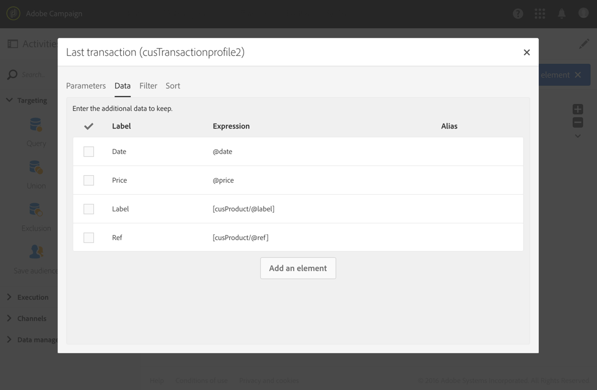

1. If you like, you can add a filter to limit the collection lines taken into account.

   Refer to the [Filtering added data](#filtering-added-data) section.

1. If you like, you can define a data sorting.

   For example, if you have selected 3 lines to return in the **[!UICONTROL Parameters]** tab, and you want to determine the three most recent purchases, you can define a descending sort on the "date" field of the collection that corresponds to the transactions.

1. Refer to the [Sorting additional data](#sorting-additional-data) section.
1. Select **[!UICONTROL Confirm]** to add the collection.

### Filtering added data {#filtering-added-data}

When you add an aggregate or a collection, you can specify an additional filter to limit the data that you want to display.

For example, if you want to only process the collection lines of transactions with amounts of 50 dollars and above, you can add a condition on the field corresponding to the transaction amount from the **[!UICONTROL Filter]** tab.

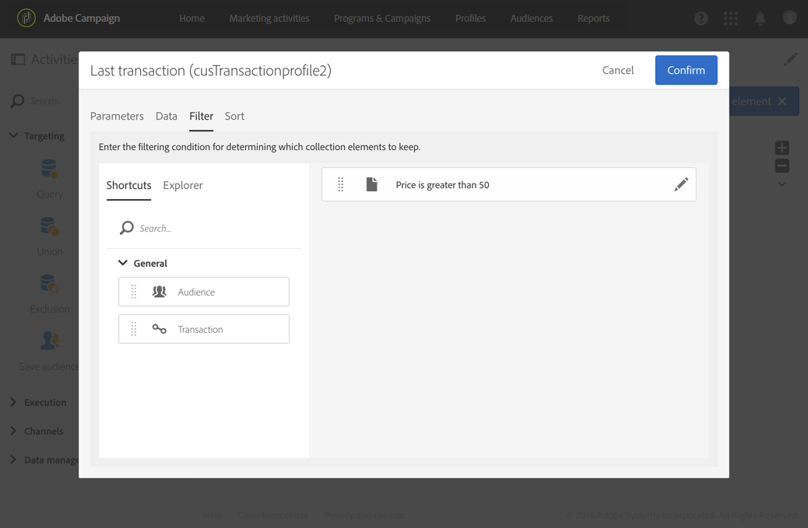

### Sorting additional data {#sorting-additional-data}

When you add an aggregate or a collection to the data of a query, you can specify whether you want to apply a sort - whether it be ascending or descending - based on the value of the field or the expression defined.

For example, if you want to save only the transaction that was carried out most recently by a profile, enter "1" in the **[!UICONTROL Number of lines to return]** field of the **[!UICONTROL Parameters]** tab, and apply a descending sort on the field corresponding to the transaction date via the **[!UICONTROL Sort]** tab.

### Filtering the targeted data according to additional data {#filtering-the-targeted-data-according-to-additional-data}

Once you have added additional data, a new **[!UICONTROL Output filtering]** tab appears in the **[!UICONTROL Query]**. This tab allows you to apply an additional filter on the data initially targeted in the **[!UICONTROL Target]** tab, by taking into account the added data.

For example, if you have targeted all of the profiles that carried out at least one transaction and an aggregate calculating the average transaction amount carried out for each profile was added to the **[!UICONTROL Additional data]**, you can refine the population initially calculated using this average.

To do this, in the **[!UICONTROL Output filtering]** tab, simply add a condition on this additional data.

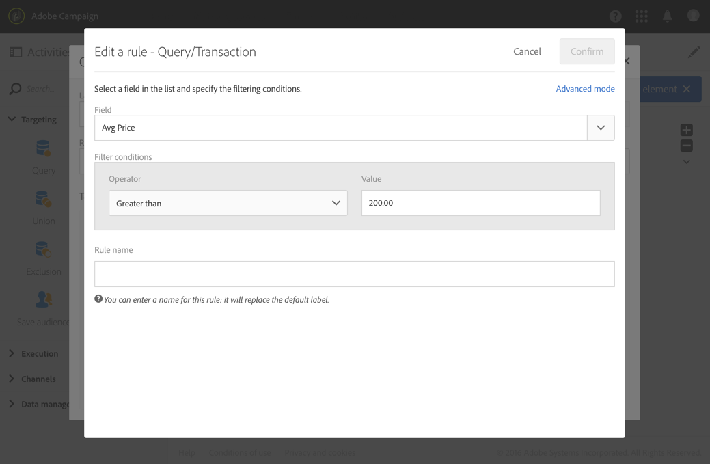

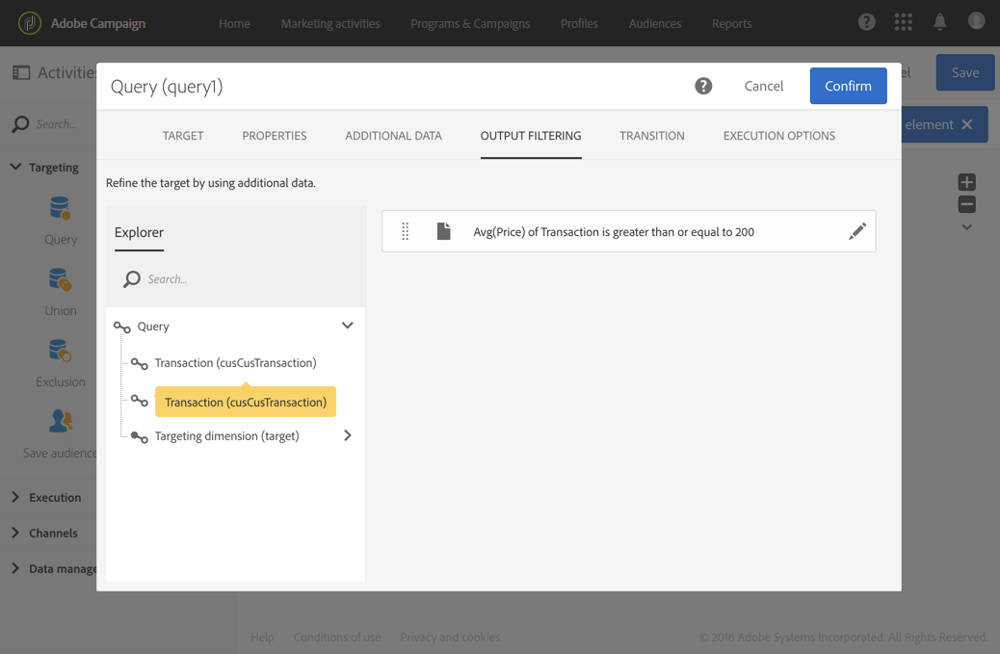
