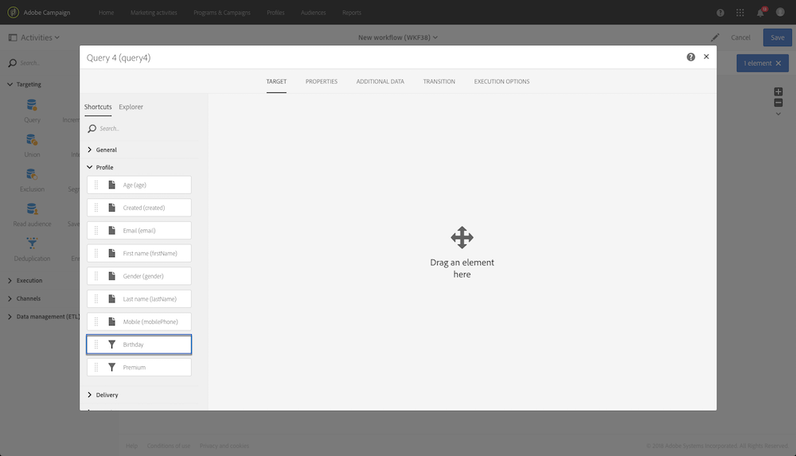

# Query{#query}

Query

## Description {#description}

The **Query** activity allows you to filter and extract a population of elements from the Adobe Campaign database. You can define **Additional data** for the targeted population via a dedicated tab. This data is stored in additional columns and can only be used for the workflow in progress.

The activity uses the query editor tool. This tool is detailed in a [dedicated section](../../automating/using/editing-queries.md#about-query-editor).

## Context of use {#context-of-use}

The **Query** activity can be used for various types of uses:

* Segmenting individuals to define the target of a message, audience, etc.
* Enriching data of the entire Adobe Campaign database table.
* Exporting data.

## Configuration {#configuration}

1. Drag and drop a **Query** activity into your workflow.
1. Select the activity, then open it using the  

   button from the quick actions that appear. By default, the activity is pre-configured to search for profiles.
1. If you would like to run a query on a resource other than the profile resource, go to the activity's **Properties** tab and select a **Resource** and a **Targeting dimension**.

   The **Resource** allows you to refine the filters displayed in the palette whereas the **Targeting dimension**, contextual with regard to the resource selected, corresponds to the type of population that you would like to obtain (identified profiles, deliveries, data linked to the selected resource, etc.).

   For more on this, refer to [Targeting dimensions and resources](../../automating/using/query.md#targeting-dimensions-and-resources)

1. In the **Target** tab, run your query by defining and combining rules.
1. You can define **Additional data** for the targeted population via a dedicated tab. This data is stored in additional columns and can only be used for the workflow in progress. In particular, you can add data from the Adobe Campaign database tables linked to the query's targeting dimension. Consult the [Enriching data](../../automating/using/query.md#enriching-data) section.

   >[!NOTE]
   >
   >By default, the **Remove duplicate rows (DISTINCT)** option is checked in the **Advanced options** of the **Additional data** tab of the query. If the **Query** activity contains many (from 100) additional data defined, it is recommended to uncheck this option, for performance reasons. Beware that unchecking this option can result in getting duplicates, depending on the data queried.

1. Confirm the configuration of your activity and save your workflow.

## Targeting dimensions and resources {#targeting-dimensions-and-resources}

Targeting dimensions and resources let you define on which elements a query will be based to determine the target of a delivery.

Targeting dimensions are defined in target mappings. For more on this, refer to [this section](../../administration/using/target-mappings-in-campaign.md).

### Defining the targeting dimension and resource of a query {#defining-the-targeting-dimension-and-resource-of-a-query}

Targeting dimension and resources are defined when creating a workflow, in the **Properties** tab of a Query activity.

>[!NOTE]
>
>The targeting dimension can also be defined when creating an audience (see [this section](../../audiences/using/creating-audiences.md)).

Targeting dimensions and resources are linked. The available targeting dimensions therefore depend on the selected resource.

For example, for the Resource **Profiles (profile)**, the following targeting dimensions will be available: 

While for **Deliveries (delivery)**, the list will contain the following targeting dimensions:

Once the targeting dimension and resource are specified, different filters are available in the query.

Example of available filters for the **Profiles (profile)** resource: 

Example of available filters for the **Deliveries (delivery)** resource: 

 

### Using resources different from targeting dimensions {#using-resources-different-from-targeting-dimensions}

By default, the targeting dimension and resource are set in order to target profiles.

However, it may be useful to use a different resource from the targeting dimension if you want to look up for a specific record in a distant table.

**Example 1: identifying profiles targeted by the delivery with the label ”Welcome back !”**.

* In this case, we want to target profiles. We will set the targeting dimension to **Profiles (profile)**.
* We want to filter the selected profiles according to the delivery label. We will therefore set the resource to **Delivery logs**. This way, we are filtering directly in the delivery log table, which will offers better performances.

  

**Example 2: identifying profiles who were not targeted by the delivery with the label “Welcome back !”**

In the previous example, we used a resource different from the targeting dimension. This operation is only possible if you want to find a record that **is present** in the distant table (delivery logs in our example).

If we want to find a record that **is not present** in the distant table (for example, profiles who were not targeted by a specific delivery), you must use the same resource and targeting dimension, as the record will not be present in the distant table (delivery logs).

* In this case, we want to target profiles. We will set the targeting dimension to **Profiles (profile)**.
* We want to filter the selected profiles according to the delivery label. It is not possible to filter directly on delivery logs as we are looking for a record not present in the delivery logs table. We will therefore set the resource to **Profile (profile)** and build our query on the profiles table.

   

## Enriching data {#enriching-data}

The **Additional data** tab of the **Query**, **Incremental query** and **Enrichment** activities allows you to enrich the data targeted and transfer this data to the following workflow activities, where it can be utilized. In particular, you can add:

* Simple data
* Aggregates
* Collections

For aggregates and collections, an **Alias** is automatically defined to give a technical ID to a complex expression. This alias, which must be unique, allows the aggregates and collections to be found easily afterwards. You can modify it to give it an easily recognizable name.

>[!NOTE]
>
>The aliases must respect the following syntax rules: Only alphanumeric characters and the "_" characters are authorized. The aliases are case-sensitive. The alias must start with the "@" character. The character immediately following the "@" must not be numeric. For example: @myAlias_1 and @_1Alias are correct; whereas @myAlias#1 and @1Alias are incorrect.

After adding any additional data, you can apply an additional filter level to the data initially targeted by creating conditions based on the additional data defined.

>[!NOTE]
>
>By default, the **Remove duplicate rows (DISTINCT)** option is checked in the **Advanced options** of the **Additional data** tab of the query. If the **Query** activity contains many (from 100) additional data defined, it is recommended to uncheck this option, for performance reasons. Beware that unchecking this option can result in getting duplicates, depending on the data queried.

### Adding a simple field {#adding-a-simple-field}

By adding a simple field as additional data, that field becomes directly visible in the outbound transition of the activity. This allows the user to check, for example, that the data from the query is the desired data.

1. From the **Additional data** tab, add a new element.
1. In the window that opens, in the **Expression** field, select one of the fields available directly in the targeting dimension or in one of the linked dimensions. You can edit expressions and use functions or simple calculations (except aggregates) from the dimension fields.

   An **Alias** is automatically created if you edit an expression that is not a simple XPATH path (for example: "Year(&lt;@birthDate&gt;)"). If you like, you can modify it. If you only select one field (for example: "@age"), you do not need to define an **Alias**.

1. Select **Add** to confirm adding the field to the additional data. When the query is executed, an additional column corresponding to the field added will be present in the activity's outbound transition.

 

### Adding an aggregate {#adding-an-aggregate}

Aggregates allow values to be calculated from fields of the targeting dimension or from fields of dimensions linked to the targeting dimension. For example: the average amount purchased by a profile.

1. From the **Additional data** tab, add a new element.
1. In the window that opens, select the collection that you want to use to create your aggregate in the **Expression** field.

   An **Alias** is created automatically. If you like, you can modify it by going back to the query's **Additional data** tab.

   The aggregate definition window opens.

1. Define an aggregate from the **Data** tab. Depending on the type of aggregate selected, only the elements whose data is compatible are available in the **Expression** field. For example, a sum can only be calculated with numerical data.

   

   You can add several aggregates for the fields of the collection selected. Make sure to define explicit labels to distinguish the different columns in the detail of the activity's outbound data.

   You can also change the aliases that are automatically defined for each aggregate.

   

1. If needed, you can add a filter to limit the data taken into account.

   Refer to the [Filtering added data](../../automating/using/query.md#filtering-added-data) section.

1. Select **Confirm** to add aggregates.

>[!NOTE]
>
>You cannot create an expression containing an aggregate directly from the **Expression** field of the **New additional data** window.

### Adding a collection {#adding-a-collection}

1. From the **Additional data** tab, add a new element.
1. In the window that opens, select the collection that you want to add in the **Expression** field. An **Alias** is created automatically. If you like, you can modify it by going back to the query's **Additional data** tab.
1. Select **Add**. A new window opens, allowing you to refine the collection data that you want to display.
1. In the **Parameters** tab, select **Collection** and define the number of lines of the collection that you want to add. For example, if you want to get the three most recent purchases carried out by each profile, enter "3" in the **Number of lines to return** field.

   >[!NOTE]
   >
   >You must enter a number larger than or equal to 1.

1. From the **Data** tab, define the fields of the collection that you want to display for each line.

   

1. If you like, you can add a filter to limit the collection lines taken into account.

   Refer to the [Filtering added data](../../automating/using/query.md#filtering-added-data) section.

1. If you like, you can define a data sorting.

   For example, if you have selected 3 lines to return in the **Parameters** tab, and you want to determine the three most recent purchases, you can define a descending sort on the "date" field of the collection that corresponds to the transactions.

1. Refer to the [Sorting additional data](../../automating/using/query.md#sorting-additional-data) section.
1. Select **Confirm** to add the collection.

### Filtering added data {#filtering-added-data}

When you add an aggregate or a collection, you can specify an additional filter to limit the data that you want to display.

For example, if you want to only process the collection lines of transactions with amounts of 50 dollars and above, you can add a condition on the field corresponding to the transaction amount from the **Filter** tab.

 

### Sorting additional data {#sorting-additional-data}

When you add an aggregate or a collection to the data of a query, you can specify whether you want to apply a sort - whether it be ascending or descending - based on the value of the field or the expression defined.

For example, if you want to save only the transaction that was carried out most recently by a profile, enter "1" in the **Number of lines to return** field of the **Parameters** tab, and apply a descending sort on the field corresponding to the transaction date via the **Sort** tab.

 

### Filtering the targeted data according to additional data {#filtering-the-targeted-data-according-to-additional-data}

Once you have added additional data, a new **Output filtering** tab appears in the **Query**. This tab allows you to apply an additional filter on the data initially targeted in the **Target** tab, by taking into account the added data.

For example, if you have targeted all of the profiles that carried out at least one transaction and an aggregate calculating the average transaction amount carried out for each profile was added to the **Additional data**, you can refine the population initially calculated using this average.

To do this, in the **Output filtering** tab, simply add a condition on this additional data.

   

### Example: personalizing an email with additional data {#example-personalizing-an-email-with-additional-data}

The following example illustrates adding different types of additional data to a query and its use as a personalization field in an email.

For this example, [custom resources](../../developing/using/data-model-concepts.md) are used:

* The **profile** resource was extended in order to add a field which allows each profile's loyalty points to be saved.
* A **transactions** resource was created and identifies all purchases carried out by the profiles in the database. The date, price, and product purchased is saved for each transaction.
* A **products** resource was created and references the products available for purchase.

The objective is to send an email to the profiles for which at least one transaction has been saved. Via this email, the clients will receive a reminder of the last transaction carried out as well as an overview of all of their transactions: the number of products purchased, total spent, a reminder of the total number of loyalty points that they have accrued.

The workflow is presented as follows:

1. Add a **Query** activity, which allows you to target the profiles that have carried out at least one transaction.

   

   From the query's **Additional data** tab, define the different data to be displayed in the final email:

    * The simple field of the **profile** dimension corresponding to the loyalty points. Refer to the [Adding a simple field](../../automating/using/query.md#adding-a-simple-field) section.
    * Two aggregates based on the transactions collection: the number of products purchased and the total amount spent. You can add them from the **Data** tab of the aggregate configuration window, using the **Count** and **Sum** aggregates. Refer to the [Adding an aggregate](../../automating/using/query.md#adding-an-aggregate) section.
    * A collection returning the amount spent, the date, and the product of the last transaction effected.

      To do this, you have to add the different fields that you want to display from the **Data** tab of the collection configuration window.

      To return only the most recent transaction, you have to enter "1" for the **Number of lines to return** and apply a descending sort on the **Date** field of the collection from the **Sort** tab.

      Refer to the [Adding a collection](../../automating/using/query.md#adding-a-collection) and [Sorting additional data](../../automating/using/query.md#sorting-additional-data) sections.

   

   If you would like to check that the data is correctly transferred by the activity's outbound transition, start the workflow for the first time (without the **Email delivery** activity) and open the query's outbound transition.

   

1. Add an **Email delivery** activity. In the email content, insert the personalization fields corresponding to the data calculated in the query. You can find it via the **Additional data (targetData)** link of the personalization fields explorer.

   

Your workflow is now ready to be executed. The profiles targeted in the query will receive a personalized email containing the data calculated from their transactions.

## Query samples {#query-samples}

### Targeting on simple profile attributes {#targeting-on-simple-profile-attributes}

The following example shows a query activity configured to target men between 18 and 30 years old, living in London.

 

### Targeting on email attributes {#targeting-on-email-attributes}

The following example shows a query activity configured to target profiles with the email address domain "orange.co.uk".

The following example shows a query activity configured to target profiles whose email address has been provided. 

 

### Targeting profiles whose birthday is today {#targeting-profiles-whose-birthday-is-today}

The following example shows a query activity configured to target profiles whose birthday is today.

1. Drag the **Birthday** filter in your query.

   

1. Set the **Filter type** to **Relative** and select **Today**.

   

### Targeting profiles who opened a specific delivery {#targeting-profiles-who-opened-a-specific-delivery}

The following example shows a query activity configured to filter profiles who opened the delivery with the label "Summer Time".

1. Drag the **Opened** filter in your query.

   

1. Select the delivery then click **Confirm**.

   

### Targeting profiles for whom deliveries failed for a specific reason {#targeting-profiles-for-whom-deliveries-failed-for-a-specific-reason}

The following example shows a query activity configured to filter profiles for whom deliveries failed because their mailbox was full. This query is only available for users with administration rights and belonging to the **All (all)** organizational and geographical units (see [this section](../../administration/using/organizational-and-geographical-units.md)).

1. Select the **Delivery logs** resource in order to filter directly in the delivery log table (see [Using resources different from targeting dimensions](../../automating/using/query.md#using-resources-different-from-targeting-dimensions)).

   

1. Drag the **Nature of failure** filter in your query.

   

1. Select the type of failure you want to target. In our case **Mailbox full**.

   

### Targeting profiles not contacted during the last 7 days {#targeting-profiles-not-contacted-during-the-last-days}

The following example shows a query activity configured to filter profiles who where not contacted during the last 7 days.

1. Drag the **Delivery logs (logs)** filter in your query.

   

   Select **Does not exist** in the drop-down list, then drag the **Delivery** filter.

   

1. Configure the filter as below.

   

### Targeting profiles who clicked a specific link {#targeting-profiles-who-clicked-a-specific-link}

1. Drag the **Tracking logs (tracking)** filter in your query.

   

1. Drag the **Label (urlLabel)** filter.

   

1. In the **Value** field, type the label that was defined when inserting the link in the delivery, then confirm.

   

