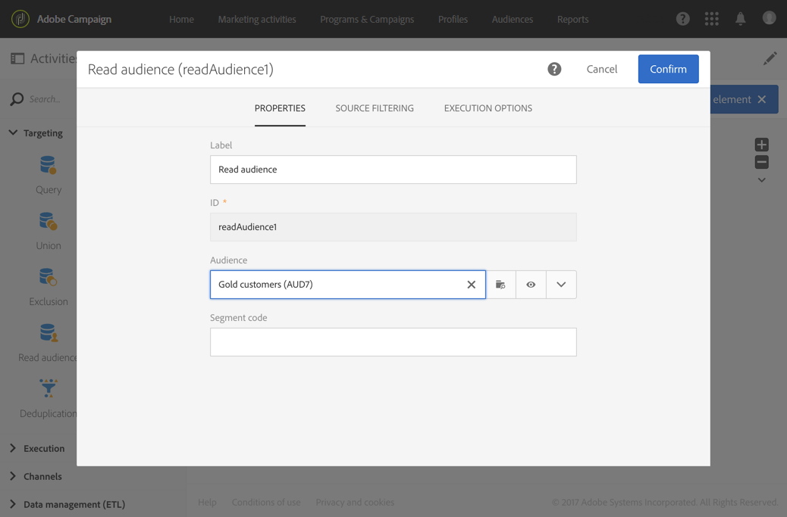
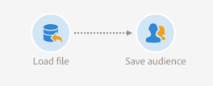
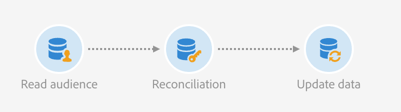
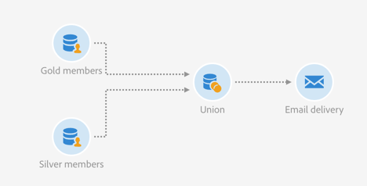

# Read audience{#read-audience}

Read audience

## Description {#description}


The **Read audience** activity allows you to retrieve an existing audience and to refine it by applying additional filtering conditions.

## Context of use {#context-of-use}

The **Read audience** activity is a simpler version of the **Query** activity designed for cases where you only need to select an existing audience.

## Configuration {#configuration}

1. Drop a **Read audience** activity into your workflow.
1. Select the activity, then open it using the  

   button from the quick actions that appear.
1. Select the audience you want to retrieve from the **Properties** tab.

   You can retrieve audiences of the following types: **List**, **Query**, **File** and **Experience Cloud**. For more information on audience types, refer to the [Audiences](../../audiences/using/about-audiences.md) documentation.

   

1. If you want to apply additional filtering to the selected audience, add conditions via the **Source filtering** tab of the activity.

   For more information about creating filtering conditions, refer to the [Creating queries](../../automating/using/editing-queries.md#creating-queries) documentation.

1. Confirm the configuration of your activity and save your workflow.

## Example: Reconcile a File audience with the database {#example-reconcile-a-file-audience-with-the-database}

This example shows how to use the **Read audience** activity to reconcile an audience directly created from a file import.

When performing a file import, you can directly save its content in an audience. This audience is a File audience and its data is not linked to any database resources.

The import workflow is designed as follows:



* A [Load file](../../automating/using/load-file.md) activity uploads a file containing profiles data that were extracted from an external tool.

  For example:

  ```
  lastname;firstname;birthdate;email;crmID
  Smith;Hayden;23/05/1989;hayden.smith@example.com;124365
  Mars;Daniel;17/11/1987;dannymars@example.com;123545
  Smith;Clara;08/02/1989;hayden.smith@example.com;124567
  Durance;Allison;15/12/1978;allison.durance@example.com;120987
  Lucassen;Jody;28/03/1988;jody.lucassen@example.com;127634
  Binder;Tom;19/01/1982;tombinder@example.com;128653
  Binder;Tommy;19/01/1915;tombinder@example.com;134576
  Connor;Jade;10/10/1979;connor.jade@example.com;132452
  Mack;Clarke;02/03/1985;clarke.mack@example.com;149876
  Ross;Timothy;04/07/1986;timross@example.com;157643
  ```

* A [Save audience](../../automating/using/save-audience.md) activity saves the incoming data as an audience. As the data has not been reconciled yet, the audience is a File audience and its data is not recognized as profile data yet.

The reconciliation workflow is designed as follows:



* A **Read audience** activity uploads the File audience created in the import workflow. The audience data is not yet reconciled with the Adobe Campaign database.
* A [Reconciliation](../../automating/using/reconciliation.md) activity identifies the incoming data as profiles through its **Identification** tab. For example by using the **email** field as reconciliation criteria.
* An [Update data](../../automating/using/update-data.md) activity inserts and updates the profiles resource of the database with the incoming data. As the data is already identified as profiles, you can select the **Directly using the targeting dimension** option and select **Profiles** in the **Identification** tab of the activity. Then, you simply have to add the list of fields that need to be updated in the according tab.

## Example: Union on two refined audiences {#example-union-on-two-refined-audiences}

The workflow defined in this example shows the union of two **Read audience** activities. The goal of this workflow is to send an email to Gold or Silver members that are between 18 and 30 years old.

Specific audiences are already created in the system to keep track of Gold and Silver members.

The workflow is designed as follows:



* A first **Read audience** activity that retrieves the Gold members audience and refines it by selecting only profiles that are between 18 and 30 years old.
* A second **Read audience** activity that retrieves the Silver members audience and refines it by selecting only profiles that are between 18 and 30 years old.
* A **Union** activity that unites populations from both **Read audiences** activities into one final population.
* An **Email delivery** activity that sends the email to the population coming from the **Union** activity.

