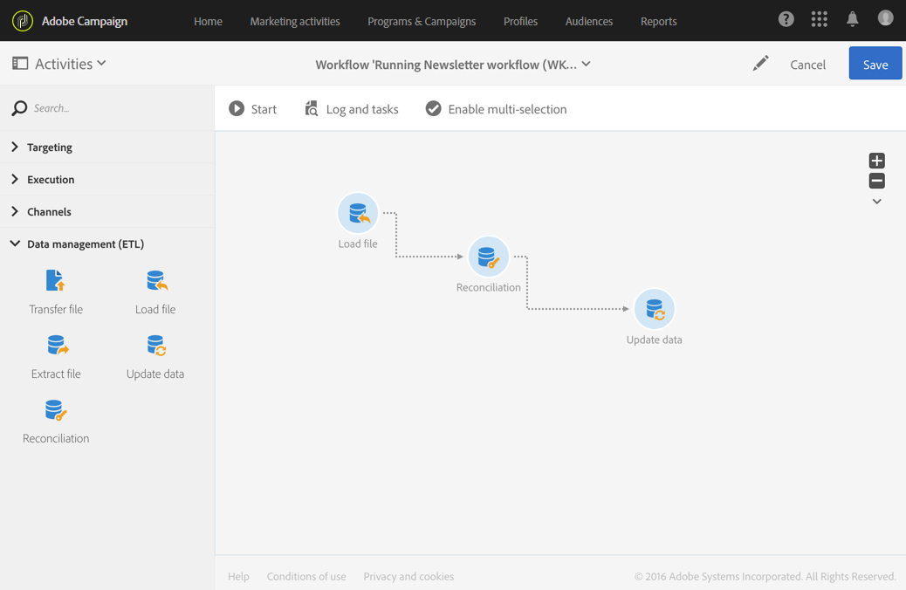
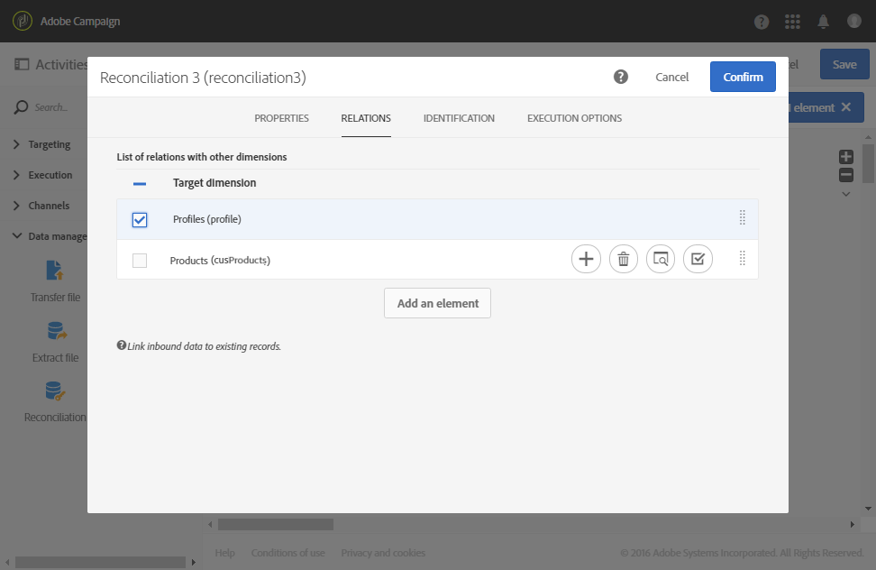
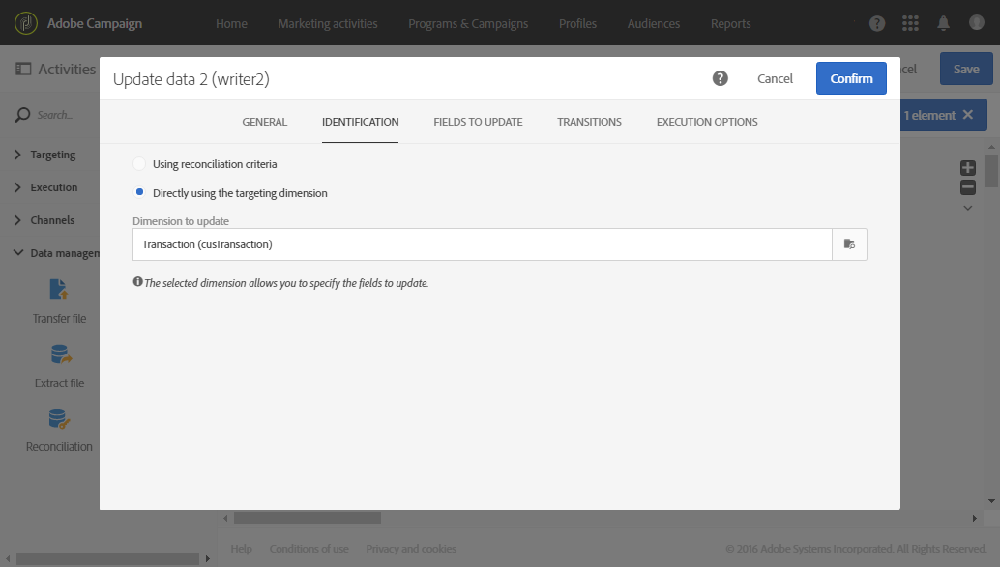
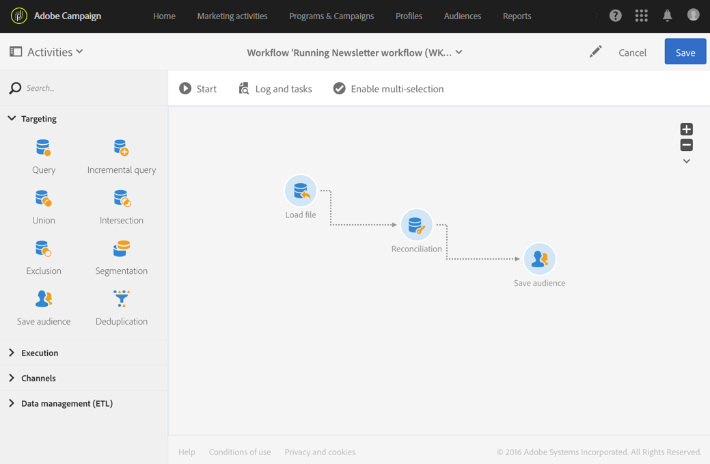
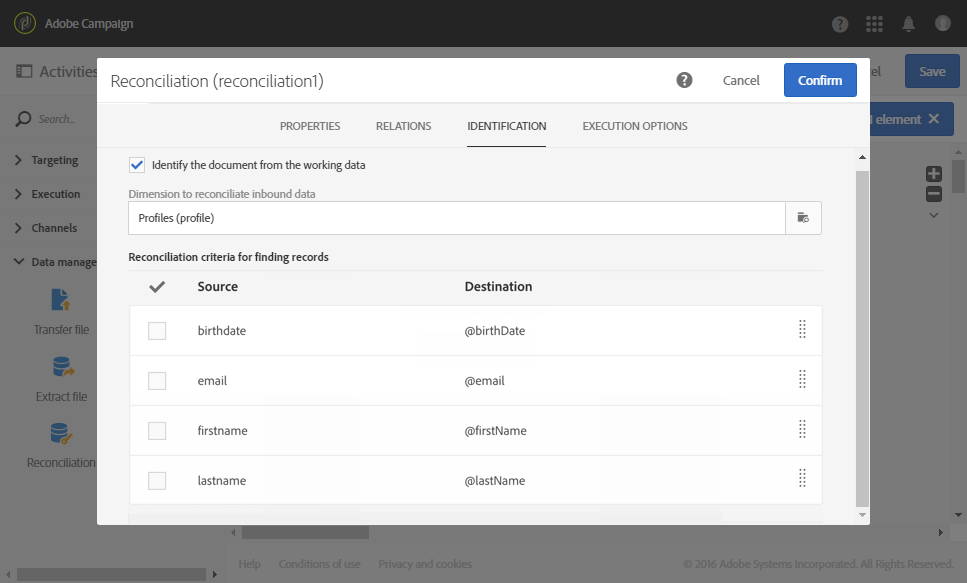
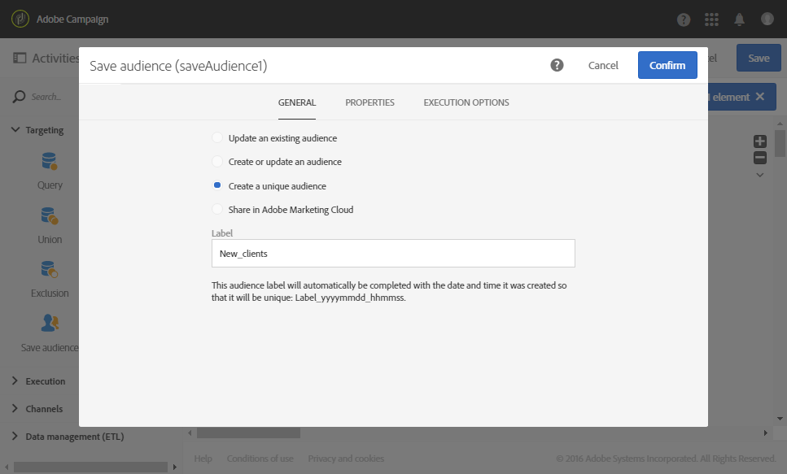

# Reconciliation{#reconciliation}

Reconciliation

## Description {#description}


The **[!UICONTROL Reconciliation]** activity allows you to link unidentified data to existing resources.

## Context of use {#context-of-use}

The **[!UICONTROL Reconciliation]** activity is essentially used for Data Management purposes and implies two different use cases:

* Adding relations: a **[!UICONTROL Links]** tab allows you to add links between the inbound data and several other Adobe Campaign database dimensions.

  For example, a file containing purchasing data may also contain information to identify the products purchased as well as the buyer. Two additional dimensions (besides that of **Purchases**) are therefore concerned by the file data: the **Products** and **Profiles** dimensions. Relations then need to be created between these and the **Purchases** dimension (refer to the following example).

  When defining a relation, a column is added to the inbound data in order to reference the foreign key of the linked dimension.

  >[!NOTE]
  >
  >This operation implies that the data of the linked dimensions are already in the database. For example, if you import a file of purchases showing which product was purchased, at what time, by which client, etc., the product as well as the client must already exist in the database.

* Data identification: an **[!UICONTROL Identification]** tab allows you to simply link inbound data to columns of an existing dimension in the Adobe Campaign database. After the activity, the data is identified as belonging to the defined dimension.

  For example, you can then perform a save audience, database update, etc.

For example, the **[!UICONTROL Reconciliation]** activity can be placed after a load data activity with the aim of importing non-standard data into the database.

## Configuration {#configuration}

1. Drag and drop a **[!UICONTROL Reconciliation]** activity into your workflow, following a transition containing a population whose targeting dimension does not directly come from Adobe Campaign. For more on this, referr to [Targeting dimensions and resources](../../automating/using/query.md#targeting-dimensions-and-resources).
1. Select the activity, then open it using the  

   button from the quick actions that appear.
1. If you would like to define links between the inbound data and other database dimensions, go to the **[!UICONTROL Links]** tab.

   Add as many relations as necessary. For each relation, first select the linked dimension, then in the link detail, specify the corresponding fields.

1. If you would like to simply identify the inbound data, go to the **[!UICONTROL Identification]** tab and check the **[!UICONTROL Identify the document from the working data]** box.

   Select the targeting dimension to which you want to reconcile the inbound data.

   Add reconciliation criteria to link an inbound transition record to a selected targeting dimension record. If several criteria are specified, they must all be verified in order for the link between all their data to work.

   Choose the **[!UICONTROL Processing unidentified source lines]** mode:

    * **[!UICONTROL Ignore them]** : only the identifiable data is kept in the activity's outbound transition.
    * **[!UICONTROL Keep in the outbound population]** : all the data from the inbound transition is kept in the activity's outbound transition.

1. Confirm the configuration of your activity and save your workflow.

## Example 1: Relation definition {#example-1--relation-definition}

The following example demonstrates a workflow that updates the database using the purchasing data in a file. The purchasing data contains data referencing elements from other dimensions, such as the client emails and product codes.

>[!NOTE]
>
>The **Transactions** and **Products** resources used in this example do not exist in the Adobe Campaign database by default. They were therefore created beforehand using the [Custom resources](../../developing/using/data-model-concepts.md) function. The profiles that correspond to the email addresses in the imported file, as well as the products, were loaded into the database beforehand.

The workflow is made up of the following activities:



* A **[!UICONTROL Load file]** activity, which loads and detects the data of the file to import. The imported file contains the following data:

    * Transaction date
    * Client email address
    * Code of product purchased

  ```
  date;client;product
  2015-05-19 09:00:00;mail1@email.com;ZZ1
  2015-05-19 09:01:00;mail2@email.com;ZZ2
  2015-05-19 09:01:01;mail3@email.com;ZZ2
  2015-05-19 09:01:02;mail4@email.com;ZZ2
  2015-05-19 09:02:00;mail5@email.com;ZZ3
  2015-05-19 09:03:00;mail6@email.com;ZZ4
  2015-05-19 09:04:00;mail7@email.com;ZZ5
  2015-05-19 09:05:00;mail8@email.com;ZZ7
  2015-05-19 09:06:00;mail9@email.com;ZZ6
  ```

* A **[!UICONTROL Reconciliation]** activity to bind purchasing data to database profiles as well as products. It is therefore necessary to define a relation between the file data and the profile table as well as the product table. This configuration is carried out in the activity's **[!UICONTROL Relations]** tab:

    * Relation with the **Profiles**: the file's **client** column is linked to the **email** field of the **Profiles** dimension.
    * Relation with the **Products**: the file's **product** column is linked to the **productCode** field of the **Profiles** dimension.

  Columns are added to the inbound data in order to reference the foreign keys of the linked dimensions.

  

* An **[!UICONTROL Update data]** activity allows you to define the database fields to update using the imported data. As the data was already identified as belonging to the **Transactions** dimension in the previous activity, here you can use the **[!UICONTROL Directly using the targeting dimension]** identification option.

  By using the option that automatically detects fields to update, the links configured in the previous activity (to profiles and products) are added to the list of **[!UICONTROL Fields to update]** . You must also make sure that the field that corresponds to the transaction date is correctly added to this list.

   

## Example 2: Identification {#example-2--identification}

The following example demonstrates a workflow that creates an audience of profiles directly from an imported file containing new clients. It is made up of the following activities:



* A **[!UICONTROL Load file]** activity, which loads and detects the data of the file to import. The imported file contains the following data:

  ```
  lastname;firstname;email;dateofbirth
  jackman;megan;megan.jackman@testmail.com;07/08/1975
  phillips;edward;phillips@testmail.com;09/03/1986
  weaver;justin;justin_w@testmail.com;11/15/1990
  martin;babeth;babeth_martin@testmail.net;11/25/1964
  reese;richard;rreese@testmail.com;02/08/1987
  cage;nathalie;cage.nathalie227@testmail.com;07/03/1989
  xiuxiu;andrea;andrea.xiuxiu@testmail.com;09/12/1992
  grimes;daryl;daryl_890@testmail.com;12/06/1979
  tycoon;tyreese;tyreese_t@testmail.net;10/08/1971
  ```

* A **[!UICONTROL Reconciliation]** activity, which links each column of the loaded file to a profile dimension column. The file records that cannot be identified (missing data, incompatible data type, etc.) are ignored to preserve the integrity of the final audience data.

  

* A **[!UICONTROL Save audience]** activity, which saves the audience of profiles.

  

