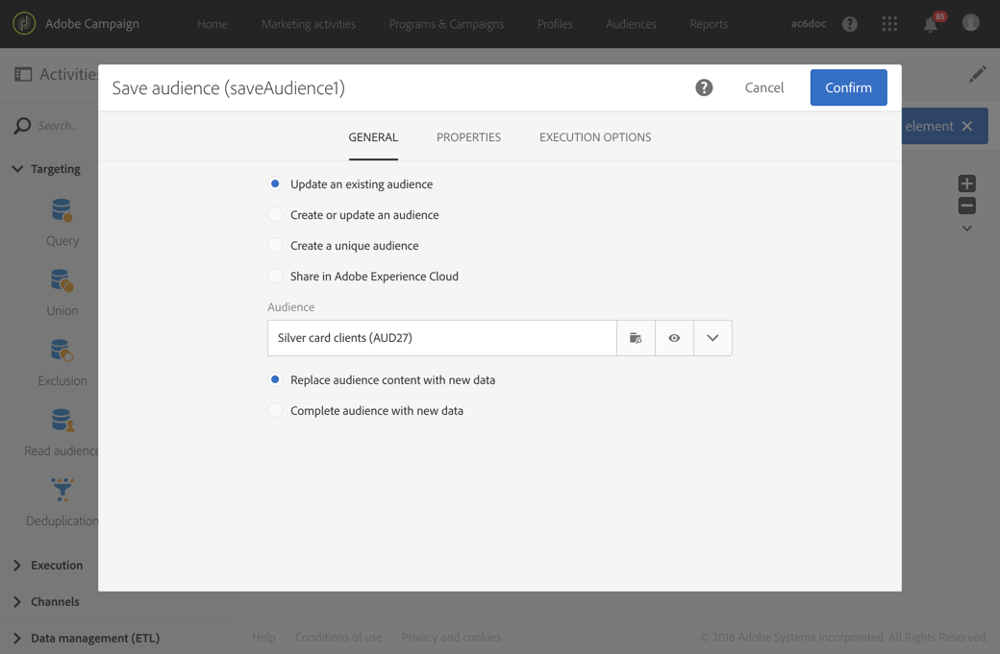

# Save audience{#save-audience}

Save audience

## Description {#description}

The **[!UICONTROL Save audience]** activity allows you to update an existing audience or create a new audience from the population computed upstream in a workflow. The audiences created or updated from this activity are **List** or **File** audiences. They are added to the list of application audiences, and are made available via the **[!UICONTROL Audiences]** menu.

>[!NOTE]
>
>If the audience created through the **[!UICONTROL Save audience]** activity has been enriched with additional data, you will not be able to use these data to personalize a standalone delivery. They can only be used from a delivery executed in a workflow.

This activity also allows you to export profiles as Adobe Experience Cloud audiences/segments. This then allows you to exploit these audiences in other Adobe Experience Cloud solutions. For more information about shared audiences, refer to [Working with Campaign and People Core Service](../../integrating/using/about-campaign-audience-manager-or-people-core-service-integration.md).

## Context of use {#context-of-use}

The **[!UICONTROL Save audience]** activity is essentially used to keep population groups computed in the same workflow, by converting them into reusable audiences.

## Configuration {#configuration}

1. Drop a **[!UICONTROL Save audience]** activity into your workflow.
1. Connect it after the other targeting activities such as a query, an intersection, a union, or an exclusion.
1. Select the activity, then open it using the  

   button from the quick actions that appear.
1. Select the action that you would like to carry out:

    * **[!UICONTROL Update an existing audience]** : Select an existing audience and choose the type of update:

        * **[!UICONTROL Replace audience content with new data]** : The whole of the audience content is replaced. The old data is lost. Only the data from the inbound transition of the save audience activity is kept.
        * **[!UICONTROL Complete audience with new data]** : The old audience data is kept and the data from the save audience activity's inbound transition is added to it.

    * **[!UICONTROL Create then update an audience]** : Enter the name of the audience and select the update type. If the audience does not already exist, then it is created. If it already exists, it is updated according the mode selected:

        * **[!UICONTROL Replace audience content with new data]** : The whole of the audience content is replaced. The old data is lost. Only the data from the inbound transition of the save audience activity is kept.

          Warning, this option erases the audience type and the targeting dimension of the updated audience.
        
        * **[!UICONTROL Complete audience with new data]** : The old audience data is kept and the data from the save audience activity's inbound transition is added to it.

          Warning, this option causes an error if the audience type or the targeting dimension of the audience updated are not compatible with the current configuration of the workflow. For example, you cannot complete a file type audience with profiles that come from a query.

    * **[!UICONTROL Create a new audience]** : Enter the name of the audience to create. The time and date the audience is created will automatically be added to the audience name. This makes the audience unique every time the workflow is executed.
    * **[!UICONTROL Share in Adobe Experience Cloud]** : If you have targeted profiles and you would like to export your audience to Adobe Experience Cloud, select this option, then select an existing shared audience or create a new audience.

      Also select a **[!UICONTROL Shared Data source]** that corresponds to the resource of the data contained in the audience so that the data is correctly reconciled in Adobe Experience Cloud.

      Using this option, the shared audience is not added to the list of Adobe Campaign audiences available via the **[!UICONTROL Audiences]** menu.

      >[!NOTE]
      >
      >This option is only available if the shared audiences functionality with Adobe Experience Cloud has been configured by your administrator. For more information, refer to [Working with Campaign and People Core Service](../../integrating/using/about-campaign-audience-manager-or-people-core-service-integration.md).

   The type of audiences saved or available during an update depends on the activities placed upstream in the workflow.

   If the targeting dimension of the audience is unknown when it is saved (for example if it is from an imported file), the audience is created or updated as a **[!UICONTROL File]** type audience.

   If the targeting dimension of the saved audience is already defined when it is saved (for example, if it comes from a targeting, after a query, etc.), then the audience is saved or updated as a **[!UICONTROL List]** type audience.

   The content of the saved audience is then available in the detail view of the audience, which can be accessed from the **[!UICONTROL Audiences]** menu. The columns available from this view correspond to the columns of the inbound transition of the workflow's save audience activity. For example: the columns of the imported file, the additional data added from a query.

1. Confirm the configuration of your activity and save your workflow.

## Example {#example}

The workflow defined in this example shows a regular audience update from targeting:

* It is automatically executed once a month using a **[!UICONTROL Scheduler]** .
* You can use a **[!UICONTROL Query]** to recover all the profiles subscribed to the different application services available.
* The **[!UICONTROL Save audience]** activity updates the audience by deleting profiles that have unsubscribed from the service since the last workflow execution and by adding the newly subscribed profiles.

The **[!UICONTROL Save audience]** activity is configured as follows:

