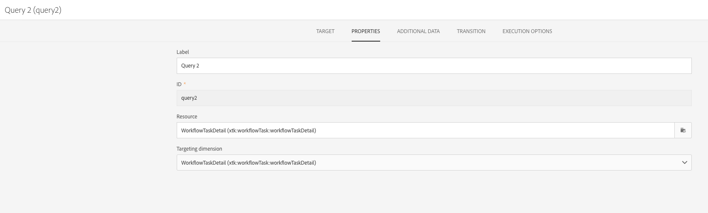
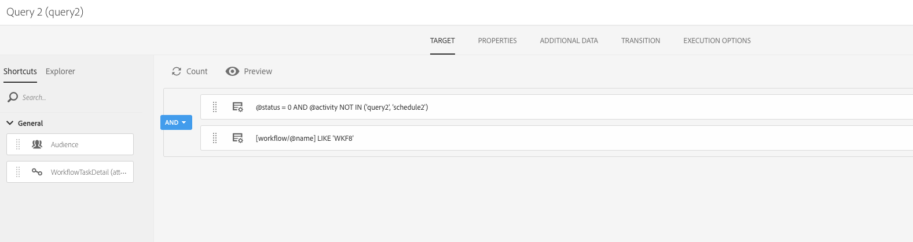
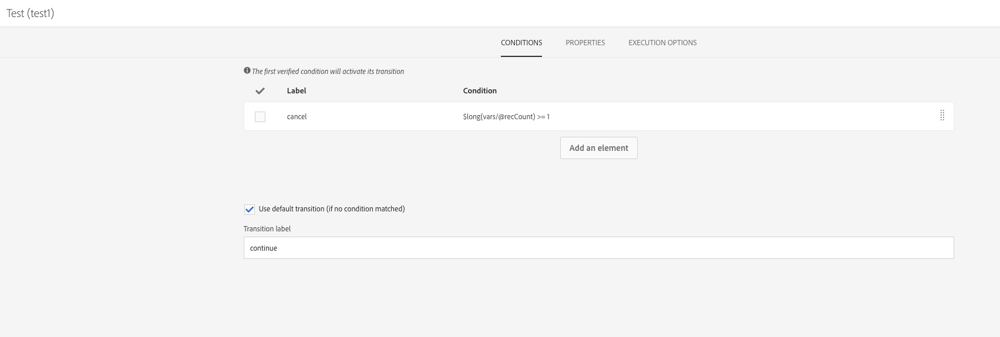
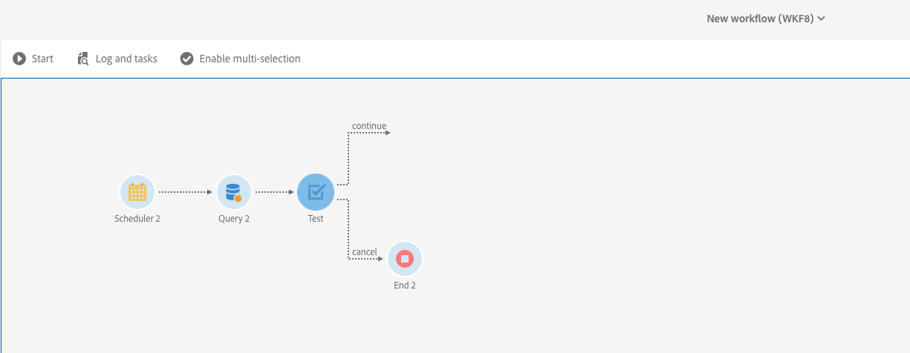

# Scheduled workflows' overlapping execution{#preventing-overlapping-execution-of-scheduled-workflows}

## About scheduled workflows execution

In Campaign Standard, the workflow engine guarantees that a workflow instance is executed by only one process (see [Architecture](../../workflow/using/architecture.md)).

Blocking activities such as imports, long running queries or writes into the database prevent the execution of any other task when running.

On the other hand, non-blocking activities do not block the execution of other tasks (usually activities waiting for an event such as the **[!UICONTROL Scheduler]**, the **[!UICONTROL Wait]** activity etc.).

This can lead to a scenario where a schedule-based workflow can start executing even when the previous run of that same workflow has not yet finished, potentially leading to unexpected data issues.

Therefore, when designing a scheduled workflow which includes multiple activities, you need to make sure that the workflow is not rescheduled until it is finished. To do this, you need to configure your workflow in order to prevent its execution if one or more tasks from a previously execution is still pending.

## Configuring the workflow

To check if one or more tasks from a previous workflow execution is still pending, you need to use a **[!UICONTROL Query]** and a **[!UICONTROL Test]** activity.

1. Add a **[!UICONTROL Query]** activity after the **[!UICONTROL Scheduler]** activity, then configure it as follows.

1. Change the activity's resource to **[!UICONTROL WorkflowTaskDetail]**, meaning it will target the workflow's current tasks.

    

1. Configure the query with the rules below:

    

    * The first rule filters out the current task (query2) as well as the next schedule task (schedule2) belonging to the current workflow.

        >[!NOTE]
        >
        >When a **[!UICONTROL Scheduler]** activity starts, it immediately adds another schedule task to run at the next scheduled time and start the workflow. Therefore, it is important to filter both the query as well as schedule tasks when looking for pending tasks from a previous execution.

    * The second rule determines whether any tasks from a previous run of the workflow are still active (pending), which corresponds to the 0 execution status.

1. Add a **[!UICONTROL Test]** activity in order to check for the number of pending tasks returned by the **[!UICONTROL Query]** activity. To do this, configure two outbound transitions.

    

    * The first transition continues the workflow execution if there are no pending tasks,
    * The second transition cancels the workflow execution if there are any pending tasks.

    

You can now configure the rest of your workflow as needed. If the workflow execution is canceled due to pending tasks, when the workflow runs again as per the schedule, it can go through these steps. This will ensure that the workflow execution will proceed only if there are no active (pending) tasks from a previous execution.
