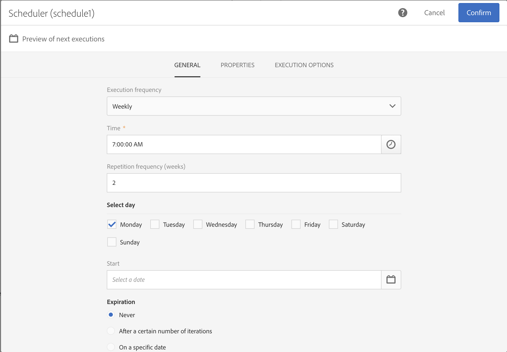

# Scheduler{#scheduler}

Scheduler

## Description {#description}

The **[!UICONTROL Scheduler]** activity allows you to schedule when a workflow or an activity is started.

## Context of use {#context-of-use}

The **[!UICONTROL Scheduler]** activity should be considered as a scheduled start. The activity positioning rules within the chart are the same as for the **[!UICONTROL Start]** activity. This activity must not have an inbound transition.

When building your workflow, only use one **[!UICONTROL Scheduler]** activity per branch and remember to set a time zone. It will be set otherwise to run at the server time zone.

>[!CAUTION]
>
>The **[!UICONTROL Repetition frequency]** of the activity cannot be less than 10 minutes. It means that a workflow cannot be automatically executed more than once every 10 minutes.

## Configuration {#configuration}

1. Drag and drop a **[!UICONTROL Scheduler]** activity into your workflow.
1. Select the activity, then open it using the  

   button from the quick actions that appear.
1. Specify the **[!UICONTROL Execution frequency]** :

    * **[!UICONTROL Once]** : the workflow is executed a single time.
    * **[!UICONTROL Several times a day]** : the workflow is regularly executed several times a day.
    * **[!UICONTROL Daily]** : the workflow is executed at a specific time, once a day.
    * **[!UICONTROL Weekly]** : the workflow is executed at a specified moment, once or several times a week.
    * **[!UICONTROL Monthly]** : the workflow is executed at a specified moment, once or several times a month.
    * **[!UICONTROL Yearly]** : the workflow is executed at a specified moment, once or several times a year.

1. Define the execution details according to the frequency selected. The detail fields may vary depending on the frequency used (time, repetition frequency, specified days, etc.).

   >[!NOTE]
   >
   >The **[!UICONTROL Repetition frequency]** field allows you to space out the times when the workflow is triggered. For example, if you select a daily execution period and the repetition frequency is set at **2** (days), the workflow will be triggered every two days. It cannot be less than 10 minutes. If the repetition frequency is set at **0** (also the default value), this option is not taken into account and the workflow will run according to the execution frequency specified.

1. Specify when the execution will expire:

    * **[!UICONTROL Never]** : the workflow will be executed, according to the frequency specified, without any limits to the time frame or number of iterations.
    * **[!UICONTROL After a certain number of iterations]** : the workflow will be executed according to the frequency specified, up until the limit of **X** is reached. The **[!UICONTROL Number of iterations]** will therefore need to be specified.
    * **[!UICONTROL On a specific date]** : the workflow will be executed according to the frequency specified, up until a specific date. The execution deadline will therefore need to be specified.

1. In the **[!UICONTROL Execution options]** tab, set up the time zone for your scheduler in the **[!UICONTROL Time zone]** field. This allows you to start your workflow at a specific time zone, otherwise the workflow will run in server time zone by default.

   For more information on sending delivery depending on the recipient's time zone, refer to this [section](../../sending/using/sending-messages-at-the-recipient-s-time-zone.md) or this [example](../../automating/using/push-notification-delivery.md#sending-a-recurring-push-notification-with-a-workflow) of a recurring workflow.

1. Confirm the configuration of your activity and save your workflow.

## Example {#example}

In the following example, the activity is configured so that it will start the workflow on a weekly basis, every other Monday at 7am, for an undetermined duration.

