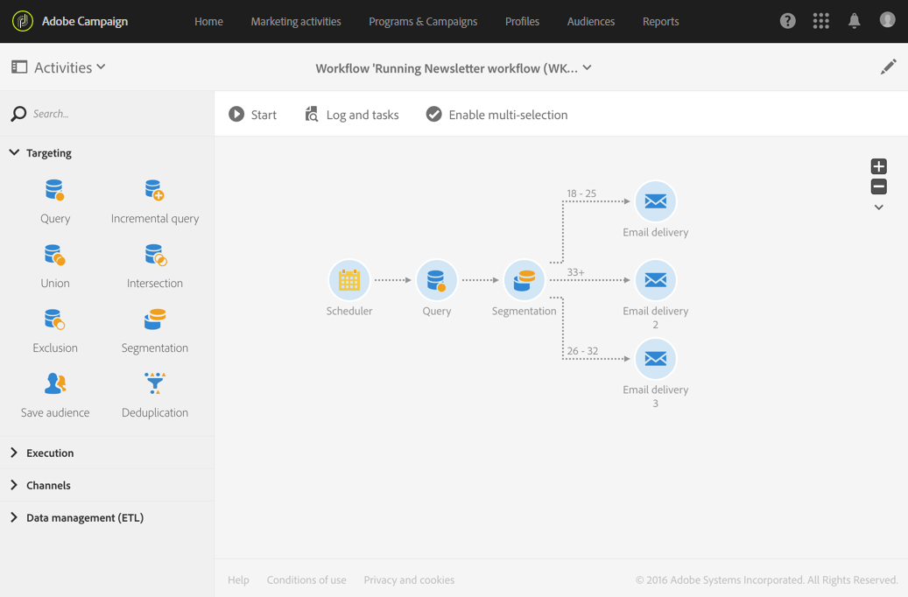
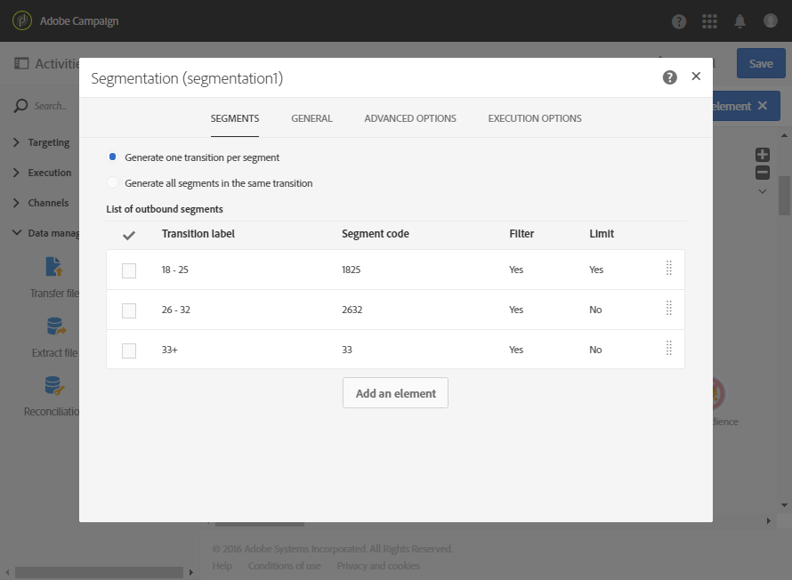
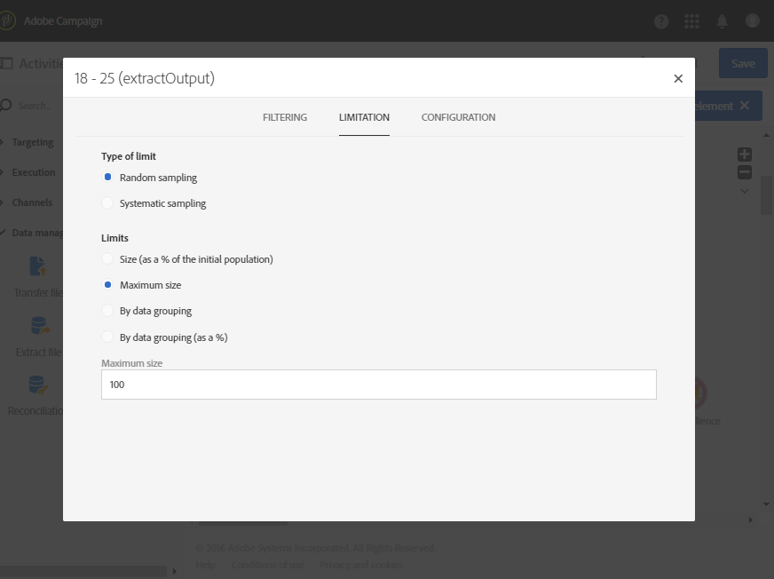

# Segmentation according to age groups {#segmentation-age-groups}

The following example shows a segmentation of database profiles according to their age group.

The aim of the workflow is to send a specific email for each age group. Considering the fact that this workflow is part of a test campaign, each segment can only contain a maximum of 100 profiles that are selected randomly in order to use audiences that are limited and representative at the same time.

The workflow is made up of the following elements:

* A [Scheduler activity](../../automating/using/segmentation.md) to specify the workflow's execution date.
* A [Query](../../automating/using/query.md) activity to target profiles of people whose birthday and email address have been entered.
* A [Segmentation](../../automating/using/segmentation.md) activity to create 3 segments divided into different outbound transitions: 18-25-year old, 26-32-year old and profiles that are over 32 years old. The segments are defined according to the following parameters:

  

    * A filter on the age to define the segment's age group

      

    * A **[!UICONTROL Random sampling]** type limit that is linked to a **[!UICONTROL Maximum size]** limit of 100

      

* An [Email delivery](../../automating/using/email-delivery.md) activity per segment.
