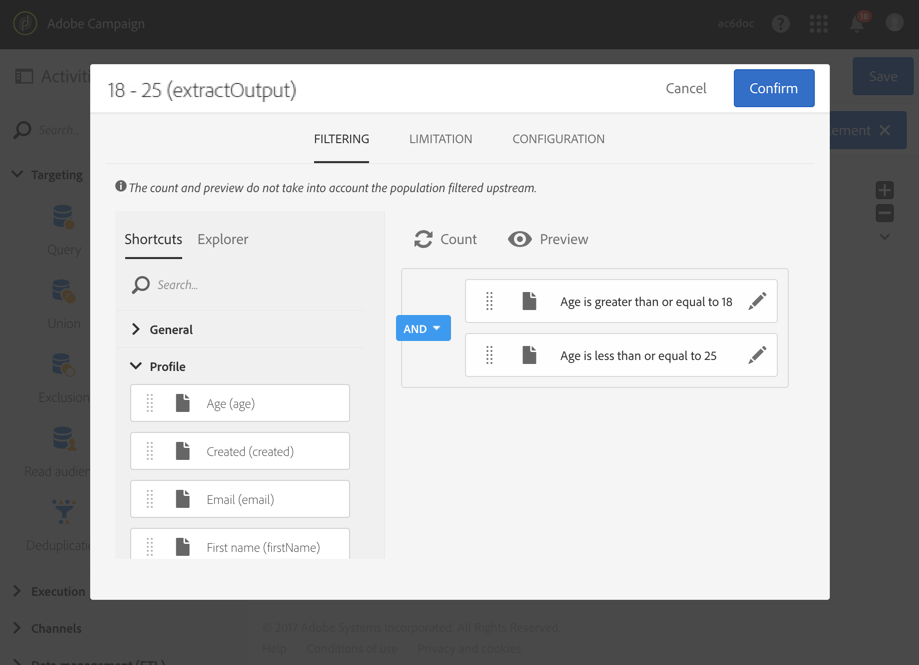
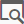
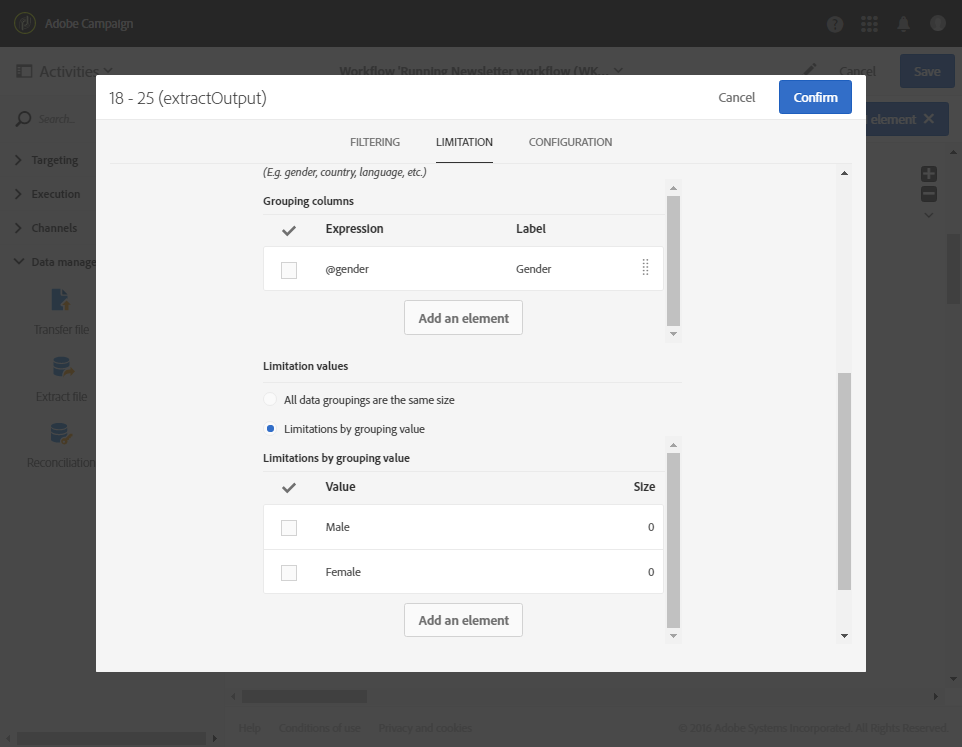

# Segmentation{#segmentation}

## Description {#description}

The **[!UICONTROL Segmentation]** activity lets you create one or several segments from a population calculated by activities placed earlier in the workflow. At the end of the activity, they can be processed in one single transition or different transitions.

>[!NOTE]
>
>By default, a member of the inbound population can only belong to one single segment. The filters are applied according to the order of the segments in the activity.

**Related topics:**
* [Use case: Segmentation on location](../../automating/using/workflow-segmentation-location.md)
* [Use case: Segmentation according to age groups](../../automating/using/segmentation-age-groups.md)

## Context of use {#context-of-use}

The **[!UICONTROL Segmentation]** activity is generally placed after targeting activities (query, intersection, union, exclusion, etc.) in order to define the standard population based on which the segments are formed.

**Related topics**

* [Use case: Segmenting profiles according to their age groups](../../automating/using/segmentation-age-groups.md).

## Configuration {#configuration}

1. Drag and drop a **[!UICONTROL Segmentation]** activity into your workflow.
1. Select the activity, then open it using the  button from the quick actions that appear.
1. In the **[!UICONTROL General]** tab, select the **[!UICONTROL Resource type]** on which the segmentation has to be carried out:

    * **[!UICONTROL Database resource]** if the segmentation is carried out on data that already exists in the database. Select the **[!UICONTROL Filtering dimension]** depending on the data that you want to segment. By default, segmentation is carried out on the **profiles**.
    * **[!UICONTROL Temporary resource]** if the segmentation is carried out on the workflow's temporary data: select the **[!UICONTROL Targeted set]** containing the data to segment. This use case can be encountered after importing a file or if the data in the database was enriched.

1. Select the outbound transition type that you would like to use:

    * **[!UICONTROL Generate one transition per segment]**: one outbound transition is added for each configured segment at the end of the activity.
    * **[!UICONTROL Generate all segments in one transition]**: all configured segments are regrouped into one single outbound transition. Specify the transition label. The members of each segment keep the segment code that has been assigned to them.

1. Add a segment by using the  or **[!UICONTROL Add an element]** button and specify the standard properties:

    * **[!UICONTROL Do not activate the transition if the population is empty]**: the segment will only be enabled if data is retrieved.
    * **[!UICONTROL Filter initial population (query)]**: lets you filter this segment's population.
    * **[!UICONTROL Limit segment population]**: lets you limit the segment size.
    * **[!UICONTROL Filter and limit segment population]**: lets you filter the segment population and limit its size.
    * **[!UICONTROL Label]**: segment label.
    * **[!UICONTROL Segment code]**: code assigned to the segment population.The segment code can be personalized using a standard expression and events variables (see [this page](../../automating/using/customizing-workflow-external-parameters.md)).
    * **[!UICONTROL Exclude segment from population]**: lets you exclude the specified segment from the outbound population of the activity. This option can only be used if the **[!UICONTROL Generate all segments in the same transition]** option is selected.

   

1. Open the detail view of the segment to access the latter's configuration options. To do this, check the relevant box in the activity's segment list, then select .
1. If the option to filter the initial population is checked, open the **[!UICONTROL Filter]** tab and specify your segment's population. The filters are based on the filtering dimension selected in step 4. Consult the [Query editing](../../automating/using/editing-queries.md) section for further information on population filtering.

   If the segmentation is carried out on a temporary resource, the count and preview of the population are not available in this tab.

1. If the option to limit the segment size is checked, open the **[!UICONTROL Limitation]** tab.

   First, select the **[!UICONTROL Type of limit]** that you would like to use:

    * **[!UICONTROL Random sampling]**: the segment population is selected randomly taking into account the configuration of the **[!UICONTROL Filter]** tab, if necessary.
    * **[!UICONTROL Ordered sampling]**: the segment population is selected in an ordered way. You must consequently specify the columns to be taken into account and the type of sorting to be applied. For example, if you select the **Age** field as the sort column while applying a **[!UICONTROL Descending sort]** and setting a limit of 100, only the profiles of the top 100 oldest people will be kept.

   Now specify the size **[!UICONTROL Limit]** of the segment:

    * **[!UICONTROL Size (as a % of the initial population)]**: specify the segment size by using a percentage of the activity's initial population.
    * **[!UICONTROL Maximum size]**: specify a maximum number of members for the segment population.
    * **[!UICONTROL By data grouping]**: you can limit the segment population according to the values of a specific field of the inbound population. Select the field for grouping, then specify the values to be used.
    * **[!UICONTROL By data grouping (as a %)]**: you can limit the segment population according to the values of a specific inbound population field by using a percentage. Select the field to apply the grouping, then specify the values to be used.

      >[!NOTE]
      >
      >Different limitations for each value can be used. For example, you can specify a grouping for the **[!UICONTROL Gender]** field and limit the population with **[!UICONTROL Male]** members to 10 and the population with **[!UICONTROL Female]** members to 30 people. If you use several data grouping fields, all the groupings have to have the same size.

   

1. Confirm the configuration of your segment.
1. Add as many segments as necessary by repeating steps 6 to 10 of this procedure.
1. If necessary, edit the parameters in the **[!UICONTROL Advanced options]** tab:

    * Check the **[!UICONTROL Enable overlapping of outbound populations]** option if you want a member of the inbound population to belong to several segments at the same time. The activity's outbound population may exceed the inbound population.
    * Check the **[!UICONTROL Concatenate the code of each segment]** option if the inbound population has already been assigned a segment code that you want to keep. The segment code specified in the activity will be added to the initial segment code.
    * Check the **[!UICONTROL Generate complement]** option if you would like to exploit the remaining population. See [Use case: Creating deliveries with a complement](../../automating/using/workflow-created-query-with-complement.md).

1. Confirm the configuration of your activity and save your workflow.
