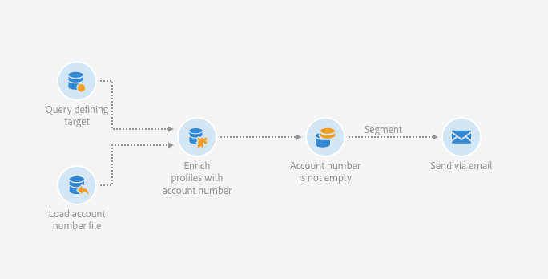
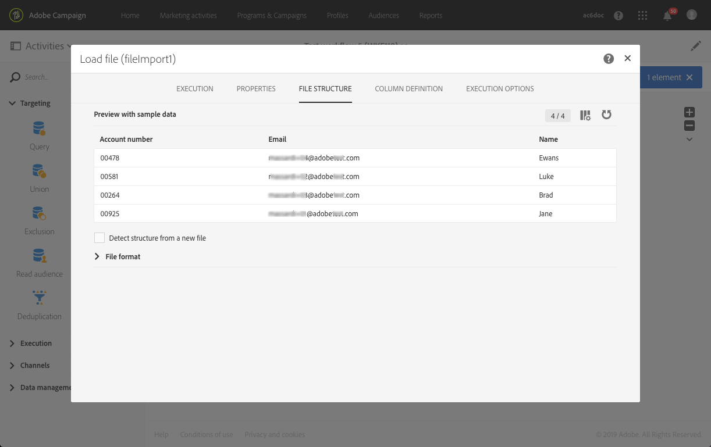
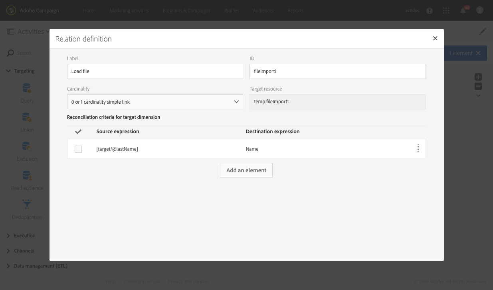
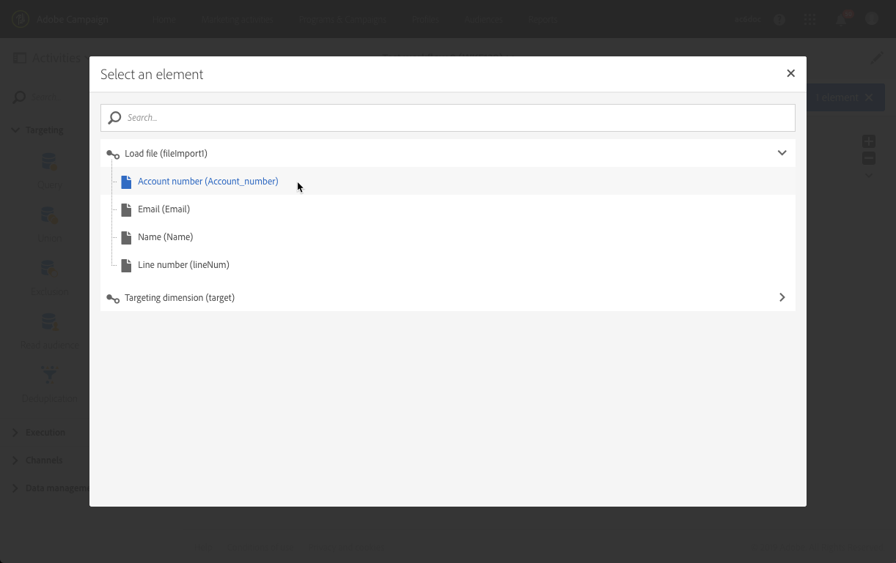
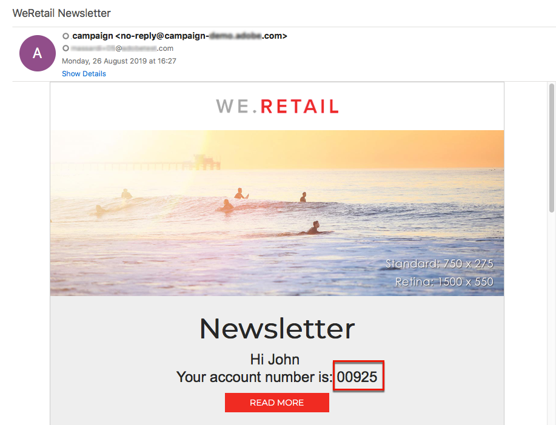

# Sending an email with enriched fields {#sending-email-enriched-fields}

<!--A new example showing how to send an email containing additional data retrieved from a load file activity has been added. [Read more](example-2-email-with-enriched-fields)-->

The load file activity also enables to send an email enriched with additional data from an external file in the same workflow.

The example below shows how to send an email using additional data retrieved from an external file through the load file activity. In this example, the external file contains a list of profiles with their associated account number. You want to import this data to send an email to each profile with their account number.

To build the workflow, follow these steps:

1. Drag and drop a [Query](../../automating/using/query.md) activity into your workflow and open it to define the main target.

   <!--The Query activity is presented in the [Query](../../automating/using/query.md) section.-->

1. Drag and drop a [Load file](../../automating/using/load-file.md) activity to assign some data to a profile. In this example, load a file containing account numbers corresponding to some profiles of the database.

   

1. Drag and drop an [Enrichment](../../automating/using/enrichment.md) activity into your workflow and link the load file and query activities to it.

1. In the **[!UICONTROL Advanced relations]** tab of the enrichment activity, select the **[!UICONTROL 0 or 1 cardinality simple link]** and define the fields to be used for reconciliation. Here we use the last name to reconcile the data with the database profiles.

   

1. In the **[!UICONTROL Additional data]** tab, select the elements that you want to use in your email. Here select Account number (column from the file that you retrieved through the load file activity).

   

   <!---->

   For more on this, see the [Enrichment](../../automating/using/enrichment.md) section.

1. Drag and drop a [Segmentation](../../automating/using/segmentation.md) activity into your workflow and open it to refine the main target.

   

   For more on this, see the [Segmentation](../../automating/using/segmentation.md) section.

1. Drag and drop an [Email delivery](../../automating/using/email-delivery.md) activity into your workflow and open it.

   <!--The Email delivery activity is presented in the [Email delivery](../../automating/using/email-delivery.md) section.-->

1. Add a personalization field and select the additional data defined in the enrichment activity (here Account number) from the **[!UICONTROL Additional data (targetData)]** node. This enables to dynamically retrieve the account number of each profile in the email content.

   

1. Save the email and start the workflow.

The email is sent to the target. Each profile receives the email with their corresponding account number.

