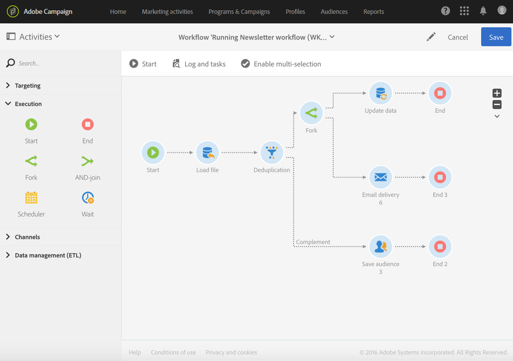

# Start and end{#start-and-end}

Start and end

## Description {#description}

 

The **Start** and **End** activities allow you to clearly mark where your workflow starts and ends.

## Context of use {#context-of-use}

Executing a workflow starts with activities without an inbound transition, and stops when there are no longer any tasks in progress. Nevertheless, you can add **Start** and **End** activities to clearly mark the starting and ending points of a workflow. This is especially helpful for relatively complex workflows.

It is a best practice to use an **End** activity instead of leaving the last transition of a workflow on its own to ensure that the workflow properly ends.

## Configuration {#configuration}

1. Drag and drop a **Start** or **End** activity into your workflow.
1. Put the **Start ** activity in front of other activities such as queries, and the **End** activity after a series of activities.
1. Select the activity, then open it using the  

   button from the quick actions that appear.
1. You can configure the **End** object so that it interrupts all of the workflow's ongoing tasks, including those that have not finished. To do this, select the corresponding option.
1. Confirm the configuration of your activity and save your workflow.

## Triggering another workflow {#triggering-another-workflow}

Using the **External signal** tab of an **End** activity, you can trigger another workflow. Refer to the [External signal](../../automating/using/external-signal.md) section.

## Example {#example}

The following example shows how a complex workflow is executed with a **Start** activity and several **End** activities. The **Stop all tasks in progress** box has been checked for the first **End** activity. Once the corresponding task is finished, the entire workflow will be stopped: it will have the same effect as if the   button had been selected (refer to the [Action bar](../../automating/using/workflow-interface.md#action-bar) section)

