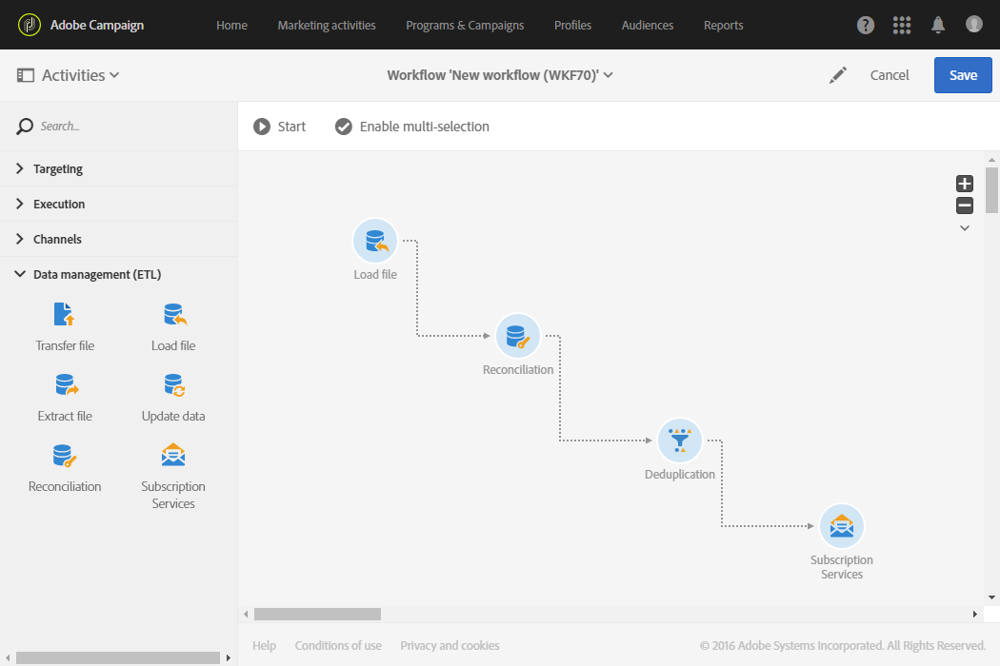
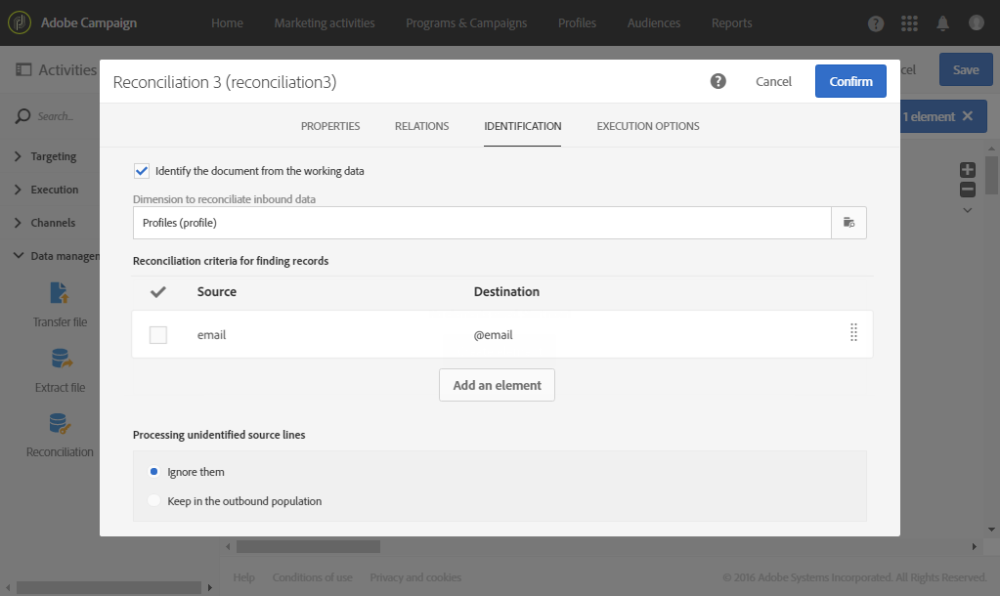
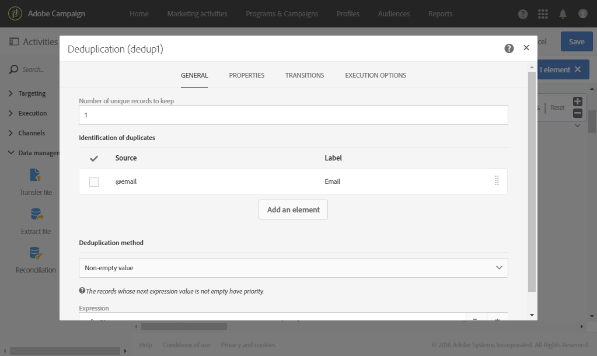
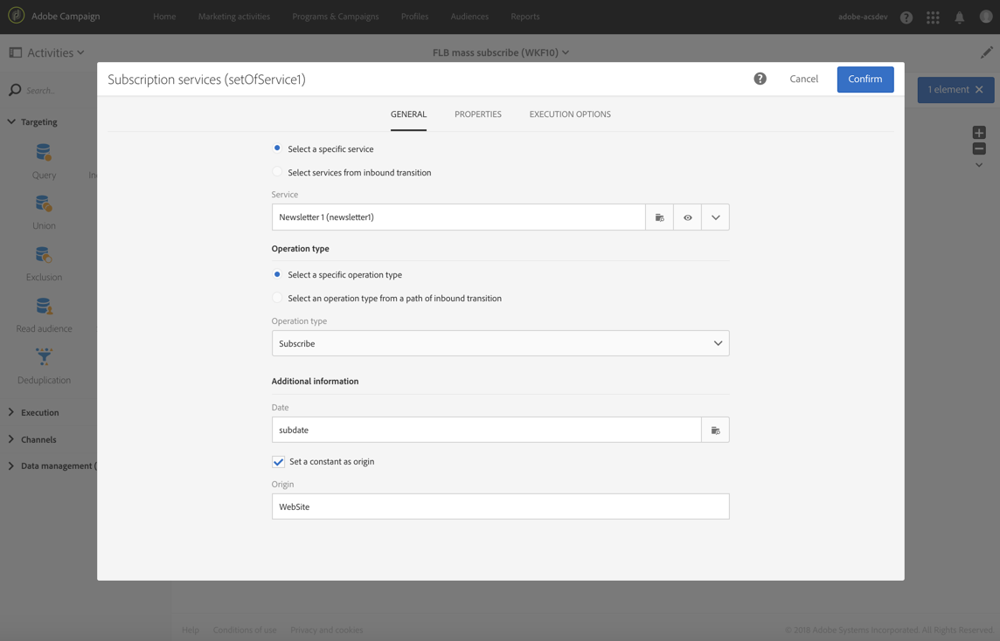

# Subscribing profiles to a specific service after importing a file {#subscribing-profiles-to-a-specific-service-after-importing-a-file}

This example illustrates how to import a file containing profiles and subscribe them to an existing service. After importing the file, a reconciliation needs to be carried out so that the data imported can be identified as being profiles. To ensure that the file does not contain any duplicates, a deduplication activity will be executed on the data.

The workflow is presented as follows:



* A [Load file](../../automating/using/load-file.md) activity loads the profile file and defines the structure of the imported columns.

  For this example, the file loaded is in the .csv format and contains the following data:

  ```
  lastname;firstname;email;birthdate;subdate
  jackman;megan;megan.jackman@testmail.com;07/08/1975;10/08/2017
  phillips;edward;phillips@testmail.com;09/03/1986;10/08/2017
  weaver;justin;justin_w@testmail.com;11/15/1990;10/08/2017
  martin;babeth;babeth_martin@testmail.net;11/25/1964;10/08/2017
  reese;richard;rreese@testmail.com;02/08/1987;11/08/2017
  cage;nathalie;cage.nathalie227@testmail.com;07/03/1989;11/08/2017
  xiuxiu;andrea;andrea.xiuxiu@testmail.com;09/12/1992;11/08/2017
  grimes;daryl;daryl_890@testmail.com;12/06/1979;12/08/2017
  tycoon;tyreese;tyreese_t@testmail.net;10/08/1971;12/08/2017
  ```

  

* A [Reconciliation](../../automating/using/reconciliation.md) activity identifies the data from the file as belonging to the profile dimension of the Adobe Campaign database. Only the **[!UICONTROL Identification]** tab is configured. It identifies the file data according to the email addresses of the profiles.

  

* A [Deduplication](../../automating/using/deduplication.md) based on the **email** field of the temporary resource (resulting from the reconciliation) identifies any duplicates. If the data imported from the file contains any duplicates, the subscription to a service will fail for all data.

  

* A [Subscription Services](../../automating/using/subscription-services.md) activity lets you select the service to which the profiles must be subscribed, the field corresponding to the subscription date, and the origin of the subscription.

  
