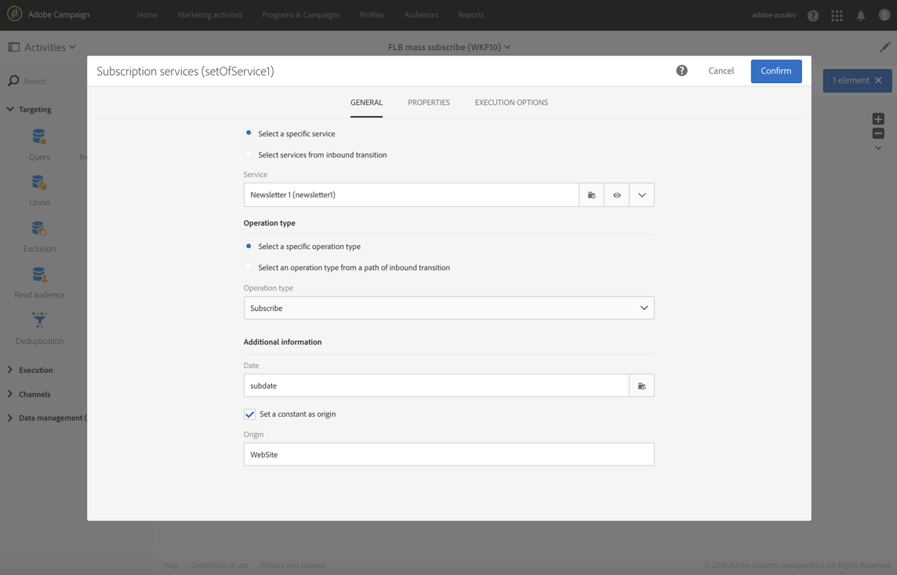

# Subscription Services {#subscription-services}

## Description {#description}


The **[!UICONTROL Subscription Services]** activity allows you to take profiles in mass and subscribe them to a service or unsubscribe them from a service.

>[!CAUTION]
>
>When subscription managed in the context of a workflow, the subscribed or unsubscribed profiles do not receive the different confirmation emails defined in the service properties.

## Context of use {#context-of-use}

The **[!UICONTROL Subscription Services]** activity is the only Adobe Campaign functionality which allows multiple profiles to be subscribed to or to be unsubscribed from a service in a single action.

You can use this activity after having carried out targeting or having imported a file with identified data.

If specified in a file through dedicated columns, this activity also lets you choose the action (subscribe or unsubscribe) and the service on which to perform the action.

**Related topics:**

* [Use case: Updating multiple subscription statuses from a file](../../automating/using/updating-subscriptions-from-file.md)
* [Use case: Subscribing profiles from a file to a specific service](../../automating/using/subscribing-profiles-from-file.md)

## Configuration {#configuration}

1. Drag and drop a **[!UICONTROL Subscription Services]** activity into your workflow.
1. Connect it after other targeting activities such as a query or a reconciliation following an import.
1. Select the activity, then open it using the  button from the quick actions that appear.
1. Select the **[!UICONTROL Service]** for which you would like to manage the subscriptions using one of the following options:

    * **[!UICONTROL Select a specific service]**: manually select a service.
    * **[!UICONTROL Select services from the inbound transition]**: the service is specified in the inbound transition. For example, you can import a file which specifies the service to manage for each line. If you choose this option, make sure a link has been created beforehand between the data and the **Service** resource, as shown in [this example](#example--updating-multiple-subscription-statuses-from-a-file).

      The service on which to perform the operation is then dynamically selected for each record.

1. Select the **[!UICONTROL Operation type]** to execute using one of the following options:

    * **[!UICONTROL Select a specific operation type]**: manually select if you want to **[!UICONTROL Subscribe]** or **[!UICONTROL Unsubscribe]** profiles.
    * **[!UICONTROL Select an operation type from a path of inbound transition]**: select the column of the inbound data that specifies the operation to perform for each record.

      In this column, the operation must be specified as a Boolean or Integer. Use **0** to unsubscribe a record and **1** to subscribe.

      In case the values contained in an imported file do not match the above requirements, you can still use the [Remapping of values](../../automating/using/load-file.md#column-format) option available in the **[!UICONTROL Load file]** activity.

1. If the inbound data contain a column with corresponding to the subscription date of the profile to the service, select it. You can leave it empty but no subscription date is set when running the workflow.
1. Define the origin of the subscription. You can set it to one of the fields of the inbound data or to a constant value of your choice by checking the **[!UICONTROL Set a constant as origin]** option. You can leave it empty but no origin is set when running the workflow.
1. If needed, you can generate an outbound transition. This transition contains exactly the same data as that in the inbound activity.
1. Confirm the configuration of your activity and save your workflow.

   It is now ready to be executed. Once executed, you can view the profiles that have subscribed to or unsubscribed from the service in the detail of the service.

## Example: Subscribing profiles to a specific service after importing a file {#example--subscribing-profiles-to-a-specific-service-after-importing-a-file}

This example illustrates how to import a file containing profiles and subscribe them to an existing service. After importing the file, a reconciliation needs to be carried out so that the data imported can be identified as being profiles. To ensure that the file does not contain any duplicates, a deduplication activity will be executed on the data.

The workflow is presented as follows:


* A **[!UICONTROL Load file]** activity loads the profile file and defines the structure of the imported columns.

  For this example, the file loaded is in the .csv format and contains the following data:

  ```
  lastname;firstname;email;birthdate;subdate
  jackman;megan;megan.jackman@testmail.com;07/08/1975;10/08/2017
  phillips;edward;phillips@testmail.com;09/03/1986;10/08/2017
  weaver;justin;justin_w@testmail.com;11/15/1990;10/08/2017
  martin;babeth;babeth_martin@testmail.net;11/25/1964;10/08/2017
  reese;richard;rreese@testmail.com;02/08/1987;11/08/2017
  cage;nathalie;cage.nathalie227@testmail.com;07/03/1989;11/08/2017
  xiuxiu;andrea;andrea.xiuxiu@testmail.com;09/12/1992;11/08/2017
  grimes;daryl;daryl_890@testmail.com;12/06/1979;12/08/2017
  tycoon;tyreese;tyreese_t@testmail.net;10/08/1971;12/08/2017
  ```

  

* A **[!UICONTROL Reconciliation]** activity identifies the data from the file as belonging to the profile dimension of the Adobe Campaign database. Only the **[!UICONTROL Identification]** tab is configured. It identifies the file data according to the email addresses of the profiles.

  

* A **[!UICONTROL Deduplication]** based on the **email** field of the temporary resource (resulting from the reconciliation) identifies any duplicates. If the data imported from the file contains any duplicates, the subscription to a service will fail for all data.

  

* A **[!UICONTROL Subscription Services]** activity lets you select the service to which the profiles must be subscribed, the field corresponding to the subscription date, and the origin of the subscription.

  

## Example: Updating multiple subscription statuses from a file {#example--updating-multiple-subscription-statuses-from-a-file}

This example illustrates how to import a file containing profiles and update their subscription to several services specified in the file. After importing the file, a reconciliation needs to be carried out so that the data imported can be identified as being profiles with a link to services. To ensure that the file does not contain any duplicates, a deduplication activity will be executed on the data.

The workflow is presented as follows:


* A **[!UICONTROL Load file]** activity loads the profile file and defines the structure of the imported columns.

  For this example, the file loaded is in the .csv format and contains the following data:

  ```
  lastname;firstname;email;birthdate;service;operation
  jackman;megan;megan.jackman@testmail.com;07/08/1975;SVC2;sub
  phillips;edward;phillips@testmail.com;09/03/1986;SVC3;unsub
  weaver;justin;justin_w@testmail.com;11/15/1990;SVC3;sub
  martin;babeth;babeth_martin@testmail.net;11/25/1964;SVC3;unsub
  reese;richard;rreese@testmail.com;02/08/1987;SVC3;sub
  cage;nathalie;cage.nathalie227@testmail.com;07/03/1989;SVC3;sub
  xiuxiu;andrea;andrea.xiuxiu@testmail.com;09/12/1992;SVC4;sub
  grimes;daryl;daryl_890@testmail.com;12/06/1979;SVC3;unsub
  tycoon;tyreese;tyreese_t@testmail.net;10/08/1971;SVC2;sub
  ```

  

  As you may have noticed, the operation is specified in the file as "sub" or "unsub". The system expects a **Boolean** or **Integer** value to recognize the operation to perform: "0" to unsubscribe and "1" to subscribe. To match this requirement, a remapping of values is performed in the detail of the "operation" column.

  

  If your file already uses "0" and "1" to identify the operation, you don't need to remap those values. Only make sure that the column is processed as a **Boolean** or **Integer** in the **[!UICONTROL Column definition]** tab.

* A **[!UICONTROL Reconciliation]** activity identifies the data from the file as belonging to the profile dimension of the Adobe Campaign database. Through the **[!UICONTROL Identification]** tab, the **email** field of the file is matched to the **email** field of the profile resource.

  

  In the **[!UICONTROL Relations]** tab, a link is created with the service resource to allow the **service** field of the file to be recognized. In this example, the values match the **name** field of the service resource.

  

* A **[!UICONTROL Deduplication]** based on the **email** field of the temporary resource (resulting from the reconciliation) identifies duplicates. It is important to eliminate duplicates since the subscription to a service will fail for all data in case of duplicates.

  

* A **[!UICONTROL Subscription Services]** identifies the services to update as coming from the transition, through the link created in the **[!UICONTROL Reconciliation]** activity.

  The **[!UICONTROL Operation type]** is identified as coming from the **operation** field of the file. Only Boolean or Integer fields can be selected here. If the column of your file that contains the operation to perform does not appear in the list, make sure that you have correctly set your column format in the **[!UICONTROL Load file]** activity, as explained earlier in this example.

  
