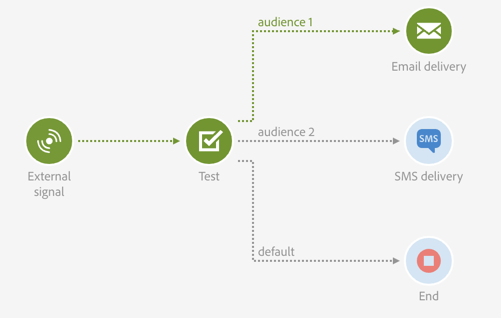

# Test{#test}

## Description {#description}

The **[!UICONTROL Test]** activity enables a transition based on a test result.

## Context of use {#context-of-use}

A **Test** activity activates the first transition that satisfies the condition associated to it.

If no condition is satisfied and if the **Use default transition** option is activated, a default transition will be activated.

Conditions can be based on **functions**, or on **variables**, for example events variables that have been declared into the workflow's **[!UICONTROL External signal]** activity.

**Related topics:**

* [List of functions](../../automating/using/list-of-functions.md)
* [Calling a workflow with external parameters](../../automating/using/calling-a-workflow-with-external-parameters.md)

## Configuration {#configuration}

1. Drag and drop a **[!UICONTROL Test]** activity into the workflow.
1. Select the activity, then open it using the  button from the quick actions that appear.
1. Define each condition's attributes:

   When editing the **[!UICONTROL Condition]** field, two buttons provide help to call events variables and edit expressions combining variables and functions:

    * : select the events variable among all variables that are available in the workflow (see [Customizing a workflow with external parameters](../../automating/using/calling-a-workflow-with-external-parameters.md#customizing-a-workflow-with-external-parameters))
    
      

    * : edit expressions combining variables and functions. For more on the Expression editor, refer to [this section](../../automating/using/advanced-expression-editing.md).
    
      

