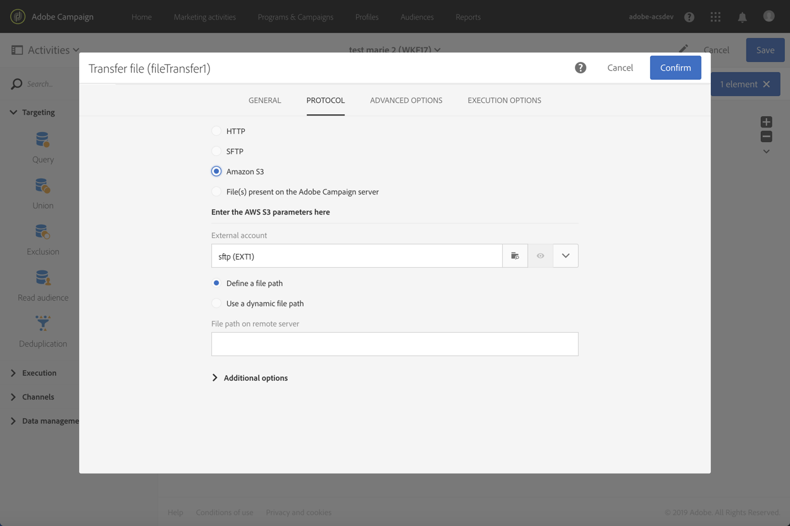

# Transfer file{#transfer-file}

## Description {#description}

The **[!UICONTROL Transfer file]** activity allows you to receive or send files, test whether there are files present, or list files in Adobe Campaign.

## Context of use {#context-of-use}

The way in which the data will be extracted is defined when the activity is configured. The file to load may be a list of contacts, for example.

You can use this activity to recover data that will then be structured with the **[!UICONTROL Load file]** activity.

**Related topics:**

* [Use case: Updating data based on an automatic file download](../../automating/using/update-data-automatic-download.md)

## Configuration {#configuration}

1. Drop a **[!UICONTROL Transfer file]** activity into your workflow.
1. Select the activity, then open it using the  button from the quick actions that appear.
1. Use the drop-down list in the **[!UICONTROL Action]** field to select one of the following activity actions:

   

    * **File download**: allows you to download a file.
    * **File upload**: allows you to upload a file. Uploading a file from Adobe Campaign file generates a log entry in the **[!UICONTROL Export audits]** menu. For more information on export audits, refer to the [Auditing exports](../../administration/using/auditing-export-logs.md) section.
    * **Test to see if file exists**: allows you to check whether there is a file.
    * **File listing**: allows you to list the files present on the server defined in the **[!UICONTROL Protocol]** tab. This action is mainly used for debugging purposes, to check if the activity is configured according to your needs before downloading the files from the remote server.

1. Select the protocol you want to use:
    * [HTTP](#HTTP-configuration-wf)
    * [SFTP](#SFTP-configuration-wf)
    * [Amazon S3](#S3-configuration-wf)
    * [Microsoft Azure Blob storage](#azure-blob-configuration-wf)
    * [File(s) present on the Adobe Campaign server](#files-server-configuration-wf)

1. The **[!UICONTROL Additional options]** section, available depending on the protocol selected, allows you to add parameters to your protocol. You can:

    * **[!UICONTROL Delete the source files after transfer]** 
    * **[!UICONTROL Disable passive mode]** 
    * **[!UICONTROL List all files]**: this option is available when selecting the **[!UICONTROL File listing]** action.in the **[!UICONTROL General]** tab. It allows you to index all the files present on the server in the **vars.filenames** event variable in which the file names are separated by the **'n'** characters.

1. The **[!UICONTROL If no files are found]** section of the **[!UICONTROL Advanced options]** tab allows you to configure specific actions if any errors or inexistent files are detected when the activity is started.

   You can also define retries. The different retries appear in the workflow execution log.

   

1. Confirm the configuration of your activity and save your workflow.

### Configuration with HTTP {#HTTP-configuration-wf}

The HTTP protocol allows you to start downloading a file from an external account or from a URL.

With this procotol, you can choose to **[!UICONTROL Use connection parameters defined in an external account]** option. In this case select the account you would like and specify the path of the file to download.
 

You can also choose the **[!UICONTROL Quick configuration]** option. You only need to enter the URL in the URL field.

### Configuration with SFTP {#SFTP-configuration-wf}

The SFTP protocol allows you to start downloading a file from a URL or an external account.

With this procotol, you can choose to **[!UICONTROL Use connection parameters defined in an external account]** option, then select the account you would like and specify the path of the file to download.

>[!CAUTION]
>
>Wildcards are supported.

You can also choose the **[!UICONTROL Quick configuration]** option. You only need to enter the URL in the URL field.

### Configuration with Amazon S3 {#S3-configuration-wf}

The Amazon S3 protocol allows you to start downloading a file from a URL or an external account via Amazon Simple Storage Service (S3).

1. Select an Amazon S3 external account. For more on this, refer to this [page](../../administration/using/external-accounts.md#amazon-s3-external-account).

2. Choose if you want to **[!UICONTROL Define a file path]** or **[!UICONTROL Use a dynamic file path]**.

3. Specify the path of the file to download.

    

4. If you want to delete your source files when transfer is completed, check **[!UICONTROL Delete the source files after transfer]**.

### Configuration with Microsoft Azure Blob storage {#azure-blob-configuration-wf}

The Microsoft Azure Blob protocol allows you to access blob located on a Microsoft Azure Blob Storage account.

1. Select a **[!UICONTROL Microsoft Azure Blob]** external account. For more on this, refer to this [page](../../administration/using/external-accounts.md#microsoft-azure-external-account).

1. Choose if you want to **[!UICONTROL Define a file path]** or **[!UICONTROL Use a dynamic file path]**.

    

1. Specify the path of the file to download, it can match multiple blobs. In that case, the **[!UICONTROL File transfer]** activity will activate the outgoing transition once per blob found. They will then be processed in alphabetical order.

    >[!CAUTION]
    >
    >Wildcards are not supported to match multiple file names. Instead, you need to enter a prefix. All blob names matching that prefix will be eligible.

    You can find below a list of file paths' examples:

    * **"campaign/"**: matches all blobs in the Campaign folder located at the root of the container.
    * **"campaign/new-"**: matches all blobs with a file name starting with "new-" and located under the Campaign folder.
    * **""**: adding an empty path allows you to match all the blobs available in the container.

### Configuration with files present on the Adobe Campaign server {#files-server-configuration-wf}

The **[!UICONTROL File(s) present on the Adobe Campaign server]** protocol corresponds to the repository containing the file(s) to recover.
Metacharacters, or wildcards (for example &#42; or ?) can be used to filter files.

Choose if you want to **[!UICONTROL Define a file path]** or **[!UICONTROL Use a dynamic file path]** 
The **[!UICONTROL Use a dynamic file path]** option, lets you use a standard expression and events variables to personalize the name of the file to transfer. For more on this, refer to [this page](../../automating/using/customizing-workflow-external-parameters.md).

Please note that the path must be relative to the storage space directory of the Adobe Campaign server. Files are located in the **sftp&lt;yourinstancename&gt;/** directory. You also cannot browse the directories above the storage space. For example:

      >**user&lt;yourinstancename>/my_recipients.csv** is correct.
      >
      >**../hello/my_recipients.csv** is incorrect.
      >
      >**//myserver/hello/myrecipients.csv** is incorrect.

## Historization settings {#historization-settings}

Every time a **[!UICONTROL Transfer file]** activity is executed, it stores the uploaded or downloaded files in a dedicated folder. One folder is created for each **[!UICONTROL Transfer file]** activity of a workflow. Therefore, it is important to be able to limit the size of this folder in order to preserve physical space on the server.

To do that, you can define **[!UICONTROL Historization settings]** in the **[!UICONTROL Advanced options]** of the **[!UICONTROL Transfer File]** activity.

**[!UICONTROL Historization settings]** allow to define a maximum number of files or total size for the activity's folder. By default, 100 files and 50 MB are authorized.

Every time the activity is executed, the folder is checked as follows:

* Only files created more than 24 hours before the execution of the activity are taken into account.
* If the number of files taken into account is greater than the value of the **[!UICONTROL Maximum number of files]** parameter, the oldest files are deleted until the **[!UICONTROL Maximum number of files]** allowed is reached.
* If the total size of files taken into account is greater than the value of the **[!UICONTROL Maximum size (in MB)]** parameter, the oldest files are deleted until the **[!UICONTROL Maximum size (in MB)]** allowed is reached.

>[!NOTE]
>
>If the activity is not executed again, its folder will not be checked nor purged. With this in mind, be cautious when transferring large files.
