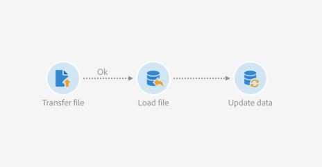
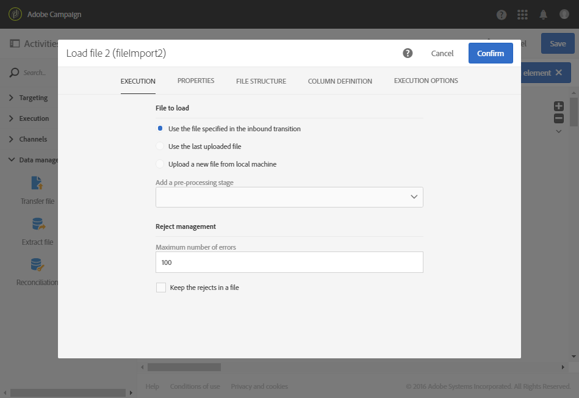

# Updating data based on an automatic file download {#updating-data-automatic-file-download}

The load file activity mainly structures the data from a transfer file activity in order to integrate it into the existing data.

The following example shows the result of an automatically downloaded load file activity via a transfer file activity, followed by an update data activity. This workflow aims to enrich the Adobe Campaign database with new profiles or to update existing profiles using the data recovered from the imported file.

To build the workflow, follow these steps:

1. Drag and drop a [Transfer file](../../automating/using/transfer-file.md) activity into your workflow.
1. Select the activity, then open it using the  button from the quick actions that appear.
1. Configure the activity in a way so that it recovers the file you would like. In the **[!UICONTROL Protocol]** tab, select **SFTP**.
1. Select the **Use connection parameters defined in an external account** option.
1. Enter the name of the external account.
1. Enter the **File path on the remote server**.

   

1. Confirm your activity.
1. Drag and drop a [Load file](../../automating/using/load-file.md) activity into your workflow and place it after the **[!UICONTROL Transfer file]** activity.
1. Select the activity, then open it using the  button from the quick actions that appear.
1. In the **[!UICONTROL File to load]** section of the **[!UICONTROL Execution]** tab, check the **[!UICONTROL Use the file specified in the inbound transition]** option.

   

1. Configure your activity as specified earlier.
1. Drag and drop an [Update data](../../automating/using/update-data.md) activity into your workflow and place it after the **[!UICONTROL Load file]** activity, then configure it.

Once the workflow has started, the data from the uploaded file is extracted and then used to enrich the Adobe Campaign database.
