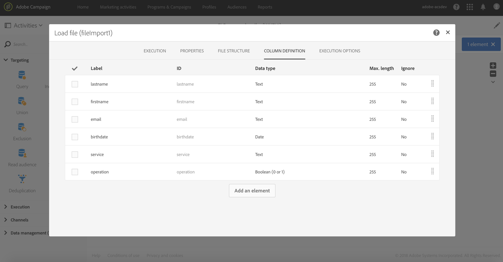
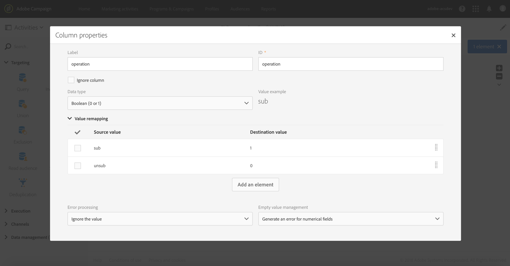
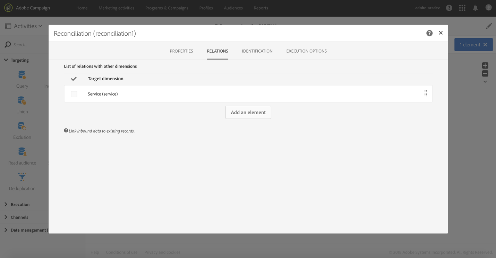
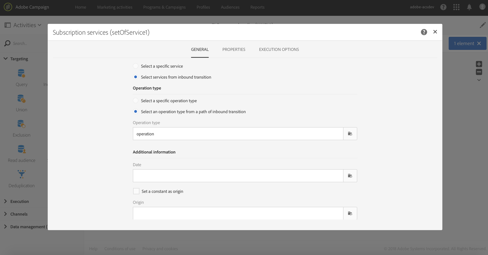

# Updating multiple subscription statuses from a file {#updating-multiple-subscription-statuses-from-a-file}

This example illustrates how to import a file containing profiles and update their subscription to several services specified in the file. After importing the file, a reconciliation needs to be carried out so that the data imported can be identified as being profiles with a link to services. To ensure that the file does not contain any duplicates, a deduplication activity will be executed on the data.

The workflow is presented as follows:


* A [Load file](../../automating/using/load-file.md) activity loads the profile file and defines the structure of the imported columns.

  For this example, the file loaded is in the .csv format and contains the following data:

  ```
  lastname;firstname;email;birthdate;service;operation
  jackman;megan;megan.jackman@testmail.com;07/08/1975;SVC2;sub
  phillips;edward;phillips@testmail.com;09/03/1986;SVC3;unsub
  weaver;justin;justin_w@testmail.com;11/15/1990;SVC3;sub
  martin;babeth;babeth_martin@testmail.net;11/25/1964;SVC3;unsub
  reese;richard;rreese@testmail.com;02/08/1987;SVC3;sub
  cage;nathalie;cage.nathalie227@testmail.com;07/03/1989;SVC3;sub
  xiuxiu;andrea;andrea.xiuxiu@testmail.com;09/12/1992;SVC4;sub
  grimes;daryl;daryl_890@testmail.com;12/06/1979;SVC3;unsub
  tycoon;tyreese;tyreese_t@testmail.net;10/08/1971;SVC2;sub
  ```

  

  As you may have noticed, the operation is specified in the file as "sub" or "unsub". The system expects a **Boolean** or **Integer** value to recognize the operation to perform: "0" to unsubscribe and "1" to subscribe. To match this requirement, a remapping of values is performed in the detail of the "operation" column.

  

  If your file already uses "0" and "1" to identify the operation, you don't need to remap those values. Only make sure that the column is processed as a **Boolean** or **Integer** in the **[!UICONTROL Column definition]** tab.

* A [Reconciliation](../../automating/using/reconciliation.md) activity identifies the data from the file as belonging to the profile dimension of the Adobe Campaign database. Through the **[!UICONTROL Identification]** tab, the **email** field of the file is matched to the **email** field of the profile resource.

  

  In the **[!UICONTROL Relations]** tab, a link is created with the service resource to allow the **service** field of the file to be recognized. In this example, the values match the **name** field of the service resource.

  

* A [Deduplication](../../automating/using/deduplication.md) based on the **email** field of the temporary resource (resulting from the reconciliation) identifies duplicates. It is important to eliminate duplicates since the subscription to a service will fail for all data in case of duplicates.

  

* A [Subscription Services](../../automating/using/subscription-services.md) activity identifies the services to update as coming from the transition, through the link created in the **[!UICONTROL Reconciliation]** activity.

  The **[!UICONTROL Operation type]** is identified as coming from the **operation** field of the file. Only Boolean or Integer fields can be selected here. If the column of your file that contains the operation to perform does not appear in the list, make sure that you have correctly set your column format in the **[!UICONTROL Load file]** activity, as explained earlier in this example.

  
