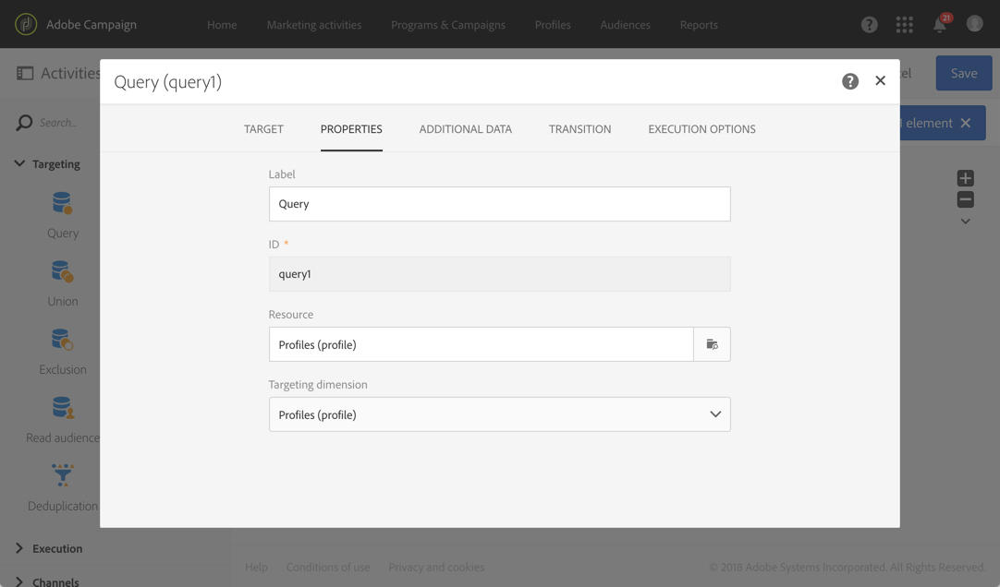

# Using resources different from targeting dimensions {#using-resources-different-from-targeting-dimensions}

This use cases presents how to use a resource that is different from the targeting dimension, for example, to look up for a specific record in a distant table.

For more on targeting dimensions and resources, refer to [this section](../../automating/using/query.md#targeting-dimensions-and-resources)

**Example 1: identifying profiles targeted by the delivery with the label ”Welcome back !”**.

* In this case, we want to target profiles. We will set the targeting dimension to **[!UICONTROL Profiles (profile)]**.
* We want to filter the selected profiles according to the delivery label. We will therefore set the resource to **[!UICONTROL Delivery logs]**. This way, we are filtering directly in the delivery log table, which will offer better performance.

**Example 2: identifying profiles who were not targeted by the delivery with the label “Welcome back !”**

In the previous example, we used a resource different from the targeting dimension. This operation is only possible if you want to find a record that **is present** in the distant table (delivery logs in our example).

If we want to find a record that **is not present** in the distant table (for example, profiles who were not targeted by a specific delivery), you must use the same resource and targeting dimension, as the record will not be present in the distant table (delivery logs).

* In this case, we want to target profiles. We will set the targeting dimension to **[!UICONTROL Profiles (profile)]**.
* We want to filter the selected profiles according to the delivery label. It is not possible to filter directly on delivery logs as we are looking for a record not present in the delivery logs table. We will therefore set the resource to **[!UICONTROL Profile (profile)]** and build our query on the profiles table.

