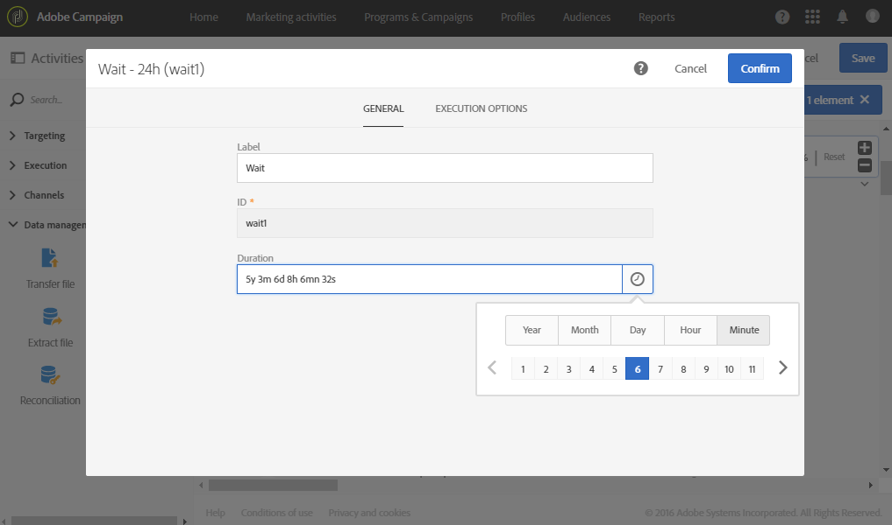
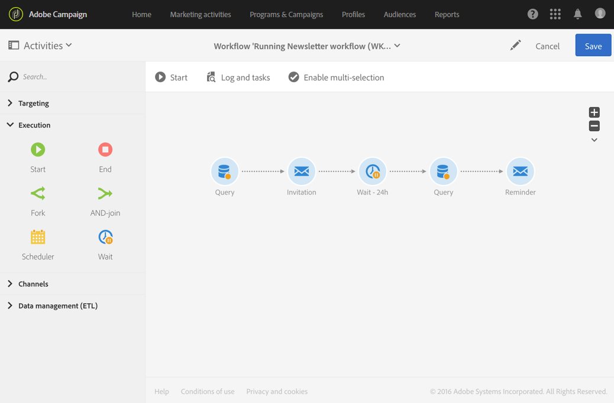

# Wait{#wait}

## Description {#description}

The **[!UICONTROL Wait]** activity momentarily suspends executing a part of a workflow. It activates its outbound transition after a delay that may range from a few seconds to several months, which executes the activities placed afterwards.

## Context of use {#context-of-use}

The **[!UICONTROL Wait]** activity is used to allow a certain amount of time to pass between two activities being executed. For example, to wait several days after an email delivery activity then analyze the opens and clicks generated during this period before performing any follow-up operations (reminder email, creating an audience, etc.).

## Configuration {#configuration}

1. Drag and drop a **[!UICONTROL Wait]** activity into your workflow.
1. Select the activity, then open it using the  button from the quick actions that appear.
1. Specify the **[!UICONTROL Duration]** of the wait between when the inbound and outbound transitions of the activity are activated.

   You can manually enter the duration or use the selector available in the field.

   

1. Confirm the configuration of your activity and save your workflow.

## Example {#example}

The following example illustrates the **[!UICONTROL Wait]** activity in a typical use case. An email invitation to an event is sent. 24 hours after it was sent, the email delivery logs are analyzed and a reminder email is sent to the people who received the first email but did not sign up.

The workflow is presented as follows:

* A first **[!UICONTROL Query]** targets the profiles that will be sent the email invitation.
* An **[!UICONTROL Email delivery]** sends the invitation for the first time to the profiles selected.
* A **[!UICONTROL Wait]** activity of 24h places a pause between when the invitation was sent and the rest of the workflow.
* A second **[!UICONTROL Query]** targets the profiles that received the first email but did not click on the subscription link inside.
* A second **[!UICONTROL Email delivery]** sends a reminder of the invitation to the people selected.

