# Workflow use-case: Building a control group {#building-control-group}

To measure the impact of a delivery, you may want to exclude some profiles from your target so that they will not receive a given message. This control group can be used to make a comparison with the behavior of the target population which received the message.

To do this in Adobe Campaign Standard, you can build a workflow including the following activities:
* A Query activity to target a given population.
* A Segmentation activity to isolate a random control group from this population.
* An Email delivery activity to send a message to the main target.
* An Update data activity to update the profiles that were excluded from the target (the random control group).

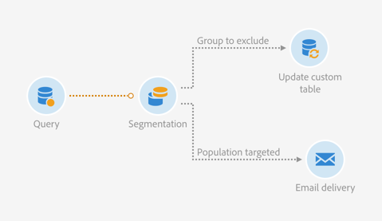

## Extending the Profile resource {#extending-profile}

First, you need to extend the **[!UICONTROL Profile]** resource with a new field corresponding to the control group. Once the workflow is run, this field will be checked for the profiles that were excluded from the target.

1. From **[!UICONTROL Administration]** > **[!UICONTROL Development]** > **[!UICONTROL Custom Resources]**, click **[!UICONTROL Create]**.
1. If you haven't extended it yet, select **[!UICONTROL Extend an existing resource]** and choose the **[!UICONTROL Profile]** resource.
1. In the **[!UICONTROL Data structure]** tab, add a new field for the control group and select **[!UICONTROL Boolean]** for the **[!UICONTROL Type]** field.

    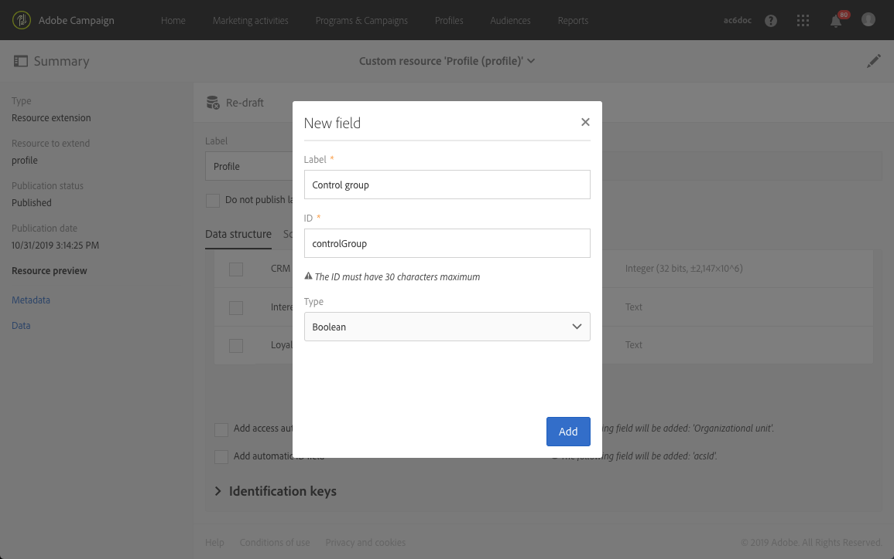

1. From the **[!UICONTROL Screen definition]** tab, unfold the **[!UICONTROL Detail screen configuration]** section and select the field that you just created so that it will be displayed for each profile.

    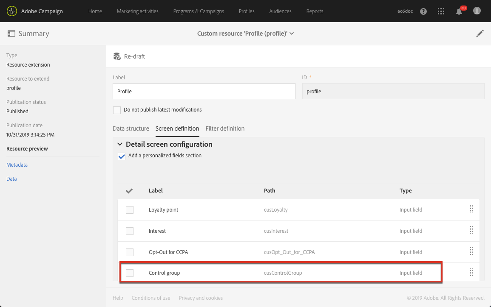

1. Save your changes.
1. Update the database structure to publish the **[!UICONTROL Profile]** extended resource. See [Publishing a custom resource](../../developing/using/updating-the-database-structure.md#publishing-a-custom-resource).

For more on extending a custom resource, see [Key steps to add a resource](../../developing/using/key-steps-to-add-a-resource.md).

## Creating a workflow {#creating-a-workflow}

1. In **[!UICONTROL Marketing Activities]**, click **[!UICONTROL Create]** and select **[!UICONTROL Workflow]**.
1. Select **[!UICONTROL New Workflow]** as workflow type and click **[!UICONTROL Next]**.
1. Enter the properties of the workflow and click **[!UICONTROL Create]**.

The detailed steps to create a workflow are presented in the [Building a workflow](../../automating/using/building-a-workflow.md) section.

## Creating a Query activity {#create-a-query-activity}

1. In **[!UICONTROL Activities]** > **[!UICONTROL Targeting]**, drag and drop a **[!UICONTROL Query activity]**.
1. Double-click the activity to define your target.
1. For example, in **[!UICONTROL Shortcuts]**, drag and drop **[!UICONTROL Profile]**, select **[!UICONTROL Age]** with the operator **[!UICONTROL Greater than]** and type 25 in the **[!UICONTROL Value]** field.
1. Click **[!UICONTROL Confirm]**.

The detailed steps to build a Query activity are presented in the [Query](../../automating/using/query.md) section.

## Creating a Segmentation activity {#creating-a-segmentation-activity}

1. Drag and drop a **[!UICONTROL Segmentation]** activity and double-click it.
1. In the **[!UICONTROL Segments]** tab, select a segment to edit.
1. In the **[!UICONTROL Configuration]** tab of that segment, select the **[!UICONTROL Limit the population of this segment]** option.

    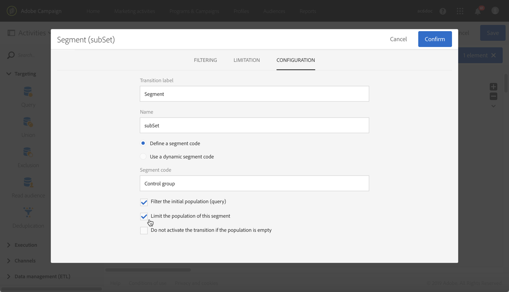

1. In the **[!UICONTROL Limitation]** tab, make sure the **[!UICONTROL Random sampling]** option is selected.

    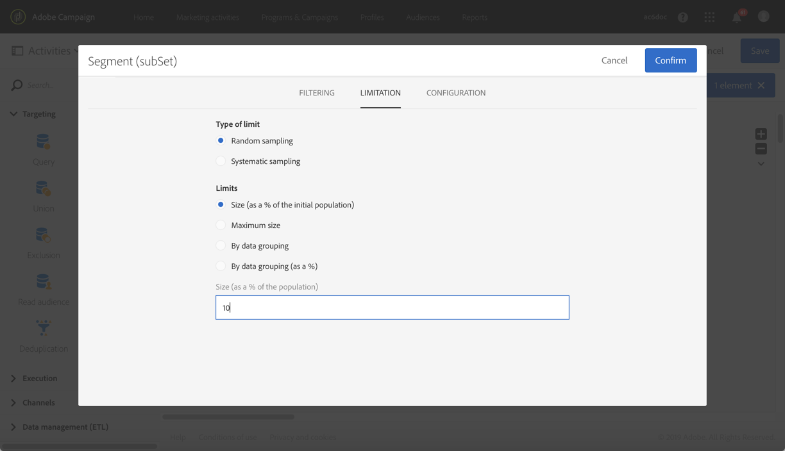

1. Define a percentage of the initial population, for example 10% and click **[!UICONTROL Confirm]**. The control group will be made up of 10% from the targeted population, selected randomly.
1. In the **[!UICONTROL Advanced options]** tab, select the **[!UICONTROL Generate complement]** option and fill in the **[!UICONTROL Transition label]** and **[!UICONTROL Segment code]** fields.

    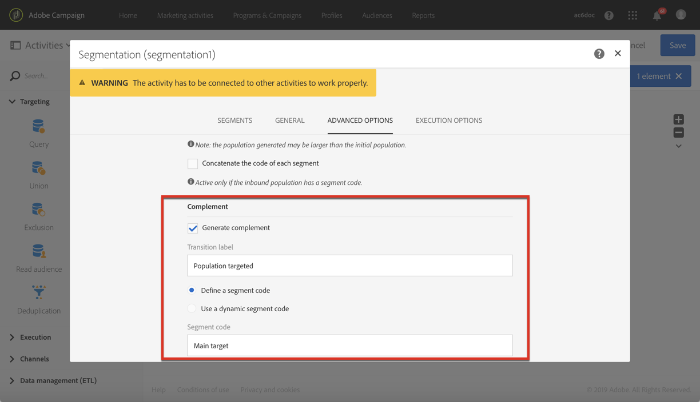

1. Click **[!UICONTROL Confirm]**.

The detailed steps to build a Segmentation activity are presented in the [Segmentation](../../automating/using/segmentation.md) section.

## Creating an Email activity {#creating-an-email-activity}

1. In **[!UICONTROL Activities]** > **[!UICONTROL Channels]**, drag and drop an **[!UICONTROL Email Delivery]** after the main target segment.
1. Click the activity and select  to edit it.
1. Select **[!UICONTROL Single send email]** and click **[!UICONTROL Next]**.
1. Select an email template and click **[!UICONTROL Next]**.
1. Enter the email properties and click **[!UICONTROL Next]**.
1. To create the layout of your email, click on **[!UICONTROL Use the Email Designer]**.
1. Edit and save your content.
1. In the **[!UICONTROL Schedule]** section of the message dashboard, unselect the **[!UICONTROL Request confirmation before sending messages}** option.

The detailed steps to build an Email activity are presented in the [Email delivery](../../automating/using/email-delivery.md) section.

## Creating an Update data activity {#creating-update-data-activity}

1. Drag and drop an **[!UICONTROL Update data]** activity after the control group segment.
1. Select the activity, then open it using the  button from the quick actions that appear.
1. In the **[!UICONTROL General]** tab, select **[!UICONTROL Update]** from the **[!UICONTROL Operation type]** drop-down list.
1. In the **[!UICONTROL Identification]** tab, select the **[!UICONTROL Directly using the targeting dimension]** option.
1. Select the **[!UICONTROL Profile]** resource that you previously extended as the dimension to update.

    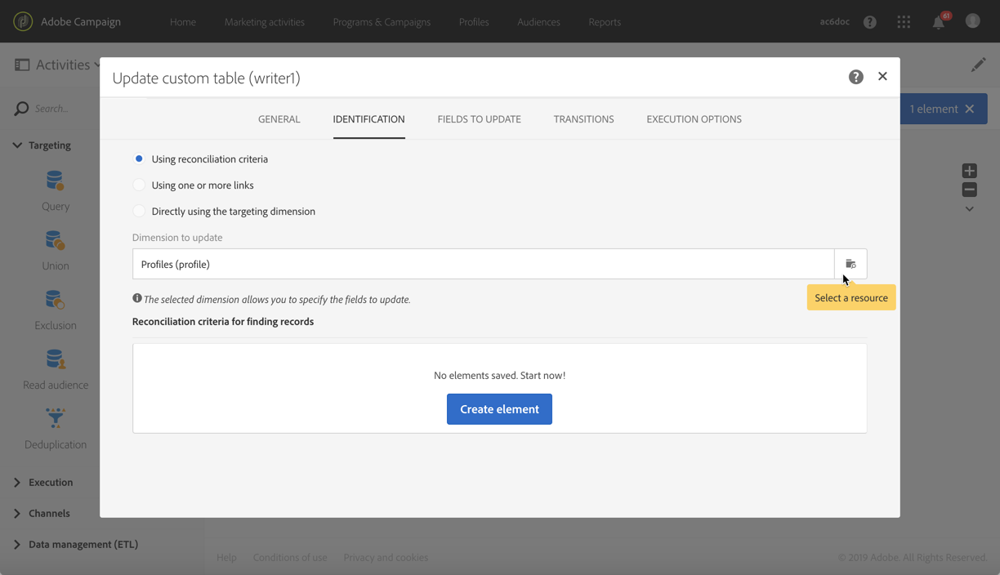

1. In the **[!UICONTROL Fields to update]** tab, select the control group field that you added to the **[!UICONTROL Profile]** resource as the **[!UICONTROL Destination]** and enter true as the condition.

    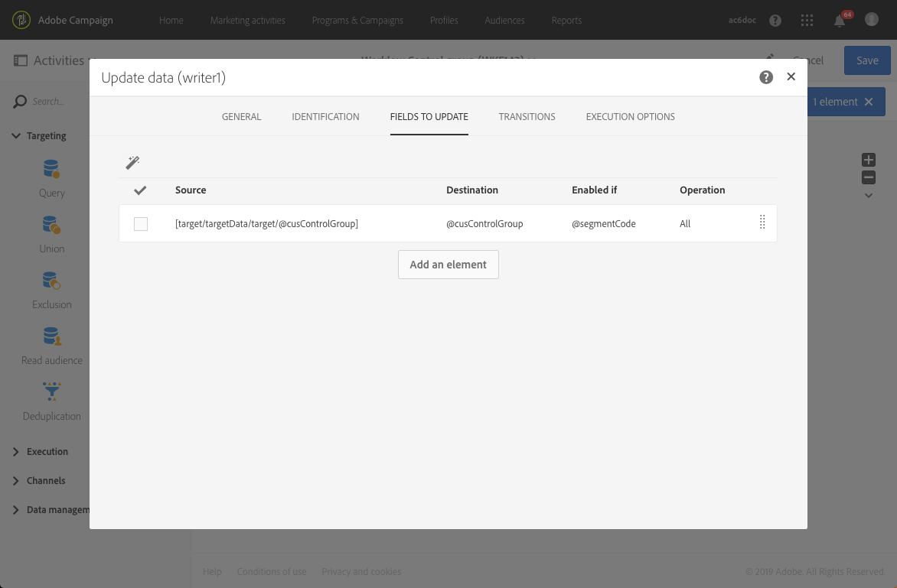

1. Click **[!UICONTROL Confirm]**.

The detailed steps to build an Update data activity are presented in the [Update data](../../automating/using/update-data.md) section.

## Running the workflow {#running-the-workflow}

Click **[!UICONTROL Start]** to run the workflow.

Once the workflow is run, the population of the control group is excluded, and the message is sent to the remaining main target.

The **[!UICONTROL Profile]** resource is updated as follows: if a profile was in the control group, the corresponding field is checked.

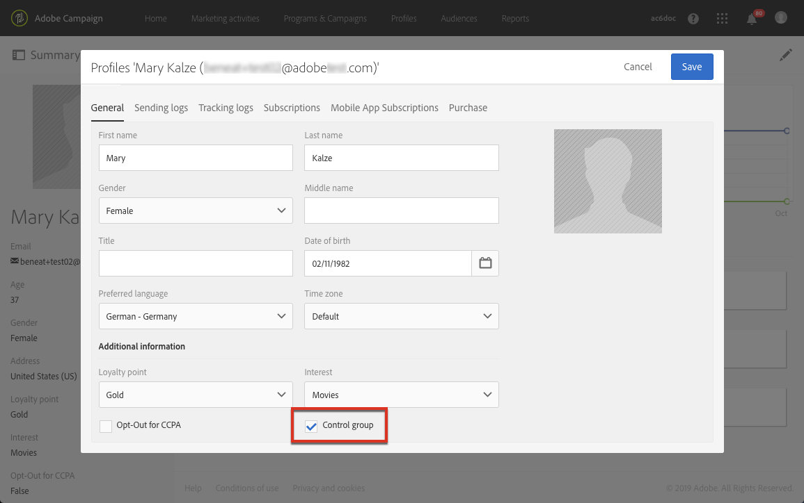

You can now compare how the recipients of the message will react compared to the small group who was excluded from the message and did not receive it.

## Reusing the same control group {#reusing-same-control-group}

The example above enables to create a global control group, as this is stored as a profile attribute independently from deliveries. Indeed, the new "Control group" field that was created as part of the **[!UICONTROL Profile]** resource extension is updated after the workflow above is run.

Consequently, next time you want to use the same control group, you can segment on the new “Control group” field rather than doing a random segmentation.

To do this:
1. When creating the **[!UICONTROL Segmentation]** activity, select the segment to edit in the **[!UICONTROL Segments]** tab.
1. In the **[!UICONTROL Configuration]** tab of that segment, make sure you do not select the **[!UICONTROL Limit the population of this segment]** option.
1. In the **[!UICONTROL Filtering]** tab, drag and drop **[!UICONTROL Profiles (attributes)]** to the main workspace.

    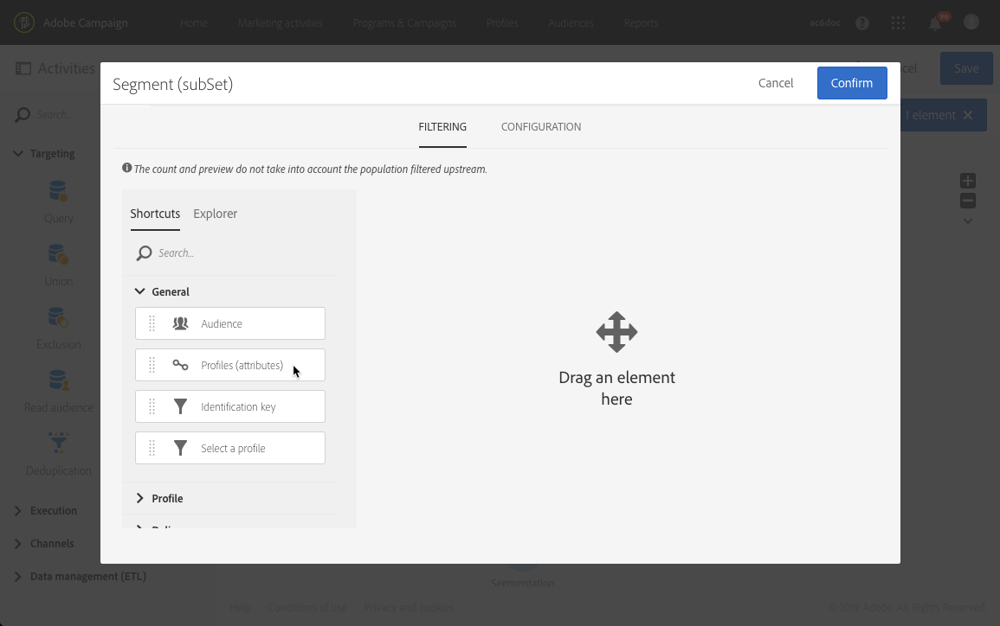

1. In the **[!UICONTROL Add a rule - Profiles (attributes)]** window, select "Control group" (the field that you added to the **[!UICONTROL Profile]** resource) and select **[!UICONTROL Yes]** as the filter condition.

    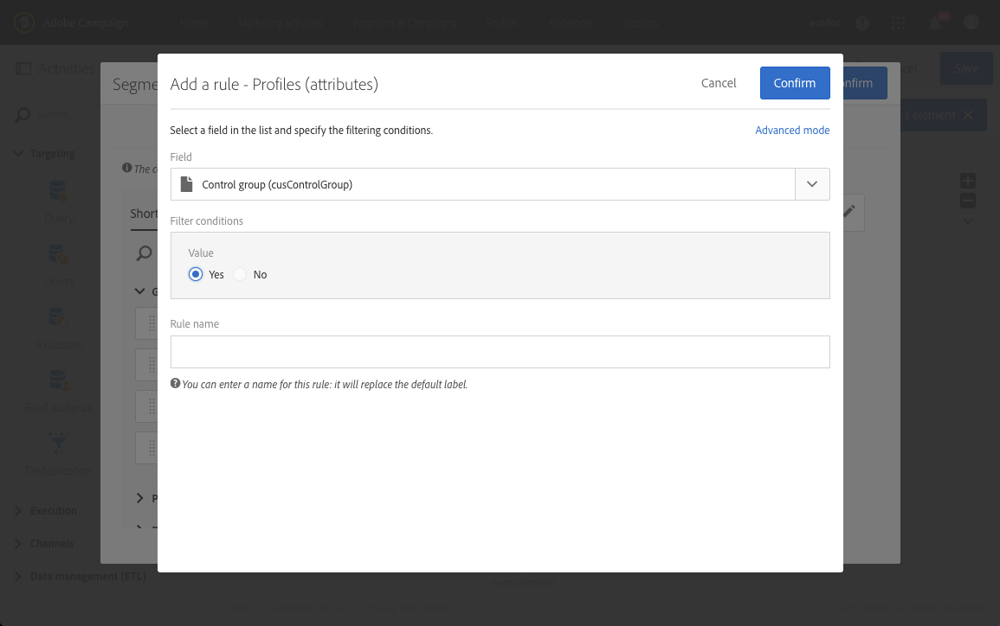