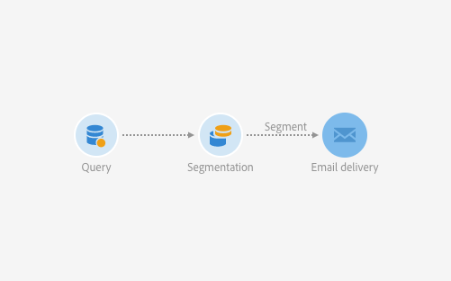

# Workflow use-case: Building a control group {#building-control-group}

To measure the impact of an email campaign, you may want to exclude some profiles from your target so that they will not receive a message. This control group can be used to make a comparison with the behavior of the target population which received the delivery.

To do this in Adobe Campaign, you can maintain a separate table for control groups and use a segmentation activity within a workflow to isolate this control group.
* The message is sent to the target population and tracked as usual in the sending logs. 
* The profiles that are exluded from the target in the Segmentation activity are tracked outside the message sending logs in a custom table.

For example, you want to compare how the recipients of a campaign will react compared to a small group who will be excluded from the message and will not receive it.

## Creating a separate table {#creating-table}

Create a table with a list of recipients? Create an empty table.

1. From **[!UICONTROL Administration]** > **[!UICONTROL Development]** > **[!UICONTROL Custom Resources]**, click **[!UICONTROL Create]**.
1. Configure the screen definition.
2. Update the database structure to publish the resource.

## Creating a workflow {#creating-a-workflow}

1. In **[!UICONTROL Marketing Activities]**, click **[!UICONTROL Create]** and select **[!UICONTROL Workflow]**.
1. Select **[!UICONTROL New Workflow]** as workflow type and click **[!UICONTROL Next]**.
1. Enter the properties of the workflow and click **[!UICONTROL Create]**.

## Creating a Query activity {#create-a-query-activity}

1. In **[!UICONTROL Activities]** > **[!UICONTROL Targeting]**, drag and drop a **[!UICONTROL Query activity]** .
1. Double-click the activity.
1. In **[!UICONTROL Shortcuts]**, drag and drop **[!UICONTROL Profiles]** and select **[!UICONTROL email]** with the operator **[!UICONTROL is not empty]**.
1. In **[!UICONTROL Shortcuts]**, drag and drop **[!UICONTROL Profiles]** and select **[!UICONTROL xxx]** with the value **[!UICONTROL xxx]**.
1. Click **[!UICONTROL Confirm]**.

## Creating a Segmentation activity {#creating-a-segmentation-activity}

1. Drag and drop a **[!UICONTROL Segmentation]** activity and double-click it.
1. Define a segment code which is the control group.
1. Click **[!UICONTROL Confirm]**.
1. In **[!UICONTROL List of outbound segments]**, click **[!UICONTROL Add an element]** and click on   to create a segment targeting profiles from the main target.
1. Click **[!UICONTROL Confirm]**.

## Creating an Email activity {#creating-an-email-activity}

1. In **[!UICONTROL Activities]** > **[!UICONTROL Channels]**, drag and drop an **[!UICONTROL Email Delivery]** after each segment.
1. Click the activity and select  to edit it.
1. Select **[!UICONTROL Simple email]** and click **[!UICONTROL Next]**.
1. Select an email template and click **[!UICONTROL Next]**.
1. Enter the email properties and click **[!UICONTROL Next]**.
1. To create the layout of your email, click on **[!UICONTROL Email Designer]**.

Once the workflow is run, the message is sent and tracked in sending logs for other profiles. For the control group segment, the population is excluded and exported to a table.

**Related topics:**

* [Publishing a custom resource](../../developing/using/updating-the-database-structure.md#publishing-a-custom-resource)
* [Building a workflow](../../automating/using/building-a-workflow.md)
* [Query activity](../../automating/using/query.md)
* [Segmentation activity](../../automating/using/segmentation.md)
* [Email delivery](../../automating/using/email-delivery.md)
