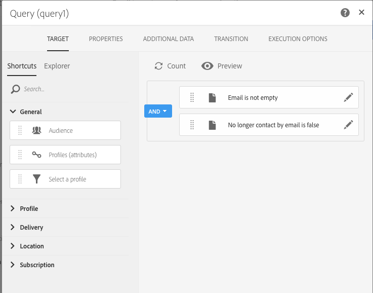
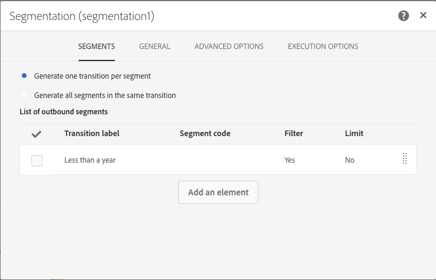
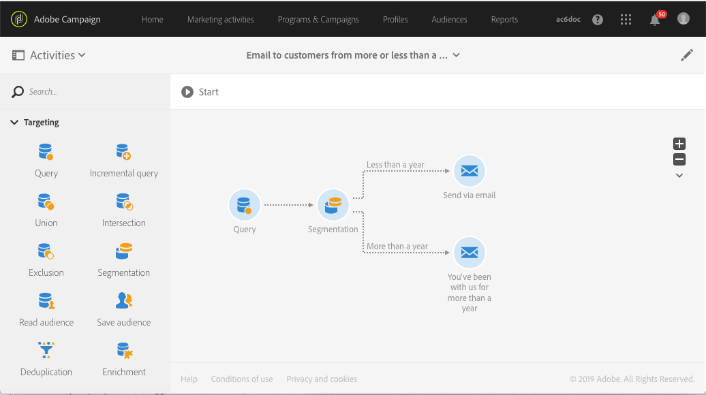

# Creating deliveries with a complement {#deliveries-with-complement}

You can send an email to customers: one for clients created less than a year ago, one for clients created more than a year ago.

1. In **[!UICONTROL Marketing Activities]**, click **[!UICONTROL Create]** and select **[!UICONTROL Workflow]**.
1. Select **[!UICONTROL New Workflow]** as workflow type and click **[!UICONTROL Next]**.
1. Enter properties of the workflow and click **[!UICONTROL Create]**.

## Create a Query activity {#create-a-query-activity}

1. In **[!UICONTROL Activities]** > **[!UICONTROL Targeting]**, drag and drop a [Query](../../automating/using/query.md) activity.
1. Double-click the activity.
1. In **[!UICONTROL Shortcuts]**, drag and drop **[!UICONTROL Profiles]** and select **[!UICONTROL email]** with the operator **[!UICONTROL is not empty]**.
1. In **[!UICONTROL Shortcuts]**, drag and drop **[!UICONTROL Profiles]** and select **[!UICONTROL no longer contact by email]** with the value **[!UICONTROL no]**.
1. Click **[!UICONTROL Confirm]**.

## Create a Segmentation activity {#create-a-segmentation-activity}

1. In **[!UICONTROL Activities]** > **[!UICONTROL Targeting]**, drag and drop a [Segmentation](../../automating/using/segmentation.md) activity and double-click it.
1. Hover over the segment then click on  to target customers added this year in the database. 
1. Drag and drop **[!UICONTROL Profiles]** and select **[!UICONTROL Created]** with the filter type **[!UICONTROL Relative]**.
1. Change the **[!UICONTROL Level of precision]** to **[!UICONTROL Year]** and select **[!UICONTROL This year]**.
1. Click **[!UICONTROL Confirm]** twice.
1. In **[!UICONTROL Advanced Options]**, check **[!UICONTROL Generate complement]** to create a segment targeting the remaining recipients.
1. Click **[!UICONTROL Confirm]**.
1. Click **[!UICONTROL Save]**.

>[!NOTE]
>
>To observe the structure of the rule, click on **[!UICONTROL Advanced Mode]**.

## Creating an Email delivery {#create-an-email-delivery}

1. In **[!UICONTROL Activities]** > **[!UICONTROL Channels]**, drag and drop an [Email delivery](../../automating/using/email-delivery.md) activity after each segment.
1. Click the activity and select  to edit.
1. Select **[!UICONTROL Single send email]** and click **[!UICONTROL Next]**.
1. Select an email template and click **[!UICONTROL Next]**.
1. Enter the email properties and click **[!UICONTROL Next]**.
1. To create the layout of your email, click on **[!UICONTROL Email Designer]**.
1. Insert elements or select an existing template.
1. Personalize your email with offers specific to each delivery.
1. Click **[!UICONTROL Preview]** to check your layout.
1. Click **[!UICONTROL Save]**.

For more information, refer to [designing an email](../../designing/using/designing-from-scratch.md#designing-an-email-content-from-scratch).

