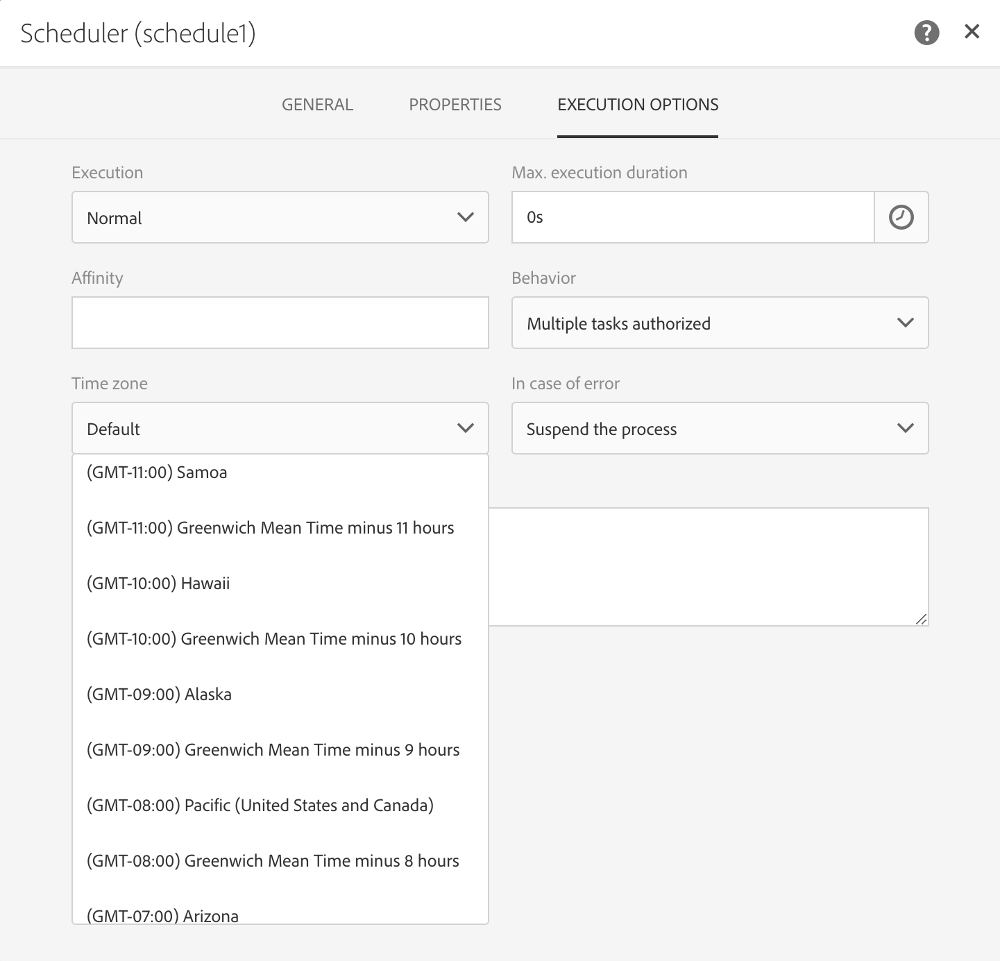
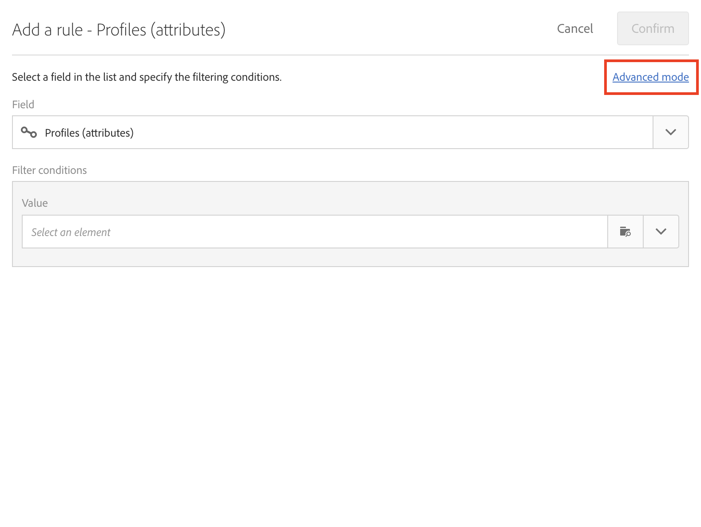
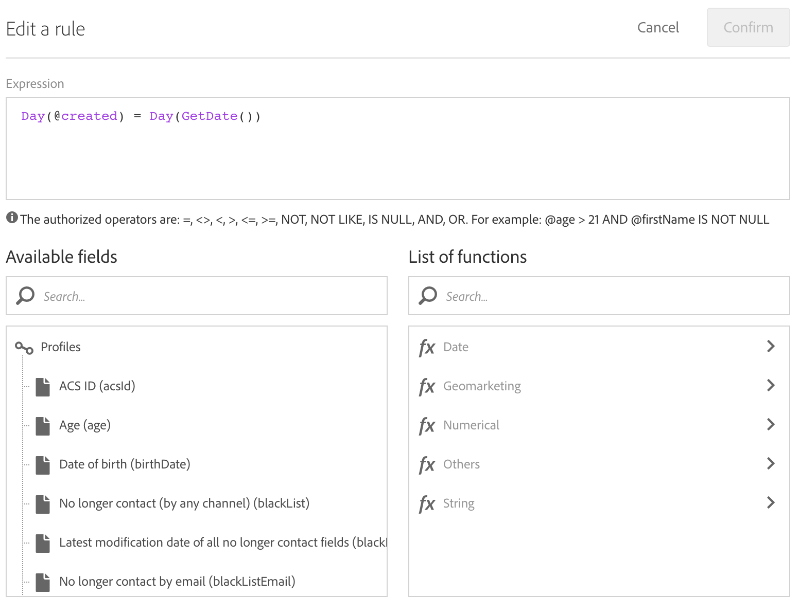
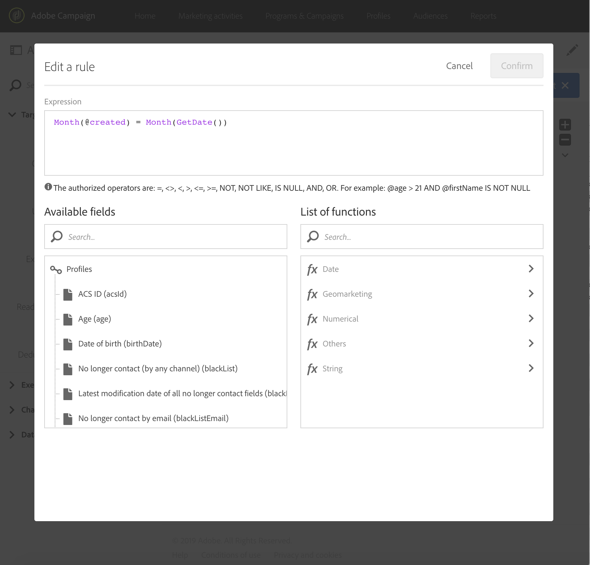

# Creating deliveries on profiles' creation date {#creation-date-query}

You can send an offer via email on the anniversary of the customer's profile creation.

1. In **[!UICONTROL Marketing Activities]**, click **[!UICONTROL Create]** and select **[!UICONTROL Workflow]**.
1. Select **[!UICONTROL New Workflow]** as workflow type and click **[!UICONTROL Next]**.
1. Enter the properties of the workflow and click **[!UICONTROL Create]**.

## Creating a Scheduler activity {#creating-a-scheduler-activity}

1. In **[!UICONTROL Activities]** > **[!UICONTROL Execution]**, drag and drop a [Scheduler](../../automating/scheduler.md) activity.
1. Double-click the activity.
1. Configure the execution of your delivery.
1. In **[!UICONTROL Execution frequency]**, select **[!UICONTROL Daily]**.
1. Select a **[!UICONTROL Time]** and the **[!UICONTROL Repetition frequency]** of execution for your workflow.
1. Select a **[!UICONTROL Start]** date and **[!UICONTROL Expiration]** for your workflow.
1. Confirm your activity and save your workflow.

>[!NOTE]
>
>To start your workflow at a specific time zone, in the **[!UICONTROL Execution options]** tab, set up the time zone for your scheduler in the **[!UICONTROL Time zone]** field. By default, the selected time zone is the one defined in the workflow properties (see [Building a workflow](../../automating/using/building-a-workflow.md)).



## Creating a Query activity {#creating-a-query-activity}

1. To select recipients, drag and drop a [Query](../../automating/query.md) activity and double-click it.
1. Add **[!UICONTROL Profiles]** and select **[!UICONTROL no longer contact by email]** with the value **[!UICONTROL no]**.

### Retriving profiles created on the same day as the day of execution {#retriving-profiles-created-on-the-same-day}

1. In **[!UICONTROL Profile]**, drag and drop the **[!UICONTROL Created]** field. and click on **[!UICONTROL Advanced Mode]**.

1. In the **[!UICONTROL list of functions]**, double-click **[!UICONTROL Day]** from the **[!UICONTROL Date]** node.
1. Then, insert the field **[!UICONTROL Created]** as argument.
1. Select **[!UICONTROL equals to (=)]** as the operator.
1. For Value, select **[!UICONTROL Day]** from the **[!UICONTROL Date]** node in the **[!UICONTROL List of functions]**.
1. Insert the **[!UICONTROL GetDate()]** function as argument.

You retrieved the profiles which creation day is equal to current day.

You should end up with:

```Day(@created) = Day(GetDate())```



Click **[!UICONTROL Confirm]**.

### Retriving profiles created on the same month as the month of execution{#retriving-profiles-created-on-the-same-month}

1. On the **[!UICONTROL Query]** editor, select the first query and duplicate it. 
1. Open the duplicate.
1. Replace **[!UICONTROL Day]** by **[!UICONTROL Month]** in the query.
1. Click **[!UICONTROL Confirm]**.



You should end up with this:  

``` Month(@created) = Month(GetDate()) ```

The final query displays:

```Day(@created) = Day(GetDate()) AND Month(@created) = Month(GetDate())```


## Creating an Email delivery{#creating-an-email-delivery}

1. Drag and drop an [Email delivery](../../automating/email-delivery.md) activity.
1. Click the activity and select  to edit.
1. Select **[!UICONTROL Recurring email]** and click **[!UICONTROL Next]**.
1. Select an email template and click **[!UICONTROL Next]**.
1. Enter the email properties and click **[!UICONTROL Next]**.
1. To create the layout of your email, click on **[!UICONTROL Email Designer]**.
1. Insert elements or select an existing template.
1. Personalize your email using fields and links.
For more information, refer to [designing an email](../../designing/using/designing-from-scratch.md#designing-an-email-content-from-scratch).
1. Click **[!UICONTROL Preview]** to check your layout.
1. Click **[!UICONTROL Save]**.

**Related topics:**

* [Email channel](../../channels/using/creating-an-email.md)
