# Creating a cross-channel delivery{#cross-channel-delivery}

This document allows you to discover the following Adobe Campaign functionality via a standard use case: creating a cross-channel delivery workflow.

The objective here is to select an audience from the recipients of the database and segment them into two different groups with the aim of sending an email to the first group and an SMS message to the second group.

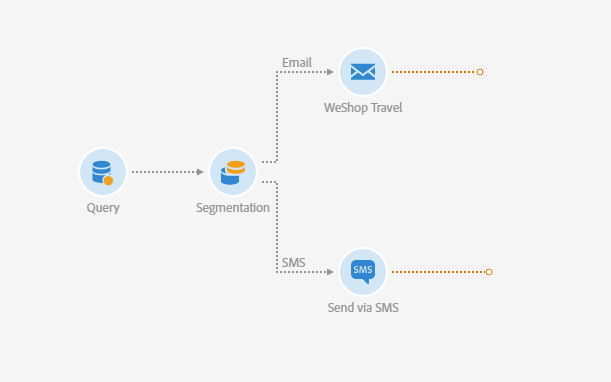

For more details on workflows and the different channels available in Adobe Campaign, check the following documents:

* [Discovering workflows](../../automating/using/get-started-workflows.md)
* [Discovering communication channels](../../channels/using/get-started-communication-channels.md)

## Creating a workflow {#creating-workflow}

To send two different deliveries to a given group, you must first define your target.

To do this, you will need to create a query to identify the recipients, and therefore, you will have to create a workflow.

Create a new workflow in the program or the campaign of your choice:

1. In **[!UICONTROL Marketing Activities]**, click **[!UICONTROL Create]** and select **[!UICONTROL Workflow]**.
1. Select **[!UICONTROL New Workflow]** as workflow type and click **[!UICONTROL Next]**.
1. Enter the properties of the workflow and click **[!UICONTROL Create]**.

The detailed steps to create a workflow are presented in the [Building a workflow](../../automating/using/building-a-workflow.md) section.

## Creating a Query activity {#creating-query-activity}

Once the workflow is created, you can access its interface.

Insert a Query activity into your workflow to target the profiles that will receive your deliveries.

1. In **[!UICONTROL Activities]** > **[!UICONTROL Targeting]**, drag and drop a [Query](../../automating/using/query.md) activity.
1. Double-click the activity.
1. In the **[!UICONTROL Target]** tab, browse the shortcuts and select one of your [audiences](../../audiences/using/about-audiences.md).
1. Drag and drop the shortcut into the editing zone. According to the type of shortcut selected, a window will appear.
1. Configure the targeting elements then confirm your query.

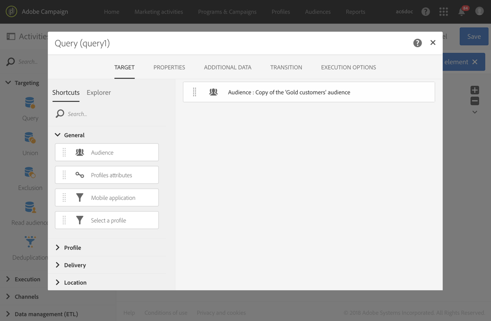

You can create a query on one or several elements.

Use the **[!UICONTROL Count]** button to see an estimation of the number of profiles targeted by the query.

## Creating a Segmentation activity {#creating-segmentation-activity}

Once your target is identified by the Query activity, you have to select a criterion to segment the target into two different populations: one will receive an email and the other will receive an SMS.

You have to use a [Segmentation](../../automating/using/segmentation.md) activity to create one or several segments from a population computed upstream in a query.

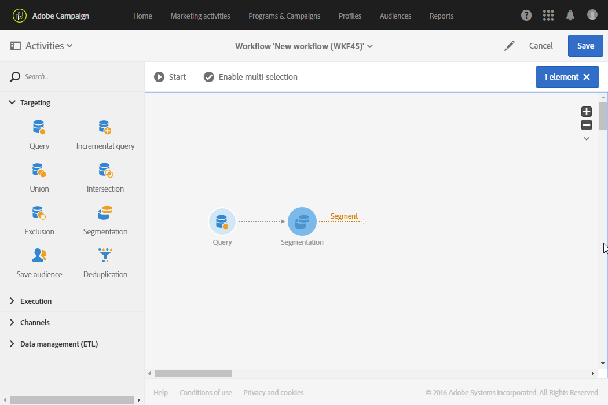

The **Email** group will target the recipients that have an email address defined but no mobile telephone number. The **SMS** group will contain the recipients whose mobile telephone number is saved in their profile.

To configure the first transition (Email):

1. In the **[!UICONTROL Segments]** tab, a first segment is present by default. Edit its properties to configure that segment.

    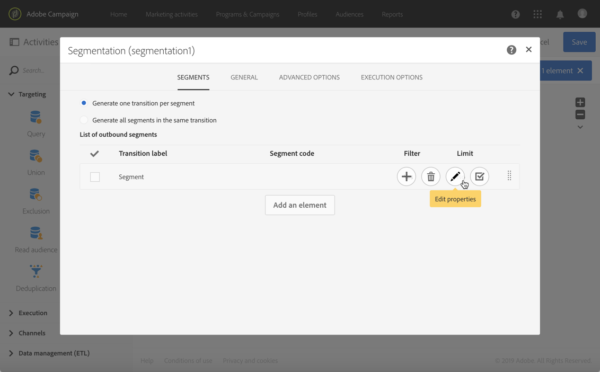

1. Select the profile's **[!UICONTROL Email]** as a filtering criterion.

    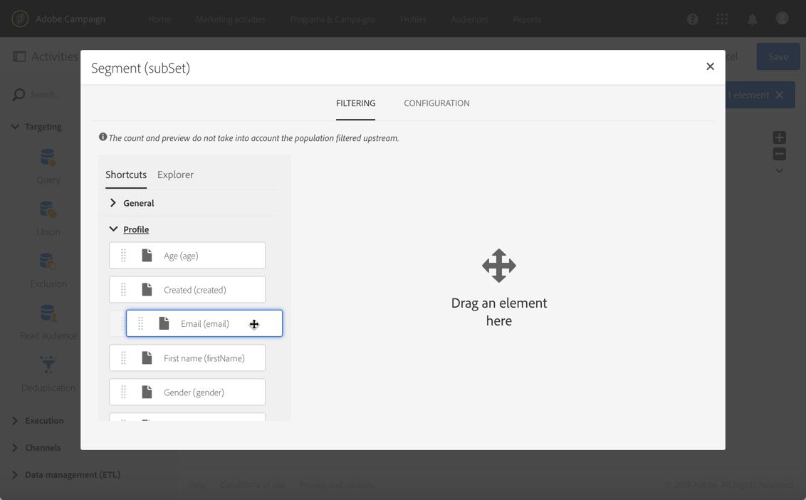

1. In the new window that appears on the screen, select the **[!UICONTROL Is not empty]** operator.

    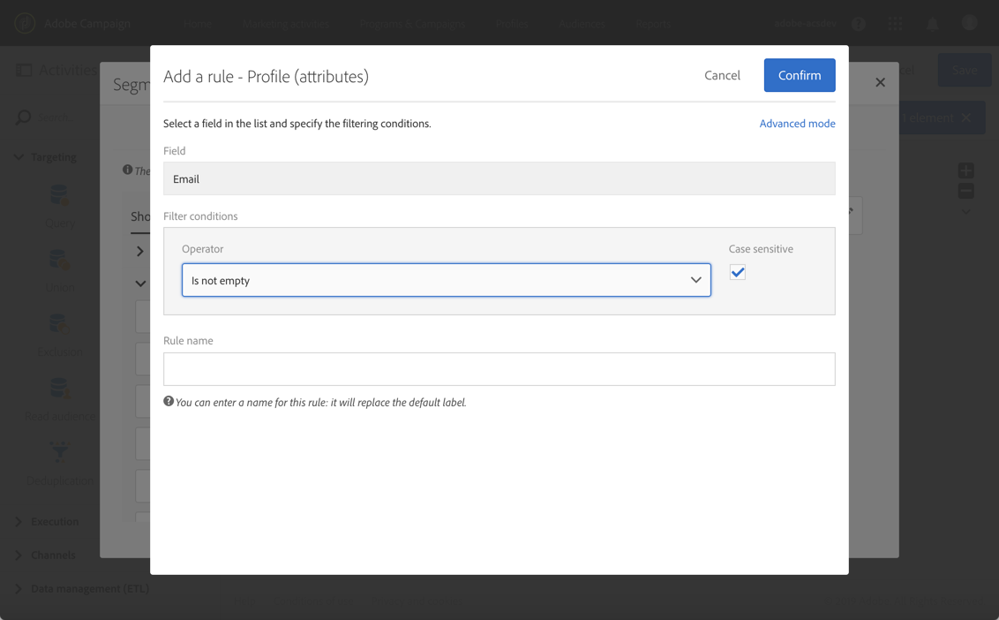

1. Add a second filtering criterion, **[!UICONTROL Mobile]**, and select the operator **[!UICONTROL Is empty]**.

    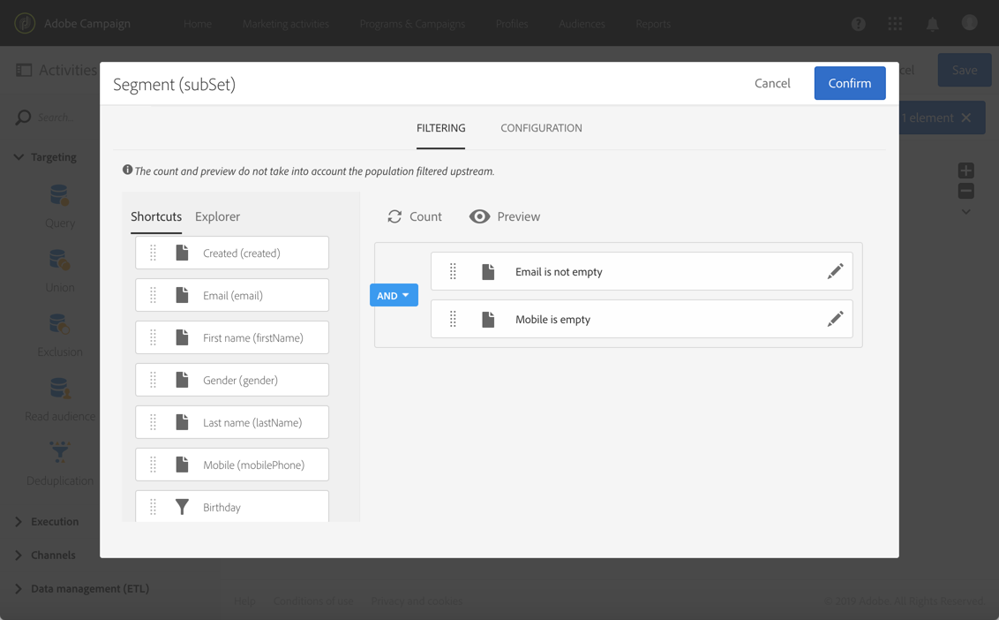

    All of the profiles coming from the query that have an email, but not a mobile telephone number defined, will be in this transition.

1. To make your workflow clearer, you can edit the transition label. Confirm your changes.

    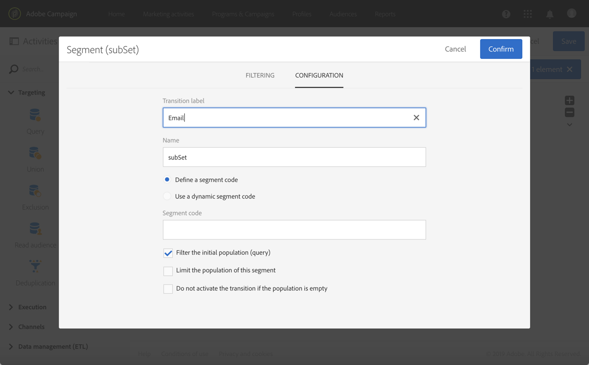

Your first transition is configured. To configure the second transition (SMS):

1. Click the **[!UICONTROL Add an element]** button to add a new transition.
1. Define a condition that allows you to retrieve all of the profiles whose mobile phone numbers have been provided. To do this, create a rule on the **[!UICONTROL Mobile]** field with the **[!UICONTROL Is not empty]** logical operator.

    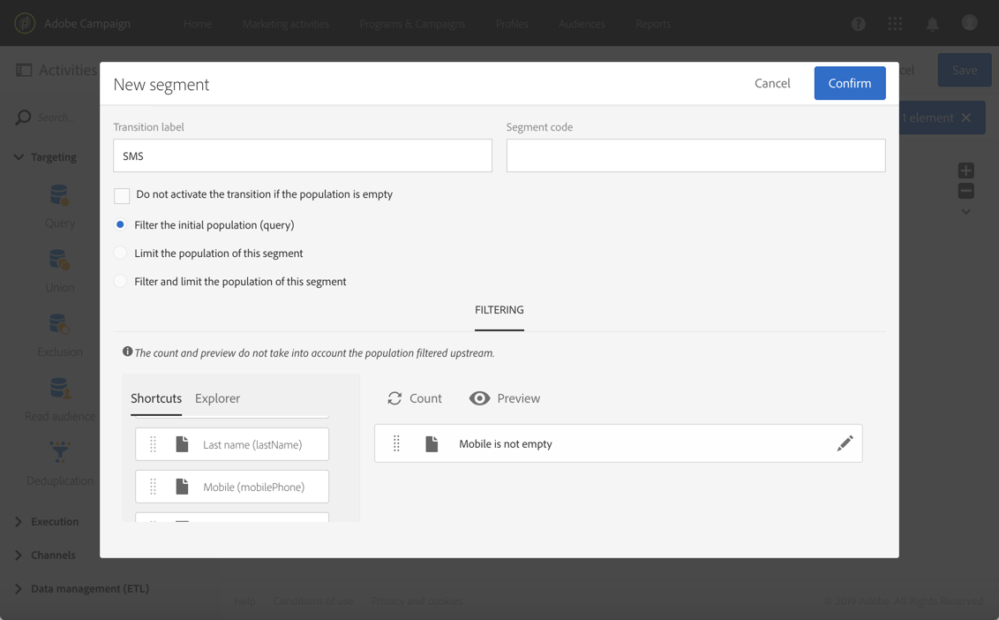

    All of the profiles coming from the query that have a mobile telephone number defined will be in this transition.

1. You can edit the label of the transition. Confirm your changes.

Your second transition is now also configured.

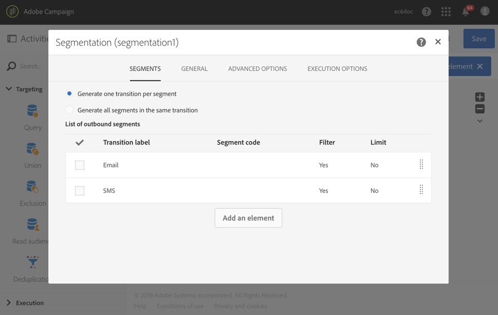

## Creating deliveries {#creating-deliveries}

As two transitions were already created, you must now add two types of deliveries to the outbound transitions of the Segmentation activity: an [Email delivery](../../automating/using/email-delivery.md) activity and an [SMS delivery](../../automating/using/sms-delivery.md) activity.

Adobe Campaign allows you to add deliveries into a workflow. To do this, select a delivery from the **[!UICONTROL Channels]** category of your workflow's activity palette.

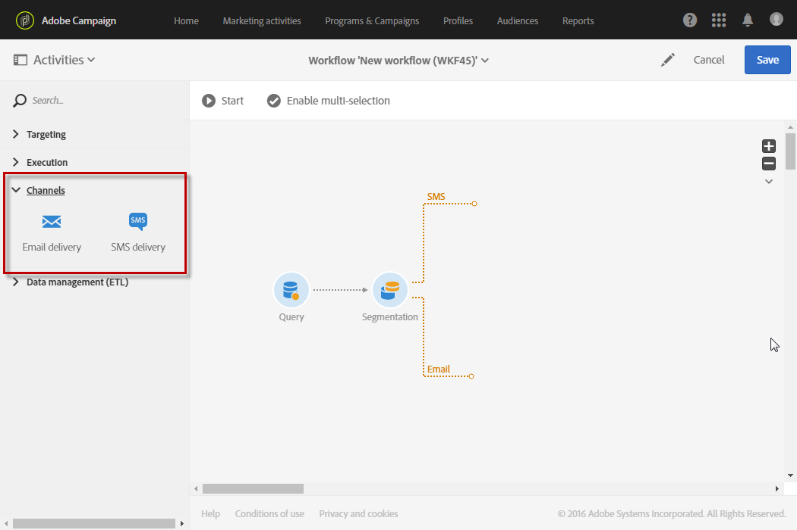

To create an Email delivery:

1. Drag and drop an [Email delivery](../../automating/using/email-delivery.md) activity after the first segment.
1. Double-click the activity to edit it.
1. Select **[!UICONTROL Simple email]**.
1. Select **[!UICONTROL Add an outbound transition with the population]** and click **[!UICONTROL Next]**.

    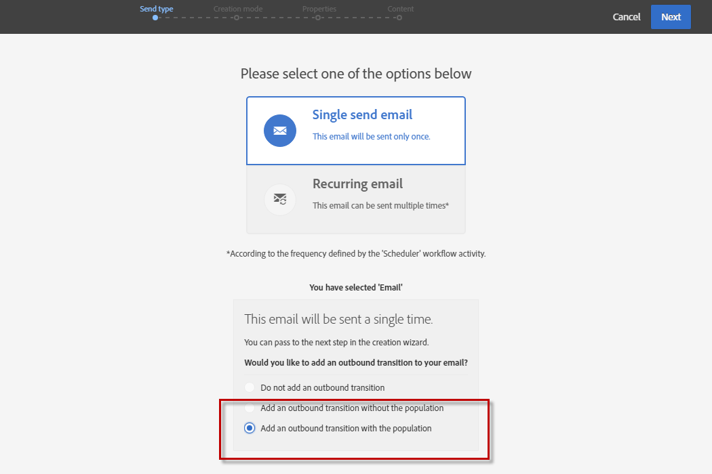

    The outbound transition will allow you to recover the population and the tracking logs. You will be able to use this, for example, to send a second mail to the people who did not click in the first mail.

1. Select an email template and click **[!UICONTROL Next]**.
1. Enter the email properties and click **[!UICONTROL Next]**.
1. To create the layout of your email, select **[!UICONTROL Use the Email Designer]**.
1. Edit and save your content.
1. In the **[!UICONTROL Schedule]** section of the message dashboard, unselect the **[!UICONTROL Request confirmation before sending messages]** option.

To create an SMS delivery:

1. Drag and drop an [SMS delivery](../../automating/using/sms-delivery.md) activity after the other segment.
1. Double-click the activity to edit it.
1. Select **[!UICONTROL SMS]** and click **[!UICONTROL Next]**.
1. Select an SMS template and click **[!UICONTROL Next]**.
1. Enter the SMS properties and click **[!UICONTROL Next]**.
1. Edit and save your content.

Once your deliveries have been created and edited, your workflow is ready to be started.

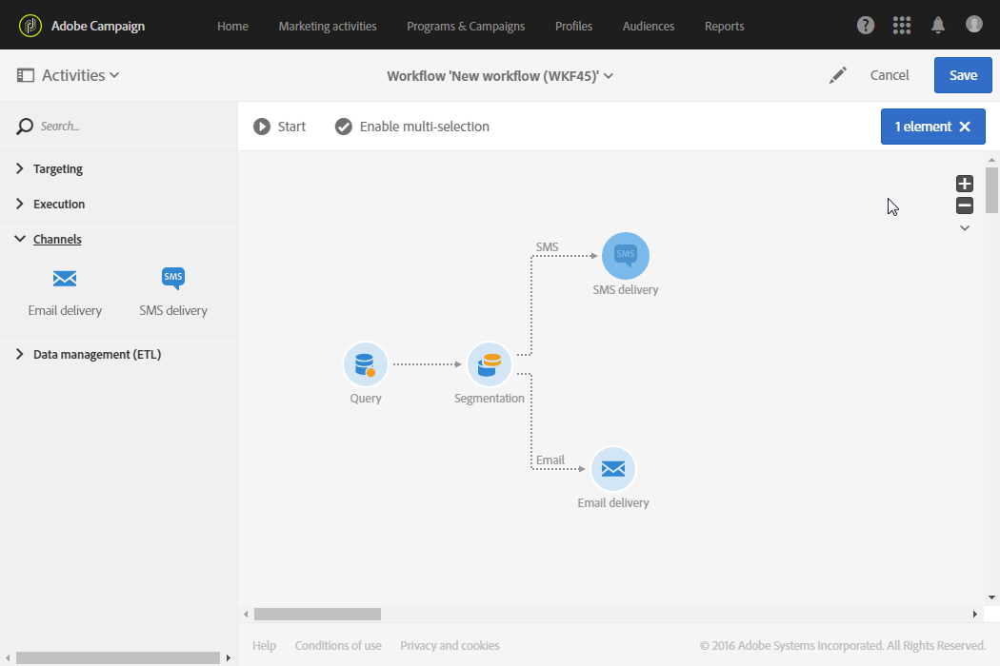

## Running the workflow {#running-the-workflow}

Once the workflow is started, the population targeted by the **[!UICONTROL Query]** activity will be segmented to receive an Email or SMS delivery.

To execute your workflow, click the **[!UICONTROL Start]** button from the action bar.

You can access your deliveries from the **[!UICONTROL Marketing plans]** > **[!UICONTROL Marketing activities]** advanced menu via the Adobe Campaign logo. Click the delivery then the **[!UICONTROL Reports]** button to access the [delivery reports](../../reporting/using/about-dynamic-reports.md#accessing-dynamic-reports), such as the delivery summary, the open rate or the email rendering according to the recipients' message inbox.
