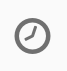
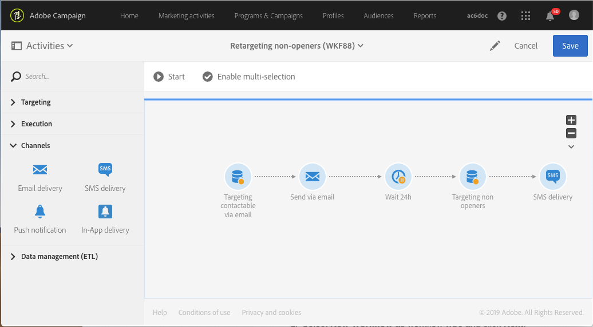

# Retargeting workflow sending a new delivery to non-openers{#retargeting-delivery-to-non-openers}

You can send an email to customers and then an sms to those who did not open the mail.

1. In **[!UICONTROL Marketing Activities]**, click **[!UICONTROL Create]** and select **[!UICONTROL Workflow]**.
1. Select **[!UICONTROL New Workflow]** as workflow type and click **[!UICONTROL Next]**.
1. Enter the properties of the workflow and click **[!UICONTROL Create]**.

## Creating a query activity{#creating-a-query-activity}

1. In **[!UICONTROL Activities]** > **[!UICONTROL Targeting]**, drag and drop a [Query](../../automating/query.md) activity .
1. Double-click the activity.
1. In **[!UICONTROL Shortcuts]**, drag and drop **[!UICONTROL Profiles]** and select **[!UICONTROL email]** with the operator **[!UICONTROL is not empty]**.
1. In **[!UICONTROL Shortcuts]**, drag and drop **[!UICONTROL Profiles]** and select **[!UICONTROL no longer contact by email]** with the value **[!UICONTROL no ]**.
1. Click **[!UICONTROL Confirm]**.

## Creating an email delivery{#creating-an-email-delivery}

1. Drag and drop an [Email delivery](../../automating/email-delivery.md) after each segment.
1. Click the activity and select  to edit.
1. Select **[!UICONTROL Simple email]** and click **[!UICONTROL Next]**.
1. Select **[!UICONTROL Add an outbound transition without the population]** and click **[!UICONTROL Next]**.
1. Select an email template and click **[!UICONTROL Next]**.
1. Enter the email properties and click **[!UICONTROL Next]**.
1. To create the layout of your email, click on **[!UICONTROL Using the Email Designer]**.
1. Insert elements or select an existing template.
1. Personalize your email with offers specific to each location.For more information, refer to [designing an email](../../designing/using/designing-from-scratch.md#designing-an-email-content-from-scratch).
1. Click **[!UICONTROL Preview]** to check your layout.
1. Click **[!UICONTROL Save]**.

## Targeting non-openers in a query activity{#targeting-non-openers-in-a-query-activity}

1. In **[!UICONTROL Activities]** > **[!UICONTROL Execution]**, drag and drop a [Wait](../../automating/wait.md) activity .
1. In **[!UICONTROL Duration]**, click on  and select one day.
1. In **[!UICONTROL Activities]** > **[!UICONTROL Targeting]**, drag and drop a **[!UICONTROL Query activity]** .
1. Double-click the activity.
1. In **[!UICONTROL Shortcuts]**, drag and drop **[!UICONTROL Tracking Logs]** and with the operator **[!UICONTROL exists]**.
1. In **[!UICONTROL Shortcuts]**> **[!UICONTROL Delivery]**, drag and drop **[!UICONTROL delivery]** with the operator **[!UICONTROL is equal to]** and select the delivery as value.
1. In **[!UICONTROL Shortcuts]**> **[!UICONTROL Delivery]**, drag and drop **[!UICONTROL type]** and check **[!UICONTROL Open]** as value.
1. Select the operator between rules as **[!UICONTROL except]**.
1. Click **[!UICONTROL Confirm]**.

## Creating a sms delivery{#creating-a-sms-delivery}

1. Drag and drop an sms delivery after each segment.
1. Click the activity and select  to edit.
1. Select **[!UICONTROL Simple sms]** and click **[!UICONTROL Next]**.
1. Select an sms template and click **[!UICONTROL Next]**.
1. Enter the sms properties and click **[!UICONTROL Next]**.
1. To create the layout of your sms, click on **[!UICONTROL Email Designer]**.
1. Insert elements or select an existing template.
1. Personalize your sms with offers specific to each location.
For more information, refer to the [Designing an sms](../../channels/using/creating-an-sms-message.md) section.
1. Click **[!UICONTROL Preview]** to check your layout.
1. Click **[!UICONTROL Save]**.

**Related topics:**

* [Email channel](../../channels/using/creating-an-email.md)
