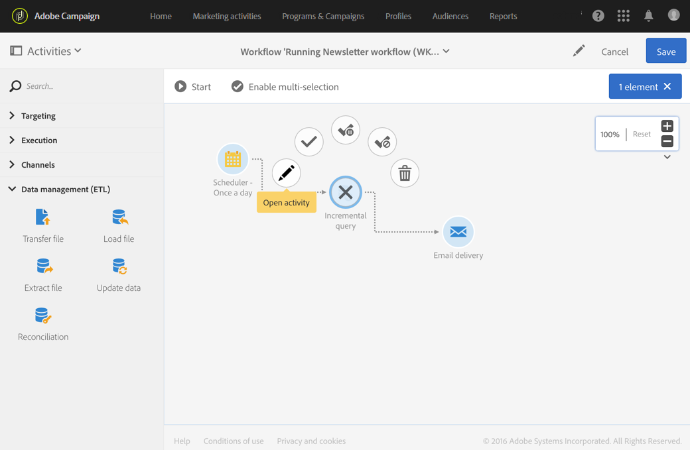
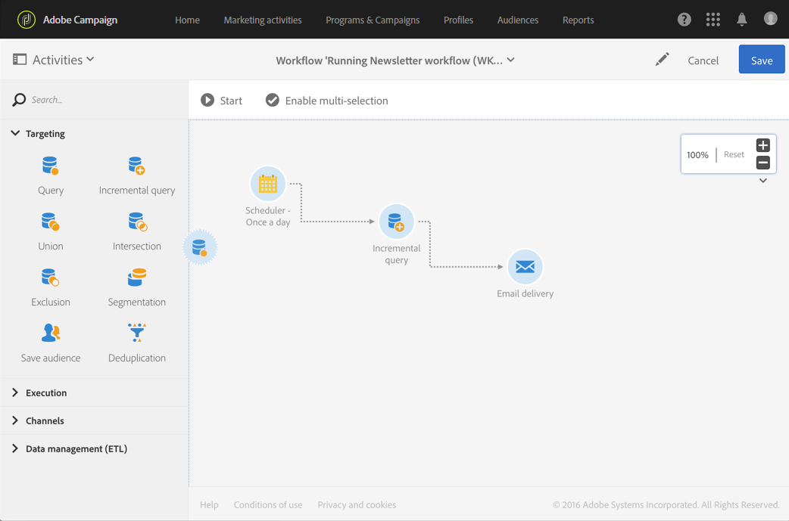
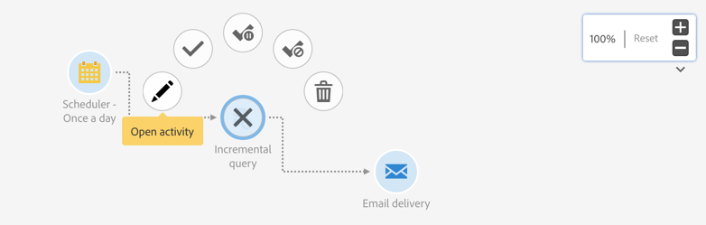

# Workflow interface{#workflow-interface}

Workflow interface

You can create workflows to manage entire processes in your campaigns and programs.

The workflow editing screen is made up of the following elements:

* The [Palette](../../automating/using/workflow-interface.md#palette), which references the available activities
* The [Workspace](../../automating/using/workflow-interface.md#workspace), in which the activities are configured and organized
* The [Action bar](../../automating/using/workflow-interface.md#action-bar), which is made up of buttons that allow you to interact with the workflow and/or its components.
* The [Quick actions](../../automating/using/workflow-interface.md#quick-actions), which appear around a selected activity, allow you to interact with it.

## Palette {#palette}

The palette is on the left-hand side of the screen. All available activities are sorted into several categories:

* [Targeting](../../automating/using/about-targeting-activities.md): activities specific to targeting, manipulating population data, and filtering activities
* [Execution](../../automating/using/about-execution-activities.md): activities specific to organizing and executing workflows
* [Channels](../../automating/using/about-channel-activities.md): activities representing the different available communication channels
* [Data Management (ETL)](../../automating/using/about-data-management-activities.md): activities specific to manipulating data

To use an activity from the palette in your workflow, drag and drop it into your workspace.

You have to configure each activity added from the palette before starting the workflow.

## Workspace {#workspace}

The workspace is the central zone in the workflow editor. It is in this zone that you can drop your activities, link them together using transitions, and configure them.

To link two activities, move the end of the arrow from the first activity up to the following activity until they connect. You can also move the activity towards the point of the arrow behind it in order to link it to the preceding activity. If you move any of the activities, they will stay linked.

Transitions following activities that process data contain the intermediary populations. You can access them if you check the **Keep interim results** option in the **Execution** section of the workflow properties.

When an activity is selected, quick actions appear around the activity, allowing you to interact with it. For example, to configure an activity, select it then open it using the  

button in the quick actions.

Certain functions are only enabled in the workspace:

* Select several activities and transitions by drawing a zone around them.
* Press **Ctrl** + left click to select several activities and/or transitions.
* Press **Enter** to view the detail of the currently selected activity or transition.
* Press **Delete** to delete the currently selected activity.

## Action bar {#action-bar}

Depending on the elements selected in the workspace or on the workflow's execution status, the buttons available in the action bar may vary.

<table> 
 <thead> 
  <tr> 
   <th> Button  </th> 
   <th> No selection  </th> 
   <th> Single-selection  </th> 
   <th> Multi-selection  </th> 
   <th> Running  </th> 
   <th> Description  </th> 
  </tr> 
 </thead> 
 <tbody> 
  <tr> 
   <td>    </td> 
   <td>    </td> 
   <td>    </td> 
   <td>    </td> 
   <td>    </td> 
   <td> Allows you to edit the workflow's properties.  </td> 
  </tr> 
  <tr> 
   <td>    </td> 
   <td>    </td> 
   <td>    </td> 
   <td>    </td> 
   <td> </td> 
   <td> Starts the workflow.  </td> 
  </tr> 
  <tr> 
   <td>    </td> 
   <td> </td> 
   <td> </td> 
   <td> </td> 
   <td>    </td> 
   <td> Pauses the workflow.  </td> 
  </tr> 
  <tr> 
   <td>    </td> 
   <td> </td> 
   <td> </td> 
   <td> </td> 
   <td>    </td> 
   <td> Interrupts workflow execution. Cannot be resumed from where it was stopped.  </td> 
  </tr> 
  <tr> 
   <td>    </td> 
   <td> </td> 
   <td> </td> 
   <td> </td> 
   <td>    </td> 
   <td> Restarts the workflow.  </td> 
  </tr> 
  <tr> 
   <td>    </td> 
   <td>    </td> 
   <td>    </td> 
   <td>    </td> 
   <td>    </td> 
   <td> Opens the workflow's execution log.  </td> 
  </tr> 
  <tr> 
   <td>    </td> 
   <td>    </td> 
   <td>    </td> 
   <td> </td> 
   <td>    </td> 
   <td> Enables multi-selection mode. The workflow must be made up of at least two activities.  </td> 
  </tr> 
  <tr> 
   <td>    </td> 
   <td> </td> 
   <td> </td> 
   <td>    </td> 
   <td> </td> 
   <td> Disables multi-selection mode.  </td> 
  </tr> 
  <tr> 
   <td>    </td> 
   <td> </td> 
   <td>    </td> 
   <td> </td> 
   <td> </td> 
   <td> Opens the selected transition.  </td> 
  </tr> 
  <tr> 
   <td>    </td> 
   <td> </td> 
   <td> </td> 
   <td>    </td> 
   <td>    </td> 
   <td> Re-enables selection if it has previously been disabled or marked as paused.  </td> 
  </tr> 
  <tr> 
   <td>    </td> 
   <td> </td> 
   <td> </td> 
   <td>    </td> 
   <td>    </td> 
   <td> Pauses the workflow at the selected activity.  </td> 
  </tr> 
  <tr> 
   <td>    </td> 
   <td> </td> 
   <td> </td> 
   <td>    </td> 
   <td>    </td> 
   <td> Disables the activity.  </td> 
  </tr> 
  <tr> 
   <td>    </td> 
   <td> </td> 
   <td> </td> 
   <td>    </td> 
   <td>    </td> 
   <td> Deletes the activities that are selected.  </td> 
  </tr> 
 </tbody> 
</table>

## Quick actions {#quick-actions}

When an activity is selected, quick action buttons appear around the activity, allowing you to interact with it.

<table> 
 <thead> 
  <tr> 
   <th> Button  </th> 
   <th> No selection  </th> 
   <th> Single-selection  </th> 
   <th> Multi-selection  </th> 
   <th> Running  </th> 
   <th> Description  </th> 
  </tr> 
 </thead> 
 <tbody> 
  <tr> 
   <td>    </td> 
   <td> </td> 
   <td>    </td> 
   <td> </td> 
   <td>    </td> 
   <td> Disables selecting the activity.  </td> 
  </tr> 
  <tr> 
   <td>    </td> 
   <td> </td> 
   <td>    </td> 
   <td> </td> 
   <td>    </td> 
   <td> Opens the selected activity.  </td> 
  </tr> 
  <tr> 
   <td>    </td> 
   <td> </td> 
   <td>    </td> 
   <td> </td> 
   <td>    </td> 
   <td> Opens the advanced options of the Email or SMS delivery activity selected.  </td> 
  </tr> 
  <tr> 
   <td>    </td> 
   <td> </td> 
   <td>    </td> 
   <td> </td> 
   <td>    </td> 
   <td> Re-enables selection if it has previously been disabled or marked as paused.  </td> 
  </tr> 
  <tr> 
   <td>    </td> 
   <td> </td> 
   <td>    </td> 
   <td> </td> 
   <td>    </td> 
   <td> Pauses the workflow at the selected activity.  </td> 
  </tr> 
  <tr> 
   <td>    </td> 
   <td> </td> 
   <td>    </td> 
   <td> </td> 
   <td>    </td> 
   <td> Disables the activity.  </td> 
  </tr> 
  <tr> 
   <td>    </td> 
   <td> </td> 
   <td>    </td> 
   <td> </td> 
   <td> </td> 
   <td> Forces immediate processing of the selection. This button is only available for the <strong>Scheduler</strong> and <strong>Wait</strong> activities.  </td> 
  </tr> 
  <tr> 
   <td>    </td> 
   <td> </td> 
   <td>    </td> 
   <td> </td> 
   <td>    </td> 
   <td> Deletes the activities that are selected.  </td> 
  </tr> 
 </tbody> 
</table>

