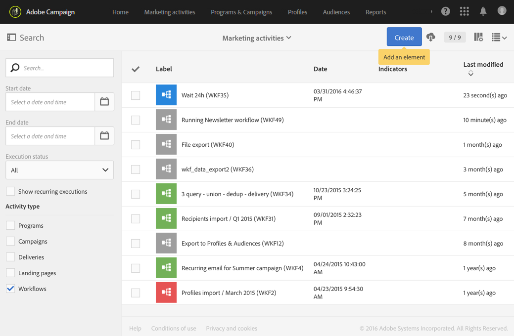

# Workflow life cycle {#life-cycle}

A workflow's life cycle includes three main steps and each step is linked to a status and a color:

* **Editing** (gray)

  This is the initial design phase of a workflow (refer to [Creating a workflow](../../automating/using/building-a-workflow.md#creating-a-workflow)). The workflow is not yet handled by the server and can be modified without any risk.

* **In progress** (blue)

  Once the initial design phase is complete, the workflow can be started and is handled by the server.

* **Finished** (green)

  A workflow is finished once there are no longer any tasks in progress or when an operator has explicitly stopped the instance.

Once it has been started, a workflow may also have two other statuses:

* **Warning** (yellow)

  The workflow could not finish or was paused using the  or  buttons.

* **Erroneous** (red)

  An error occurred when a workflow was executed. The workflow was stopped and the user must carry out an action. To find out more about this error, use the  button to access the workflow log (refer to [Monitoring](../../automating/using/monitoring-workflow-execution.md)).

The list of marketing activities allows you to display all the workflows as well as their statuses. For more on this, see [Managing marketing activities](../../start/using/marketing-activities.md#about-marketing-activities).

