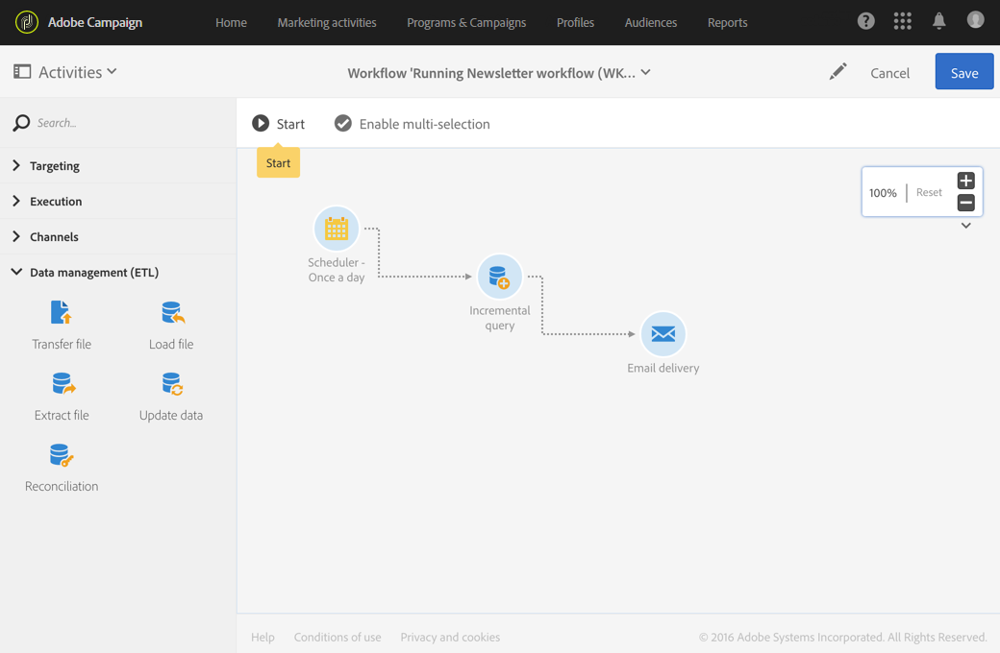

# Discover workflows {#about-workflows}

## About workflows {#about-workflows}

Adobe Campaign offers a comprehensive graphical environment that allows you to design complex processes including segmentation, campaign execution, file processing, approvals, etc. For example, you can use a workflow to download a file from a server, decompress it, and then import its records into the Adobe Campaign database.

A workflow can also involve users by assigning them tasks or having them approve performed tasks. This means you can assign a task to one or several users to work on content or specify targets, and approve proofs before sending the message.

Workflows can be used in **different contexts**, as for example:

* Targeting to manage audiences or send messages. For more on this, refer to [Channel activities](../../automating/using/about-channel-activities.md) and [Targeting activities](../../automating/using/about-targeting-activities.md).
* Data management (ETL) to manipulate data. For more on this, refer to [Data management activities](../../automating/using/about-data-management-activities.md).
* Importing data into Campaign database. For more on this, refer to [Importing and exporting data](../../automating/using/about-data-import-and-export.md).
* Technical processes such as database cleanup, recovering tracking information, etc. Learn more about technical workflows in [this section](../../administration/using/technical-workflows.md).

Workflows are also accessible from the Adobe Campaign Standard API. For more on this, refer to the [dedicated documentation](../../api/using/controlling-a-workflow.md).

## Workflow operating principles{#workflow-operating-principles}

A workflow is a **sequence of configurable activities**. Each activity has a specific role in the process. The result of each activity is forwarded to the following activity by a **transition**, represented by an arrow.

The type of data exchanged between one activity and another can affect the way the following activities are configured. For example, if a population is established before email delivery activity, it can serve as the target for the email in question.

You can open activities to check or edit parameters before or after executing the workflow.

You can open transitions to check that the data sent is correct during or after executing the workflow. To access the detail view of the transitions, you have to check the **[!UICONTROL Keep interim results]** option in the **[!UICONTROL Execution]** section of the workflow properties.

