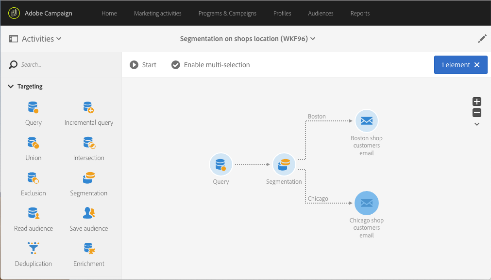

# Segmentation on location {#segmentation-on-location}

You can send a targeting email to customers with offers on their local shops.

1. In **[!UICONTROL Marketing Activities]**, click **[!UICONTROL Create]** and select **[!UICONTROL Workflow]**.
1. Select **[!UICONTROL New Workflow]** as workflow type and click **[!UICONTROL Next]**.
1. Enter the properties of the workflow and click **[!UICONTROL Create]**.

## Selecting recipients contactable via email{#selecting-recipients-contactable-via-email}

1. In **[!UICONTROL Activities]** > **[!UICONTROL Targeting]**, drag and drop a [Query](../../automating/using/query.md) activity .
1. Double-click the activity.
1. In **[!UICONTROL Shortcuts]**, drag and drop **[!UICONTROL Profiles]** and select the field **[!UICONTROL email]** with the operator **[!UICONTROL is not empty]**.
1. In **[!UICONTROL Shortcuts]**, drag and drop **[!UICONTROL Profiles]** and select the field **[!UICONTROL no longer contact by email]** with the value **[!UICONTROL no]**.
1. Click **[!UICONTROL Confirm]** twice.

## Creating a Segmentation activity{#creating-a-segmentation-activity}

1. Drag and drop a [Segmentation](../../automating/using/segmentation.md) activity and double-click it.
1. Click on segment then open transition to target people in the first city. Here Boston.
1. Drag and drop **[!UICONTROL Location]**  and select **[!UICONTROL City]** with the operator **[!UICONTROL equals to]** and the value **[!UICONTROL Boston]**.
Note: To reach all the people that entered boston, unregarding of the case uncheck the case sensitive option.
1. Click **[!UICONTROL Confirm]**.
1. In **[!UICONTROL List of outbound segments]**, click **[!UICONTROL Add an element]** and click on   to create a segment targeting people in the second city. Here Chicago.
1. Drag and drop **[!UICONTROL Location]** and select **[!UICONTROL City]** with the operator **[!UICONTROL equals to]** and enter **[!UICONTROL Chicago]** in value.
1. To reach all the people that entered chicago, unregarding of the case uncheck the case sensitive option.
1. Click **[!UICONTROL Confirm]**.

## Creating an email delivery{#creating-an-email-delivery}

1. In **[!UICONTROL Activities]** > **[!UICONTROL Channels]**, drag and drop an [Email delivery](../../automating/using/email-delivery.md) activity after each segment.
1. Click the activity and select  to edit.
1. Select **[!UICONTROL Simple email]** and click **[!UICONTROL Next]**.
1. Select an email template and click **[!UICONTROL Next]**.
1. Enter the email properties and click **[!UICONTROL Next]**.
1. To create the layout of your email, click on **[!UICONTROL Email Designer]**.
1. Insert elements or select an existing template.
1. Personalize your email with offers specific to each location.

    For more information, refer to [designing an email](../../designing/using/designing-from-scratch.md#designing-an-email-content-from-scratch).

1. Click **[!UICONTROL Preview]** to check your layout.
1. Click **[!UICONTROL Save]**.

