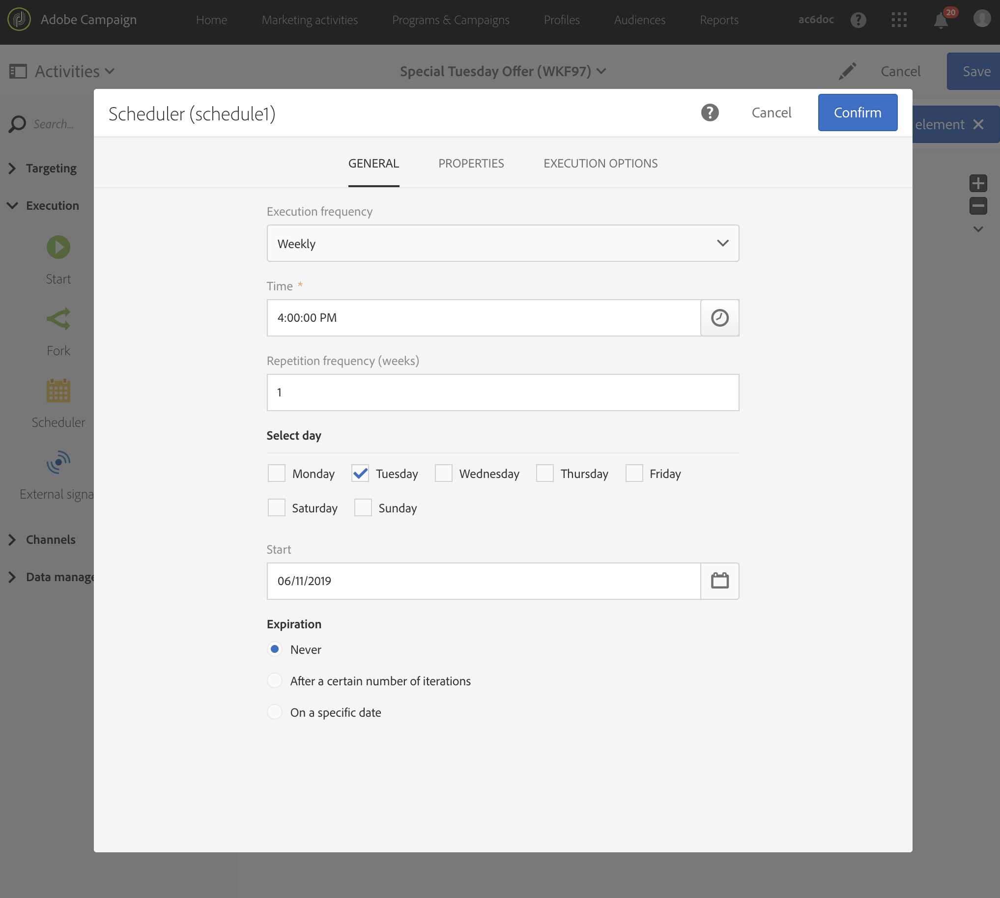

# Creating an email delivery every Tuesday{#creating-email-every-tuesday}

You can send an email every Tuesday to all the customers for Special Offers.

1. In **[!UICONTROL Marketing Activities]**, click **[!UICONTROL Create]** and select **[!UICONTROL Workflow]**.
1. Select **[!UICONTROL New Workflow]** as workflow type and click **[!UICONTROL Next]**.
1. Enter properties of the workflow and click **[!UICONTROL Create]**.

## Creating a Scheduler activity{#creating-a-scheduler-activity}

1. In **[!UICONTROL Activities]** > **[!UICONTROL Execution]**, drag and drop a [Scheduler](../../automating/using/scheduler.md) activity.
1. Double-click the activity.
1. Configure the execution of your delivery. 
1. In **[!UICONTROL Execution frequency]**, select **[!UICONTROL Weekly]**.
1. Select a **[!UICONTROL Time]** and a **[!UICONTROL Repetition frequency]** for your deliveries.
1. In **[!UICONTROL Days of the week]**, select **[!UICONTROL Tuesday]**.
1. Specify a **[!UICONTROL Start]** and an **[!UICONTROL Expiration]** parameter for your workflow.
1. Confirm your activity and save your workflow.

>[!NOTE]
>
>To start your workflow at a specific **[!UICONTROL Time Zone]**, in the **[!UICONTROL Execution options]** tab, set up the time zone for your scheduler in the Time zone field. By default, the selected time zone is the one defined in the workflow properties (see [Building a workflow](../../automating/using/building-a-workflow.md)).

## Creating a Query activity{#creating-a-query-activity}

1. In **[!UICONTROL Activities]** > **[!UICONTROL Targeting]**, to select recipients, drag and drop a [Query](../../automating/using/query.md) activity and double-click it.
1. In **[!UICONTROL Shortcuts]** > **[!UICONTROL Profile]**, drag and drop **[!UICONTROL Email]**.
1. Select **[!UICONTROL is not empty]** as an operator.
1. In **[!UICONTROL Shortcuts]** > **[!UICONTROL General]**, add profiles and select **[!UICONTROL no longer contact by email]** with the value **[!UICONTROL No]**.
1. Click **[!UICONTROL Confirm]**.

## Creating an Email delivery{#creating-an-email-delivery}

1. In **[!UICONTROL Activities]** > **[!UICONTROL Channels]**, drag and drop an [Email delivery](../../automating/using/email-delivery.md) activity.
1. Click the activity and select  to edit.
1. Select **[!UICONTROL Recurring email]** and click **[!UICONTROL Next]**.
1. Select an email template and click **[!UICONTROL Next]**.
1. Enter the email properties and click **[!UICONTROL Next]**.
1. To create the layout of your email, click on **[!UICONTROL Use Email Designer]**.
1. Insert elements or select an existing template.
1. Personalize your email using fields and links.
1. Click **[!UICONTROL Save]**.

For more information, refer to [designing an email](../../designing/using/designing-from-scratch.md#designing-an-email-content-from-scratch).

**Related topics:**

* [Email channel](../../channels/using/creating-an-email.md)
