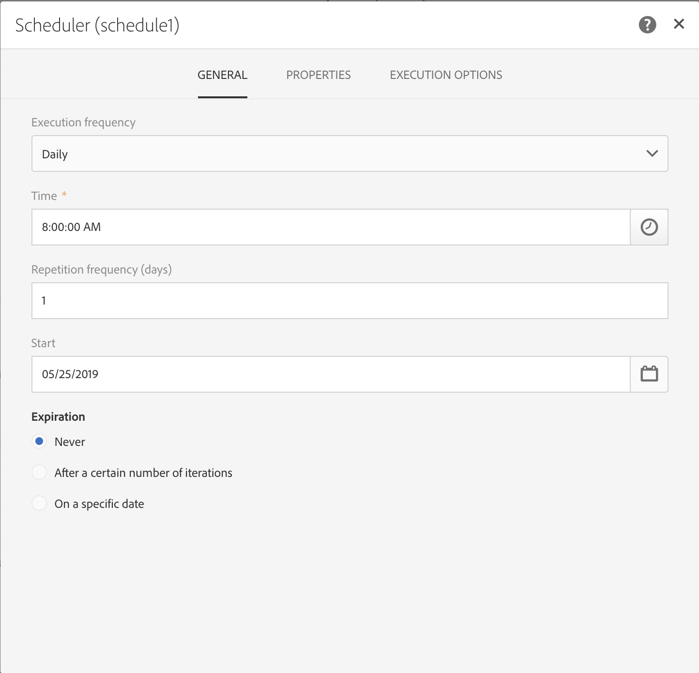

# Workflow use case: Create deliveries on profiles' creation date {#creation-date-query}

You can send an offer via email on the anniversary of the customer's profile creation.

1. In a Marketing Activities, click create and select **Workflow**.
1. Select **New Workflow** as workflow type and click **Next**.
1. Enter properties of the workflow and click **Create**.

## Creating a Scheduler activity {#creating-a-scheduler-activity}

1. In **Activities** > **Execution**, drag and drop a **Scheduler activity** .
1. Double-click the activity.
1. Configure the execution of your delivery.
	1. In **Execution frequency**, select **Daily**.
	1. Select a **Time** and the **Repetition frequency** of execution for your workflow.
	1. Select a **Start** date and **Expiration** for your workflow.

		

		>[!NOTE]
		>
		>To start your workflow at a specific time zone, in the **Execution options** tab, set up the time zone for your scheduler in the **Time zone** field.

		

1. Confirm your activity and save your workflow.

## Creating a Query activity {#creating-a-query-activity}

1. To select recipients, drag and drop a query activity and double-click it.
1. Add profiles and select no longer contact by email with the value no.

### Retriving profiles created on the same day as the day of execution {#retriving-profiles-created-on-the-same-day}

1. In Profile, drag and drop the Created field. At the top-right of the window, click on **Advanced Mode**.

1. In the **list of functions**, double-click Day from the **Date** node.
1. Then, insert the field **Created** as argument.
1. Select **equals to** (=) as the operator.
1. For Value, select **Day** from the **Date** node in the **List of functions**.
1. Insert the **GetDate()** function as argument. 
You retrieved the profiles which creation day is equal to current day.
You should end up with this:

	```Day(@created) = Day(GetDate())```
	

1. Click **Confirm**.

### Retriving profiles created on the same month as the month of execution{#retriving-profiles-created-on-the-same-month}

1. On the Query editor, select the first query and duplicate it. 
1. Open the duplicate.
1. Replace Day by Month in the query.
	You should end up with this:  

	``` Month(@created) = Month(GetDate()) ```

1. Click **Confirm**.


The final query displays: 


## Creating an Email delivery{#creating-an-email-delivery}

1. Drag and drop an email delivery.
	1. Click the activity and select  to edit.
	1. Select **Recurring email** and click **Next**.
	1. Select an email template and click **Next**.
	1. Enter the email properties and click **Next**.
  1. To create the layout of your email, click on **Email Designer**.
	1. Insert elements or select an existing template.
	1. Personalize your email using fields and links.
	For more information, refer to [designing an email](../../designing/using/about-email-content-design.md#designing-an-email-content-from-scratch).
1. Click **Preview** to check your layout.
1. Click **Save**.

**Related topics:**

* [Query](../../automating/using/query.md)
* [Scheduler](../../automating/using/scheduler.md)
* [Email delivery](../../automating/using/email-delivery.md)
* [Email channel](../../channels/using/creating-an-email.md)
