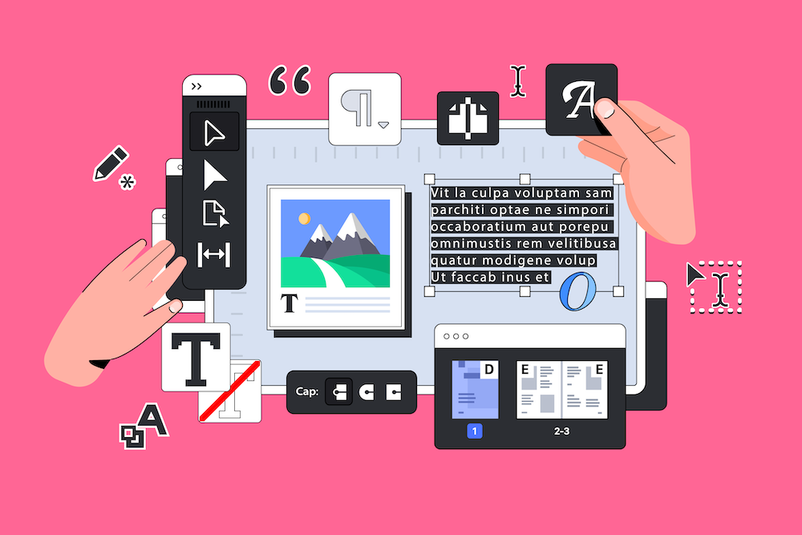

# Adobe Campaign Standard Documentation {#campaign-standard-documentation}

## What's New

Get a glimpse of the newest enhancements in Adobe Campaign Standard product and documentation! For a comprehensive list of features, improvements, and fixes, check out the detailed [Release Notes](rn/using/release-notes.md).

>[!BEGINTABS]

>[!TAB Transition to Campaign v8]

We are excited to announce that Adobe Campaign Standard users are now eligible to transition to Adobe Campaign Managed Cloud Services v8.

{target="_blank"}

>[!TAB Campaign 25.1 release is live!]

Discover improvements and fixes coming with Campaign Standard 25.1 release.

>[!TAB Campaign - RTCDP integration] 

Learn how to share data between Campaign and Real-time Customer Data Platform (RTCDP).

>[!ENDTABS]

## Start with the basics

<table style="table-layout:fixed">
  <tr style="border: 0;">
    <td>
    
    
<strong>User interface</strong> Learn how to navigate and optimize your experience in Journey Optimizer.

    </td>
    <td>
    
    
<strong>Email Designer</strong> Learn how to use the Email Designer to create responsive and personalized emails.

    </td>
    <td>
    
    
<strong>Communications channels</strong> Learn how to send messages across various channels such as email, SMS, push notifications among others.
    </td>
    <td>
    
    
<strong>Build your first workflow</strong> Learn the main principles and best practices for building workflows.

    </td>
  </tr>
  <tr style="border: 0;">
    <td align="center"></td>
    <td align="center"></td>
    <td align="center"></td>
    <td align="center"></td>
    </tr>
</table>

## Explore the documentation

<table style="table-layout:auto">
  <tr style="border: 0;">
    <td>
       
      <strong>Customer's experience</strong> <a href="sending/using/track-and-monitor.md">Monitoring messages</a> - <a href="channels/using/getting-started-with-transactional-msg.md">Transactional messaging</a> - <a href="channels/using/getting-started-with-landing-pages.md">Landing pages</a> - <a href="reporting/using/about-dynamic-reports.md">Reporting</a> - <a href="start/using/privacy-management.md">Privacy</a>
    </td>
    <td>
       
      <strong>Configuration administration</strong> <a href="administration/using/about-channel-configuration.md">Configure channels</a> - <a href="administration/using/about-campaign-standard-settings.md">Campaign Standard settings</a>  - <a href="administration/using/about-access-management.md">Access management</a> - <a href="administration/using/monitoring-guidelines.md">Monitoring guidelines</a> - <a href="integrating/using/get-started-campaign-integrations.md">Integrate Campaign with other solutions</a>
    </td>
    <td>
       
      <strong>Communication channels</strong> <a href="channels/using/about-emails.md">Email</a> - <a href="channels/using/about-sms-messages.md">SMS</a> - <a href="channels/using/about-in-app-messaging.md">In-app</a> - <a href="channels/using/about-push-notifications.md">Push notifications</a> - <a href="channels/using/about-direct-mail.md">Direct mail</a> - <a href="channels/using/about-direct-mail.md">Web</a>
    </td>
  </tr>
  <tr style="border: 0;">
    <td>
       
      <strong>Content management</strong> <a href="sending/using/design-and-personalize.md">Build personalized content</a> - <a href="sending/using/sending-proofs.md">Send proofs</a> - <a href="sending/using/previewing-messages.md">Preview deliveries</a> - <a href="sending/using/use-templates.md">Use templates</a>
    </td>
    <td>
       
      <strong>Profiles & audiences</strong> <a href="audiences/using/about-audiences.md">Audiences</a> - <a href="audiences/using/about-profiles.md">Profiles</a> - <a href="audiences/using/about-subscriptions.md">Subscriptions</a> - <a href="audiences/using/about-opt-in-and-opt-out-in-campaign.md">Opt-in & opt-out</a>
    </td>
    <td>
       
      <strong>Data management</strong> <a href="developing/using/data-model-concepts.md">Campaign Standard data model</a> - <a href="developing/using/key-steps-to-add-a-resource.md">Adding or extending a resource</a> - <a href="automating/using/about-data-import-and-export.md">Data import and export</a> - <a href="automating/using/managing-encrypted-data.md">Manage encrypted data</a>
    </td>
  </tr>
</table> 

## Additional resources

<table style="table-layout:fixed"><tr style="border: 0;">
<td><strong>Useful pages</strong> 
<a href="https://experienceleague.adobe.com/docs/campaign-standard-learn/tutorials/overview.html" target="_blank">Tutorials</a> - <a href="https://helpx.adobe.com/legal/product-descriptions/campaign-standard.html" target="_blank">Product description</a> - <a href="rn/using/deprecated-features.md">Deprecated and removed features</a> - <a href="rn/using/release-planning.md">Release planning</a>
</td>
<td><strong>Technical resources</strong> 
<a href="integrating/using/about-adobe-experience-cloud-triggers.md">Experience Cloud triggers</a> - <a href="api/using/get-started-apis.md">Campaign APIs</a> - <a href="https://helpx.adobe.com/campaign/kb/acs-article-list.html" target="blank">Technical notes</a> - <a href="https://experienceleague.adobe.com/docs/control-panel/using/control-panel-home.html" target="_blank">Control Panel documentation</a> - <a href="https://experienceleague.adobe.com/developer/campaign-errors/error_codes.html">List of error messages</a>
</td>
</tr></table>