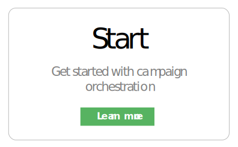
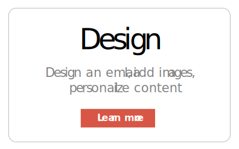
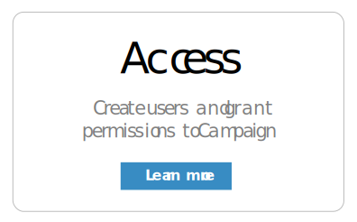

# Adobe Campaign Standard product documentation {#adobe-campaign-standard-product-documentation}

Learn Adobe Campaign basics through simple step-by-step procedures, and experience the power of the solution.

<table>
<thead>
 <tr>
  <th colname="col1" class="entry"> Description </th>
  <th colname="col2" class="entry"> Description </th>
  <th colname="col3" class="entry"> Description </th>
 </tr>
</thead>
<tbody>
    <tr>
        <td></td>
        <td></td>
        <td></td>
    </tr>
    <tr>
        <td></td>
        <td></td>
        <td></td>
    </tr>
    <tr>
        <td></td>
        <td></td>
        <td></td>
    </tr>
</tbody>
</table>