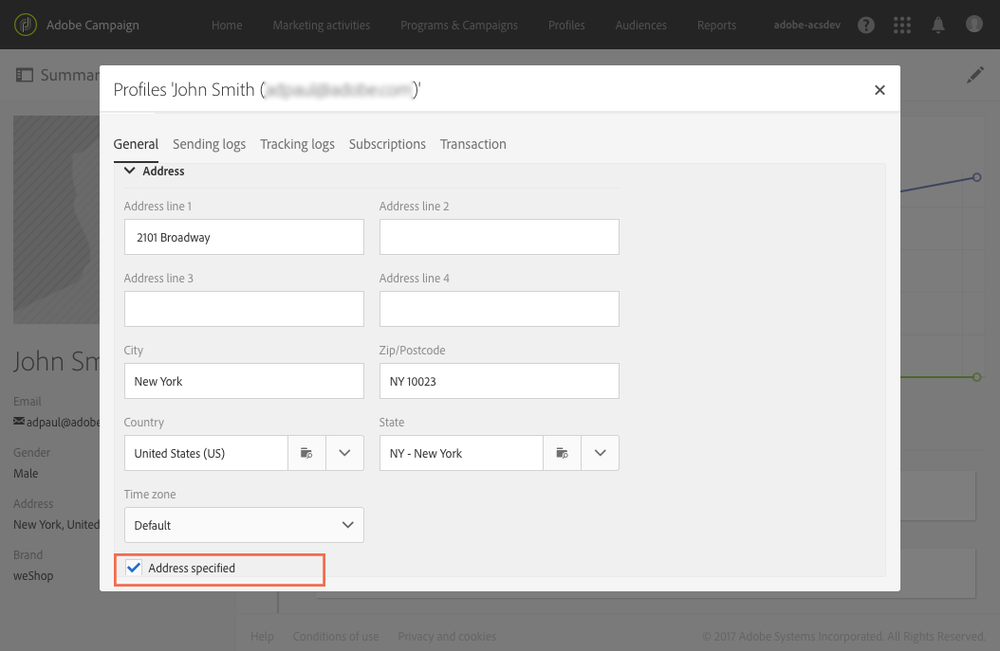
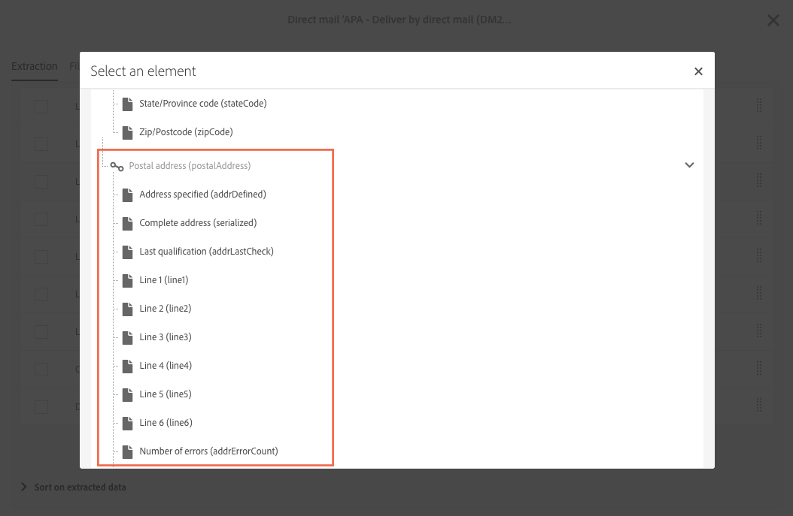

# About direct mail{#about-direct-mail}

Direct mail is an offline channel that allows you to personalize and generate the file required by direct mail providers. It gives you the possibility to mix online and offline channels in your customer journeys.

>[!NOTE]
>
>This feature is optional. Please check your license agreement. The **[!UICONTROL Export]** role is required to use direct mail. Please contact your administrator.

Online channels allow you to create your messages (email, SMS, mobile app delivery, etc.) and send them to your audience directly from Adobe Campaign. With offline channels, it is different. When you prepare a direct mail delivery, Adobe Campaign generates a file including all the targeted profiles and the chosen contact information (postal address for example). You will then be able to send this file to your direct mail provider who will take care of the actual sending.

The following section explains how to create and generate a one-shot direct mail delivery. You also have the possibility to include a direct mail activity in a workflow to orchestrate campaigns combining online and offline channels. For more on this, refer to the [Workflows](../../automating/using/workflow-data-and-processes.md) guide.

The user process in Adobe Campaign is as follows:

1. Creating the delivery
1. Choosing the audience
1. Defining the content
1. Setting the contact date
1. Generating the file

## Recommendations {#recommendations}

### Direct mail providers {#direct-mail-providers}

First of all, you need to reach out to your direct mail provider and collect their recommendations. Identify what profile information needs to be included in the extraction file so that they can personalize the communication and send it to the audience. For example, the first and last name, the postal address, a promotion code, etc. These fields are the ones that you will add in the [Defining the extraction](../../channels/using/defining-the-direct-mail-content.md#defining-the-extraction) tab of the direct mail's content.

Make sure you have checked the **[!UICONTROL Address specified]** box in your profiles' information. If this option is activated, the profile will be added to the target. It is not, it will excluded by a typology rule during the preparation phase (see [Creating the direct mail](../../channels/using/creating-the-direct-mail.md)). During profile import, do not forget to update this field.

### Postal addresses {#postal-addresses}

When you add the fields to include in the extraction file, the postal address fields are available in the **[!UICONTROL Location]** node.

Adobe Campaign offers you a set of predefined calculated fields that follow the most common postal address normalizations. The fields are available in the **[!UICONTROL Postal address]** node.

An address can contain up to six lines by default: the first calculated field ( **[!UICONTROL Line 1]** contains the first name and last name, the next lines contain the postal address (road etc.), and the last line contains the ZIP/Postal code and town or city.

