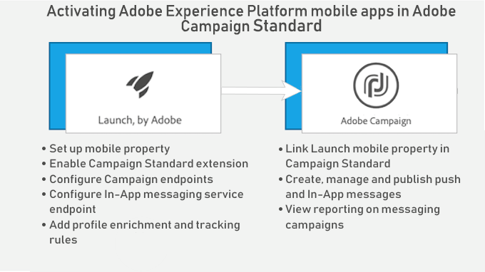

# About In-App messaging{#about-in-app-messaging}

In-App messaging is a messaging channel that allows you to display a message when the user is active within the mobile application. This message type is complimentary to push notifications which are delivered to the notification center of users' phone. For more information on the push notification channel, refer to this [section](../../channels/using/about-push-notifications.md).

This channel requires mobile applications to be integrated with Adobe Experience Platform SDK. These apps have to be activated in Adobe Experience Platform Launch before being available in Adobe Campaign for In-App deliveries.

To start sending In-App messages on mobile applications leveraging Experience Platform SDK, you need to meet following prerequisites:

1. In Adobe Campaign, make sure you can access the **[!UICONTROL In-App]** channel. If you cannot access these channels, contact your account team.
1. In Experience Platform Launch, create the mobile application by creating a mobile property and instrument your mobile app with Experience Platform SDK.

   For more information, refer to the [Set up a mobile property](https://aep-sdks.gitbook.io/docs/getting-started/create-a-mobile-property) section in Adobe Launch documentation.

1. In Experience Platform Launch, install the **[!UICONTROL Adobe Campaign Standard]** extension for your mobile application in Experience Platform Launch:

   For more on extensions, refer to the [Configure Campaign Standard Extension in Experience Platform Launch](https://aep-sdks.gitbook.io/docs/using-mobile-extensions/adobe-campaign-standard) in Experience Platform Launch documentation.

1. In Experience Platform Launch, configure rules and data elements for your application, see [Configuring your application in Experience Platform Launch](https://helpx.adobe.com/campaign/kb/config-app-in-launch.html#Step1Createdataelements)

1. Configure your Experience Platform Launch application in Adobe Campaign Standard, see [Setting up your Experience Platform Launch application in Adobe Campaign](https://helpx.adobe.com/campaign/kb/configuring-app-sdk.html#SettingupyourAdobeLaunchapplicationinAdobeCampaign) .

To learn how to configure Experience Platform SDKs, refer to this [page](https://helpx.adobe.com/campaign/kb/configuring-app-sdk.html).

**Related content:**

* [Preparing and sending an In-App message](../../channels/using/preparing-and-sending-an-in-app-message.md)
* [Customizing an In-App message](../../channels/using/customizing-an-in-app-message.md)
* [Customizing a local notification message type](../../channels/using/customizing-an-in-app-message.md#customizing-a-local-notification-message-type)
* [Sending an In-App message within a workflow](../../automating/using/in-app-delivery.md)
* [Push and In-App FAQ](https://helpx.adobe.com/campaign/kb/push_inapp_faq.html)