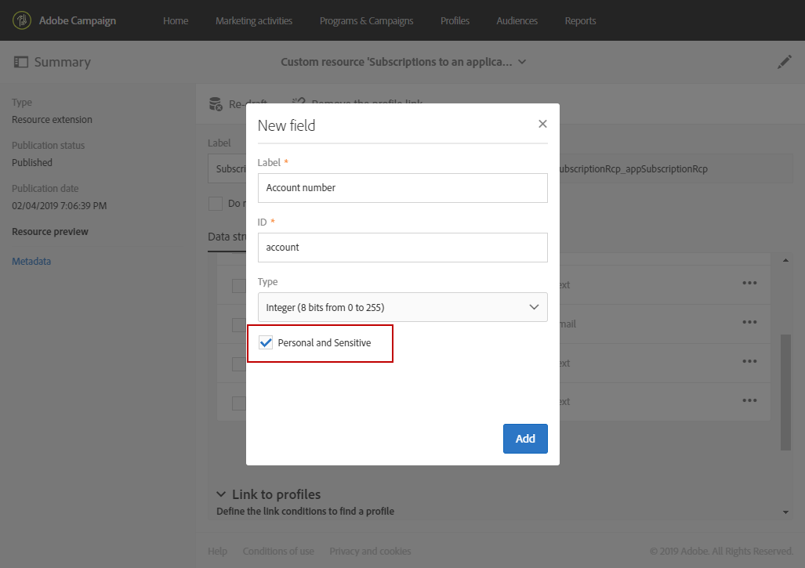

# About In-App messaging{#about-in-app-messaging}

In-App messaging is a messaging channel that allows you to display a message when the user is active within the mobile application. This message type is complimentary to push notifications which are delivered to the notification center of users' phone. For more information on the push notification channel, refer to this [section](../../channels/using/about-push-notifications.md).

This channel requires mobile applications to be integrated with Adobe Experience Platform SDK. These apps have to be activated in the Data Collection UI before being available in Adobe Campaign for In-App deliveries.

To start sending In-App messages on mobile applications leveraging Experience Platform SDK, you need to meet following prerequisites:

1. In Adobe Campaign, make sure you can access the **[!UICONTROL In-App]** channel. If you cannot access these channels, contact your account team.

1. To leverage mobile use cases in Adobe Campaign Standard with an Experience Cloud SDK application, a mobile app has to be created in the Data Collection UI and be configured in Adobe Campaign Standard. For the step-by-step guide, refer to this [page](../../administration/using/configuring-a-mobile-application.md).

1. Once configured, you can now prepare your In-App message. For more on this, refer to this [page](../../channels/using/preparing-and-sending-an-in-app-message.md#preparing-your-in-app-message).

1. You can then decide to send an [In-App message](../../channels/using/customizing-an-in-app-message.md) or a [Customizing a local notification message type](../../channels/using/customizing-an-in-app-message.md#customizing-a-local-notification-message-type).

1. Your delivery is now ready to be sent. To learn more, refer to this [page](../../channels/using/preparing-and-sending-an-in-app-message.md#sending-your-in-app-message).

**Related content:**

* [In-App report](../../reporting/using/in-app-report.md)
* [Mobile use cases supported in Adobe Campaign Standard](../../administration/using/configuring-rules-launch.md)
* [Campaign Standard Mobile guide](../../channels/using/get-started-communication-channels.md)

## Handling mobile profile fields with personal and sensitive data {#handling-mobile-profile-fields-with-personal-and-sensitive-data}

In Adobe Campaign, mobile profile attributes data sent from mobile device are stored in **[!UICONTROL Subscriptions to an application (appSubscriptionRcp)]** resource which allows you to define the data that you want to collect from your applications' subscribers.

This resource needs to be extended to collect data you intend to send from the mobile device to Adobe Campaign. To do so, refer to this [page](../../developing/using/extending-the-subscriptions-to-an-application-resource.md) for the detailed steps.

To enable personalization of your In-App messages more securely, mobile profile fields from this resource need to be configured accordingly. In your **[!UICONTROL Subscriptions to an application (appSubscriptionRcp)]**, when creating your new mobile profiles fields, check **[!UICONTROL Personal and Sensitive]** to make them unavailable during In-App messages personalization.

>[!NOTE]
>
>If you have an existing implementation with custom resource extension on this table, we advise you to label the fields appropriately before leveraging them for personalization of In-App messages.

Once your **[!UICONTROL Subscriptions to an application]** custom resource is configured and published, you can start preparing your In-App delivery using the **[!UICONTROL Target users based on their Mobile profile (inApp)]** template. Only non-personal and non-sensitive fields will be available from **[!UICONTROL Subscriptions to an application (appSubscriptionRcp)]** resource for personalization.

If you require personalization with **Personal and Sensitive** fields, we recommend using the **[!UICONTROL Target users based on their Campaign profile (inAppProfile)]** template which has additional security mechanism to ensure that your users' PII data remains secure.
