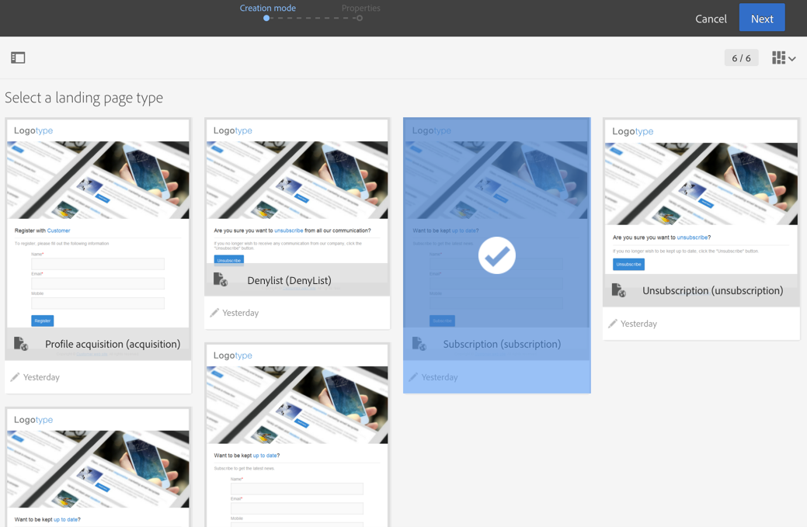
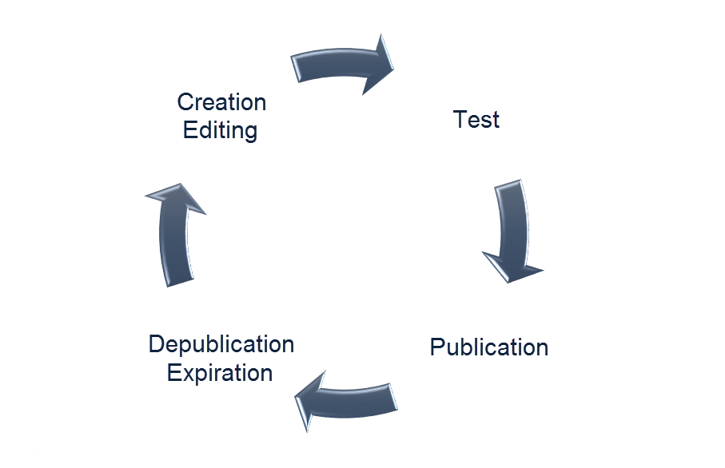

# About landing pages{#about-landing-pages}

Campaign comes with landing pages which are web forms that can be used to capture information on your audiences, offer subscriptions to a service, display data and grow your database. Landing pages can also be used for acquiring or updating existing profiles.

>[!CAUTION]
>
>Landing pages can only be used to create or update **profiles**.

Campaign comes with a set of built-in landing page templates:

* **[!UICONTROL Acquisition]**: this is the default template for landing pages, which enables you to capture and update data in Campaign database.
* **[!UICONTROL Subscription]**: this template should be used to offer subscriptions to a service.
* **[!UICONTROL Unsubscription]**: this template can be linked from an email sent to subscribers to a service, to allow them to unsubscribe this service.
* **[!UICONTROL Blacklist]**: this template should be used when a profile no longer wants to be contacted by Campaign. For more about blacklisting, refer to [About opt-in and opt-out in Campaign](../../audiences/using/about-opt-in-and-opt-out-in-campaign.md).

These templates are proposed by default when creating a new landing page.

Adobe recommends to create your own templates by duplicating a built-in template. Some parameters can only be set in landing page templates, and cannot be modified in landing pages directly.

>[!NOTE]
>
>To access landing page templates, click the Adobe Campaign logo on the upper left corner and select **[!UICONTROL Resources]** > **[!UICONTROL Templates]** > **[!UICONTROL Landing page templates]**.

The full life cycle of a landing page is as follows:

1. Creation: design and set the content of the landing page.
1. Test: simulate the landing page execution on a test profile.
1. Publication: publish the landing page to push it live.
1. Expiration or depublication: unpublish manually or wait for the landing page to expire, then it is no longer available.

Once created and published, you can make the landing page accessible via a website or by [inserting a direct link to the landing page into an email](../../designing/using/links.md#inserting-a-link).

**Related topics:**

* [Creating a landing page](https://helpx.adobe.com/campaign/kt/acs/using/acs-create-edit-landing-page-feature-video-use.html) video
* [Use a landing page to subscribe a service](../../audiences/using/creating-a-service.md)