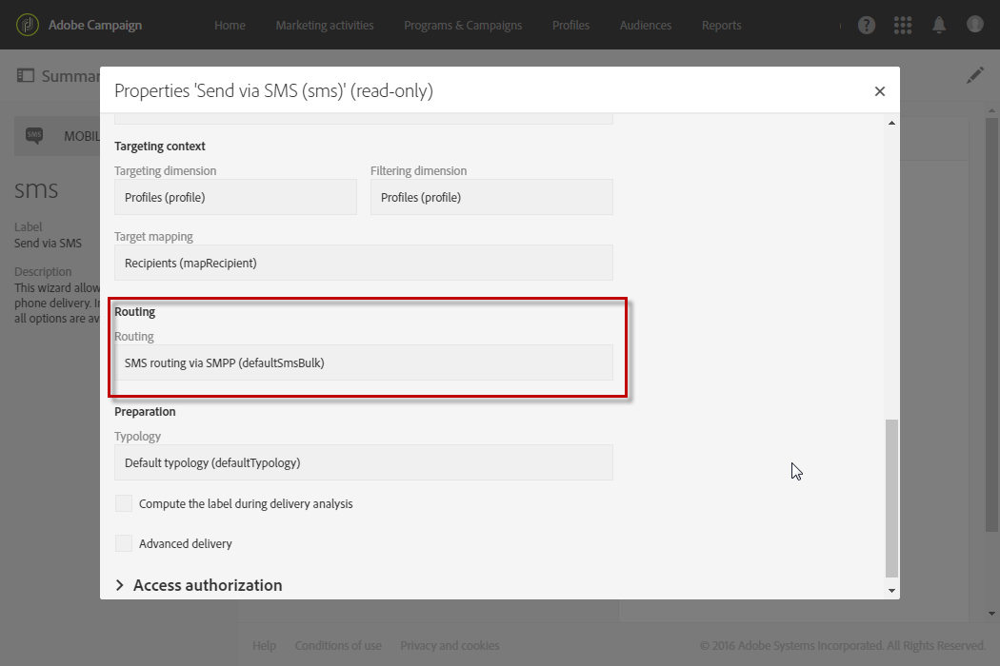

# About SMS messages{#about-sms-messages}

Adobe Campaign allows you to deliver SMS (Short Message Service) messages.

>[!NOTE]
>
>SMS channel is an add-on. Please check your license agreement.

For SMS messages, you can create, modify, and personalize messages in text format only. You can also preview your SMS messages before they are sent.

The length of an SMS message is restricted to 160 characters if it is in GSM encoding and only 70 characters if it is in Unicode. However, certain special characters can influence the length of the message. For more on this, refer to the [SMS encoding](../../administration/using/configuring-sms-channel.md#sms-encoding--length-and-transliteration) section.

SMS messages can be created from the **[!UICONTROL Marketing activities]** menu, from a campaign, or in a workflow, see [Creating an SMS message](../../channels/using/creating-an-sms-message.md).

To deliver SMS messages to a mobile telephone you need:

* A **[!UICONTROL Routing]** external account configured on the **[!UICONTROL Mobile (SMS)]** channel with the **[!UICONTROL Bulk delivery]** mode. For more on this, refer to the [Routing](../../administration/using/configuring-sms-channel.md#defining-an-sms-routing) section.
* A delivery template that is correctly linked to this external account.

**Related topics:**

* [Managing templates](../../start/using/marketing-activity-templates.md)
* [SMS configuration](../../administration/using/configuring-sms-channel.md#defining-an-sms-routing)
* [SMS report](../../reporting/using/sms-report.md)
* [Campaign Standard Mobile guide](https://helpx.adobe.com/campaign/kb/acs-mobile.html)

## SMS delivery template {#sms-delivery-template}

Adobe Campaign offers a delivery template for mobile devices. This template must be correctly linked to the external account used for the **[!UICONTROL Mobile (SMS)]** channel. To access and modify it:

1. Select **[!UICONTROL Resources]** > **[!UICONTROL Templates]** > **[!UICONTROL Delivery templates]** from the advanced menu.
1. Hover over the **[!UICONTROL Send via SMS]** template with the mouse and select the **Duplicate element** option.
1. Select the new template.
1. Click the **[!UICONTROL Edit properties]** button.
1. In the **[!UICONTROL Advanced parameters]** section of the template properties, make sure that the template is linked to the external account to be used for delivering SMS.

   

**Related topics:**

* [Managing templates](../../start/using/marketing-activity-templates.md)
