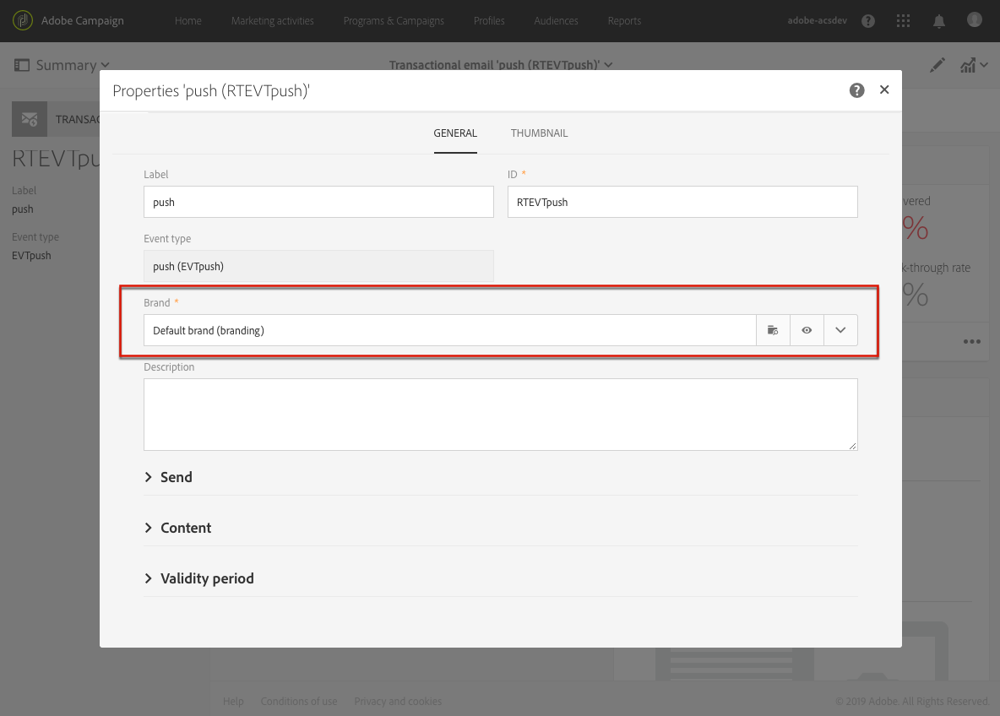

# About transactional messaging{#about-transactional-messaging}

You can create and manage personalized transactional messages in Adobe Campaign.

A transactional message is an individual and unique communication sent to a user by a provider such as a website.

* This type of message is particularly expected, as it contains information that the recipient wants to check or confirm. It could be a welcome message after creating an account for example, or a confirmation that an order has shipped, a bill, or a message confirming a password change.
* It is an important message that defines the client relation: the user expects it to be sent in real time. The delay between the event being triggered and the message arriving therefore has to be very short.
* Transactional messages generally have high open rates.

Adobe Campaign allows you to integrate this functionality with an information system which sends it events that are to be transformed into custom transactional messages.

>[!NOTE]
>
>Transactional messages can be sent by email, SMS or push notification, depending on your options. Please check your license agreement.

Two types of transactional messages are available in Adobe Campaign:

* [Event transactional messages](../../channels/using/event-transactional-messages.md) targeting an event. The data contained in the event itself is used to define the delivery target.
* [Profile transactional messages](../../channels/using/profile-transactional-messages.md) targeting profiles from the Adobe Campaign marketing database. You can use information from the Adobe Campaign database to send a transactional message based on customer marketing profiles.

The message type is defined when configuring the event that will be transformed into a transactional message. See [Transactional messaging configuration](../../administration/using/configuring-transactional-messaging.md).

>[!NOTE]
>
>Adobe Campaign prioritizes processing the transactional messages over any other delivery.

Transactional messaging is also available from the Adobe Campaign Standard API. For more on this, refer to the [dedicated documentation](../../api/using/managing-transactional-messages.md).

If you have upgraded to the [Enhanced MTA](https://helpx.adobe.com/campaign/kb/campaign-enhanced-mta.html), all transactional messages may also be sent with the Adobe Campaign Enhanced MTA for improved deliverability, throughput, and bounce handling. All impacts are the same as for standard marketing messages and they are detailed in the [Adobe Campaign Enhanced MTA](https://helpx.adobe.com/campaign/kb/campaign-enhanced-mta.html) document.

## Transactional messaging operating principle {#transactional-messaging-operating-principle}

Let's take the example of a company that has a website and on this website its users can buy products.

Adobe Campaign allows you to send a notification email to site users who have added products to their cart: when one of them leaves the site without going through with their purchases, a cart abandonment email is automatically sent to them.

The steps for putting this into place are:

1. Configure an event that will be named "Cart abandonment" and publishing this event configuration, which automatically creates a transactional message. Creating and publishing an event are presented in the [Configuring an event to send an event transactional message](../../administration/using/configuring-transactional-messaging.md#use-case--configuring-an-event-to-send-a-transactional-message) section.
1. The transactional message has to be personalized, tested, then published. See [Event transactional messages](../../channels/using/event-transactional-messages.md).
1. Furthermore, in order for the event to be triggered when a client abandons their cart, this event has to be sent from the company's website using the Adobe Campaign Standard REST API. See [Site integration](../../administration/using/configuring-transactional-messaging.md#integrating-the-triggering-of-the-event-in-a-website).

Once all of these steps have been carried out, as soon as a user leaves the site without ordering the products in their cart, they automatically receive a notification email.

## Transactional messaging publication process {#transactional-messaging-pub-process}

The chart below illustrates the transactional messaging publication process.

For more on the event configuration steps, see [Transactional messaging configuration](../../administration/using/configuring-transactional-messaging.md).

## Transactional messaging limitations {#transactional-messaging-limitations}

>[!NOTE]
>
>To access transactional messages, you must have administration rights.

### Design and publication {#design-and-publication}

As you are designing and publishing transactional messages, some of the steps you need to perform cannot be reverted. You need to be aware of the following limitations:

* Only one channel can be used for each event configuration. See [Creating an event](../../administration/using/configuring-transactional-messaging.md#creating-an-event).
* Once the event is created, you cannot change the channel. Therefore, if a message is not sent successfully, you need to design the mechanism allowing to send it from another channel using a workflow. See [Workflow data and processes](../../automating/using/workflow-data-and-processes.md).
* You cannot change the targeting dimension ( **[!UICONTROL Real-time event]** or **[!UICONTROL Profile]** ) after the event is created. See [Creating an event](../../administration/using/configuring-transactional-messaging.md#creating-an-event).
* It is not possible to rollback a publication, but you can unpublish an event: this operation makes the event and the associated transactional message inaccessible. See [Unpublishing an event](../../administration/using/configuring-transactional-messaging.md#unpublishing-an-event).
* The only transactional message that can be associated with an event is the message that is automatically created upon publishing that event. See [Previewing and publishing the event](../../administration/using/configuring-transactional-messaging.md#previewing-and-publishing-the-event).

### Personalization {#personalization}

The way you can personalize a message content depends on the type of transactional message. Specificities are listed below:

**Event-based transactional messages**:

* The personalization information is coming from the data contained in the event itself. See [Event transactional messages](../../channels/using/event-transactional-messages.md).
* You cannot use **Unsubscription link** content blocks in an event transactional message.
* Event-based transactional messaging is supposed to use only the data that are in the sent event to define the recipient and the message content personalization. However, you can enrich the content of your transactional message using information from the Adobe Campaign database. See [Enriching the transactional message content](../../administration/using/configuring-transactional-messaging.md#enriching-the-transactional-message-content).
* As event transactional messages do not contain profile information, they are not compatible with fatigue rules, even in the case of an enrichment with profiles. See [Fatigue rules](../../administration/using/fatigue-rules.md).

**Profile-based transactional messages**:

* The personalization information can come from the data contained in the event or from the reconciled profile record. See [Profile transactional messages](../../channels/using/profile-transactional-messages.md).
* You can use **Unsubscription link** content blocks in a profile transactional message. See [Adding a content block](../../designing/using/personalization.md#adding-a-content-block).
* Fatigue rules are compatible with profile transactional messages. See [Fatigue rules](../../administration/using/fatigue-rules.md).

Note that product listings are available in transactional email messages only. See [Using product listings in a transactional message](../../channels/using/event-transactional-messages.md#using-product-listings-in-a-transactional-message).

### Permissions and branding {#permissions-and-branding}

When it comes to [branding](../../administration/using/branding.md) management, transactional messaging enables less flexibility than standard messaging. Adobe recommends linking all brands used in transactional messages to the **[!UICONTROL All]** [organizational unit](../../administration/using/organizational-units.md). For more on this, read the detailed explanation below.

When editing a transactional message, you can link it to a brand to automatically apply some parameters such as the brand name or the brand logo. The **[!UICONTROL Default brand]** is selected by default in the transactional message properties.

All objects (including branding) used in a transactional message must be visible from the **[!UICONTROL Message Center]** organizational unit, meaning that these objects must be in the **[!UICONTROL Message Center]** or **[!UICONTROL All]** organizational units.

However, if the brand selected in the message properties is linked to an organizational unit which is different from **[!UICONTROL Message Center]** or **[!UICONTROL All]**, this will cause an error and you will not be able to send the transactional message.

Therefore, if you want to use multi-branding in the context of transactional messaging, you should link all brands either to the **[!UICONTROL Message Center]** organizational unit or to the **[!UICONTROL All]** organizational unit.

### Exporting and importing transactional messages {#exporting-and-importing-transactional-messages}

* To export a transactional message, you need to include the corresponding event configuration when [creating the package export](../../automating/using/managing-packages.md#creating-a-package).
* Once the transactional message is [imported through a package](../../automating/using/managing-packages.md#importing-a-package), it is not displayed in the transactional message list. You need to [publish](../../administration/using/configuring-transactional-messaging.md#previewing-and-publishing-the-event) the event configuration in order to make the associated transactional message available.

