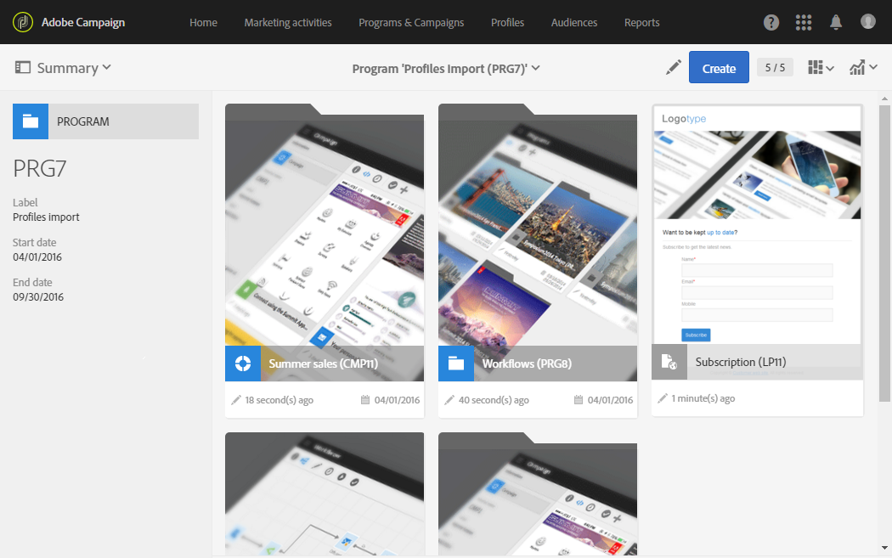

# Accessing messages{#accessing-messages}

You can access a set of advanced functionalities, from targeting, creating and personalizing messages, executing communications, to associated operational reports.

Messages can be accessed:

* within a campaign
* from the Adobe Campaign home page
* from the list of marketing activities

## Accessing messages in campaigns {#accessing-messages-in-campaigns}

To access the list of a campaign's marketing activities:

1. Go to **[!UICONTROL Marketing activities]** from the top navigation bar.
1. Select **[!UICONTROL Marketing activities > Marketing plans > Programs & Campaigns]**.

   You can also directly click the **[!UICONTROL Programs & Campaigns]** card from the home page. For more information on campaigns, refer to the [Programs and campaigns](../../start/using/programs-and-campaigns.md) section.

1. Select a program, then a campaign.

   

1. Click the **[!UICONTROL Summary]** drop-down list.
1. Click **[!UICONTROL Search]** to filter the way messages are displayed (by name, date, or status).

   To filter recurring messages, you can check the corresponding box.

## Accessing the message list {#accessing-the-message-list}

To access the full list of marketing activities from all the campaigns combined:

1. Select **[!UICONTROL Marketing activities]** from the upper navigation bar.

   You can also access it from the **[!UICONTROL Marketing activities]** card on the home page. For more information on the list of marketing activities, refer to the [Managing marketing activities](../../start/using/marketing-activities.md#creating-a-marketing-activity) section.

1. To filter the marketing activities (by name, date, status or activity type), use the **[!UICONTROL Search]** fields to the left of the list of marketing activities.

## Message life cycle {#message-life-cycle}

A message's status is represented by a specific color in the lists. The possible statuses are:

* **[!UICONTROL Editing]** (gray): the message is being edited.
* **[!UICONTROL In progress]** (blue): the message is being sent.
* **[!UICONTROL Finished]** (green): sending has finished without any errors.
* **[!UICONTROL Erroneous]** (red): sending was canceled or an error has occurred while the message was being prepared or sent.

  >[!NOTE]
  >
  >A yellow notification banner may appear above the card when an action is required, for example when you have to confirm sending a message.
